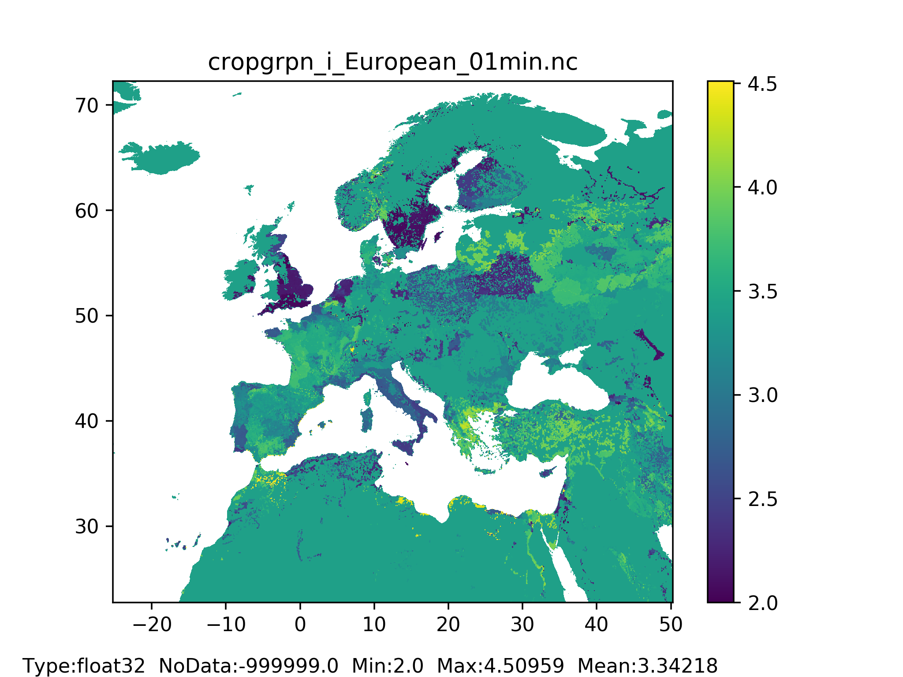
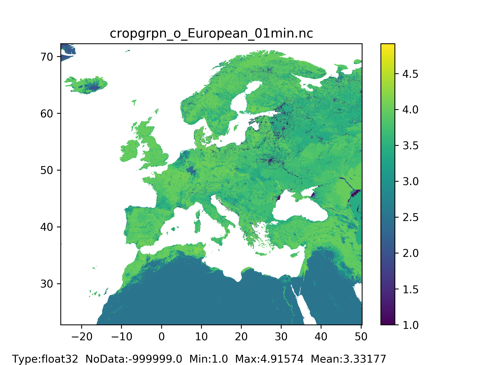
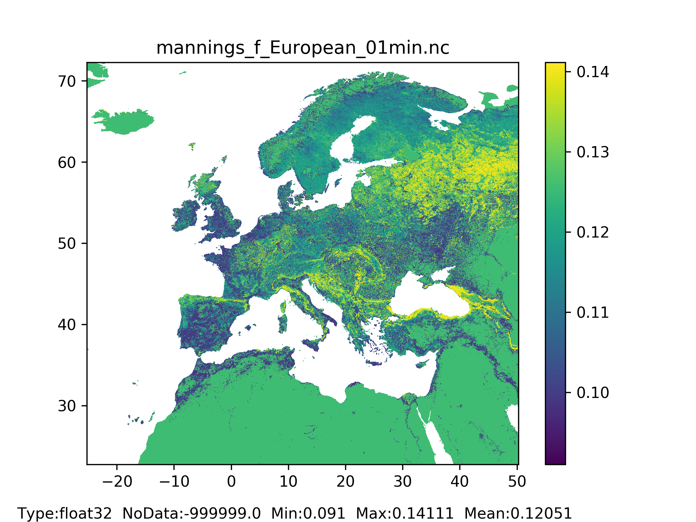
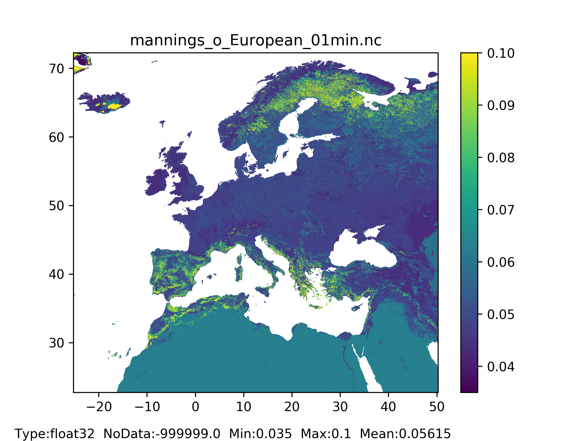
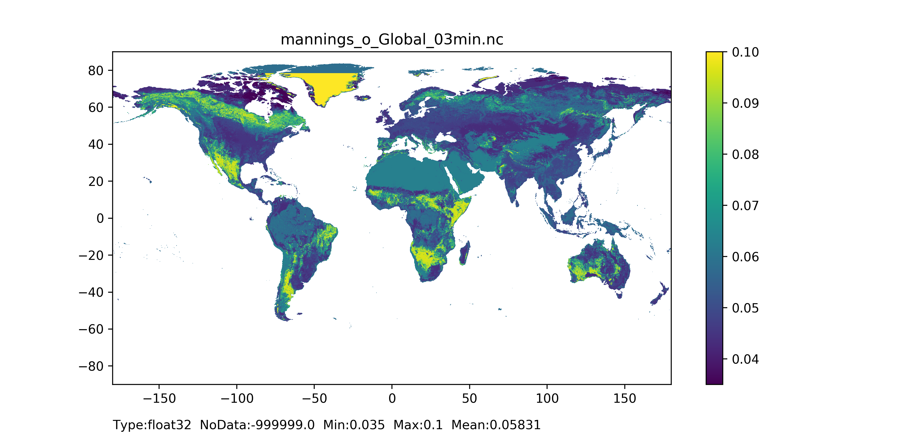
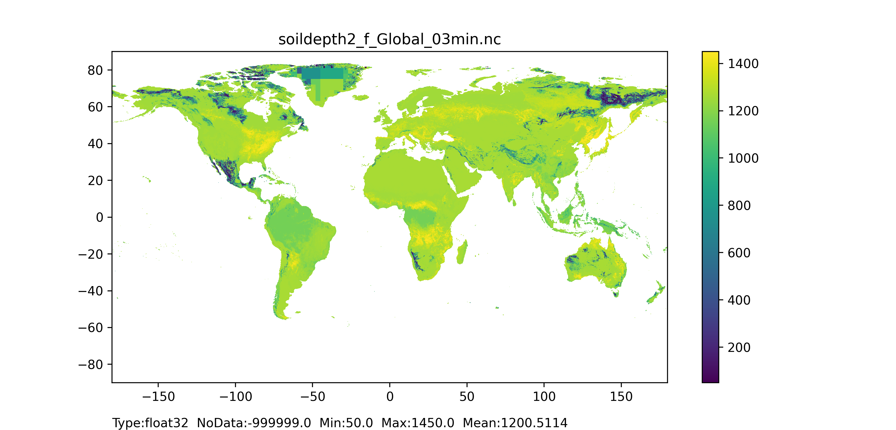

# Land use depending

Crop coefficient, crop group number, and Manning's surface roughness are the land cover depending maps which are calculated considering geographical distribution of each land cover type. 
The LISFLOOD hydrological model can distinguish dependencies for the forested (and also non-forested), irrigated crops (excluding rice), and other land cover type areas. Forest includes evergreen and deciduous needle leaf and broad leaf trees, irrigated crops - all possible crops excluding rice (is modelled separately), and other land cover type - agricultural areas, non-forested natural area, pervious surface of urban areas. Non-forest (also referred to as ’others‘) refers to any other land cover types apart from forest.  
+ **Crop coefficient** for forest, irrigated crops and other land use type maps
Crop coefficient is a simple ratio between the potential (reference) evapotranspiration rate, in mm/day, and the potential evaporation rate of a specific crop. In the LISFLOOD model the crop coefficient for forest, irrigated crops and other land cover type maps are used in the computation of the transpiration rate for the forest, irrigated agriculture and other land cover type fractions respectively, e.g. in the computation of the [roots water uptake](https://ec-jrc.github.io/lisflood-model/2_07_stdLISFLOOD_plant-water-uptake/) to support plant transpiration.)
+ **Crop group number** for forest, irrigated crops and other land use type maps
The crop group number represents a vegetation type and is an indicator of its adaptation to dry climate. In the LISFLOOD model the crop group number for forest, irrigated crops and other land cover type maps are used in the computation of the critical amount of soil moisture [$wcrit$](https://ec-jrc.github.io/lisflood-model/2_07_stdLISFLOOD_plant-water-uptake/) below which water uptake from plants is reduced as they start closing their stomata. The crop group number for forest, irrigated crops and other land cover type are applied to the forest, irrigated agriculture and other land cover type fractions respectively.
+ **Manning’s surface roughness coefficient** for forest, irrigated crops and other land cover type maps
Manning's surface roughness coefficient represents the roughness or friction applied to the flow by the surface on which water is flowing. In the LISFLOOD model the Manning's surface roughness coefficients for forest, irrigated crops and other land cover type maps are used to compute surface runoff routing for the forest, irrigated agriculture and other [land cover type fractions](../4_Static-Maps_land-use/) respectively.
+ **Soil depth layers 1, 2 and 3** for forested and non-forested areas maps
Soil depth is used to compute the available water storage volume in the soil. In the LISFLOOD model, three soil layers are used to model the hydrological processes in the soil. The layers take into account forest and non-forest root depths to divide the total soil depth between topsoil (surface layer or layer 1, and middle layer or layer 2) and subsoil (bottom layer or layer 3) hydrological processes.

## Crop coefficient, crop group number, Manning’s surface roughness coefficient for forest, irrigated crops and other land use type maps

### General map information and possible source data

| Map name | File name;type | Units; range | Description |
| :---| :--- | :--- | :--- |
|Crop coefficient|cropcoef_**T**.nc; Type: Float32|Units: -;   Range: 0.20 .. 1.08| Averaged (by time and ecosystem type) crop coefficient for forest/ irrigated crops/ other land cover type|
|Crop group number|cropgrpn_**T**.nc; Type: Float32|Units: -;   Range: 1 .. 5| Averaged (by time and ecosystem type) crop group number for forest/ irrigated crops/ other land cover type|
|Manning's coefficient|mannings_**T**.nc; Type: Float32|Units: XXXX;   Range: 0.015 .. 0.200|Averaged (by ecosystem type) Manning’s roughness coefficient for forest/ irrigated crops/ other land cover type|

*where **T** is the landcover type (**T** = ’f’ for forest, **T** = ’i’ for irrigated crops, **T** = ’o’ for other land cover type).

| Source data| Reference/preparation | Temporal coverage | Spatial information |
| :---| :--- | :--- | :--- |
|Copernicus Global Land Cover Layers: CGLS-LC100 collection 2|https://developers.google.com/earth-engine/datasets/catalog/COPERNICUS_Landcover_100m_Proba-V-C3_Global#description|2015|Global, 100m|
|Spatial Production Allocation Model (SPAM) - Global Spatially-Disaggregated Crop Production Statistics Data for 2010 (V 1.0)|https://dataverse.harvard.edu/dataset.xhtml?persistentId=doi:10.7910/DVN/PRFF8V|2010|Global, 5min (~10 km)|
|FAO Irrigation and Drainage Paper No. 56: Crop Evapotranspiration (guidelines for computing crop water requirements) by Richard G. ALLEN, Luis S. PEREIRA, Dirk RAES, Martin SMITH|https://www.researchgate.net/publication/284300773_FAO_Irrigation_and_drainage_paper_No_56|1998|Global, per crop type|
|System description of the Wofost 6.0 crop simulation model implemented in CGMS. Volume 1: Theory and Algorithms by I. Supit, A.A. Hoojer and C.A. Van Diepen|https://op.europa.eu/en/publication-detail/-/publication/a99325a7-c776-11e6-a6db-01aa75ed71a1|1994|Global, per crop type|
|OPEN-CHANNEL HYDRAULICS by Ven Te Chow|http://web.ipb.ac.id/~erizal/hidrolika/Chow%20-%20OPEN%20CHANNEL%20HYDRAULICS.pdf|1959|Global|

### Methodology

First, different ecosystem type fraction maps are prepared: 

+ for **forest**  
The 'discrete_classification' dataset from Copernicus Global Land cover Layers, which provides values representing a dominant cover type per grid-cell (discrete information) can be used. Only tree cover types are selected (i.e. '111' - evergreen needleleaf closed forest, '112' - evergreen broadleaf closed forest, '113' - deciduous needleleaf closed forest, '114' - deciduous broadleaf closed forest, '115' - mixed closed forest, '116' - unknown closed forest, '121' - evergreen needleleaf open forest, '122' - evergreen broadleaf open forest, '123' - deciduous needleleaf open forest, '124' - deciduous broadleaf open forest, '125' - mixed open forest, '126' - unknown open forest). For each of these 12 tree cover types selected a map containing information about forest type was created, assigning '0' to the grid-cells with no forest and '1' to the grid-cells covered with forest type in question. Then, the resolution of these maps is reduced from native 100 m to the needed resolution, e.g. 1 arc min, with mean() reducer. 

+ for **irrigated crops**  
The 'spam2010v1r0_global_physical-area_CROP_i' dataset from SPAM dataset can be used. The files represent the actual area in hectares where each crop is grown, not considering how often its production is harvested, 'i' - denotes an irrigated portion of a crop. All 42 crop types are selected and single crop fraction maps are created, assigning '0' to the grid-cells with no crop and '1' to the grid-cells covered with crop type in question. Then, the resolution of these maps is changed from native to the needed resolution, e.g. 1 arc min. 

+ for **other** land cover type 
i) The 'discrete_classification' dataset from Copernicus Global Land cover Layers, providing values representing a dominant cover type per grid-cell (discrete information) can be used. Here, only the other land cover types are selected (i.e. '20' - shrubland, '30' - herbaceous vegetation, '40' - cropland, '60' - bare/sparse vegetation, '70' - snow & ice, '90' - herbaceous wetland, '100' - moss & lichen). For other land cover types, 7 fraction maps where created – each map contains information only about one other land cover type ('0' - grid-cell has no other land cover type in question, '1' - grid-cell is covered with other land cover type in question). Then, the resolution of these maps is reduced from native 100 m to the needed resolution, e.g. 1 arc min, with mean() reducer. 
ii) The 'spam2010v1r0_global_physical-area_CROP_r' dataset from the SPAM dataset can be used. The files represent the actual area in hectares where each crop is grown, not considering how often its production is harvested, 'r' - denotes a rainfed portion of a crop. All 42 crop types are selected and 42 fraction maps containing information only about one crop type ('0' - grid-cell has no crop type in question, '1' - grid-cell is covered with crop type in question) are created. Then, the resolution of these maps is changed from native to the needed resolution, e.g. 1 arc min. 
Next, land cover depending parameters are computed according to the formulas in the table below. 

| Parameter| Equation* | Notes |
| :---| :--- | :--- | 
|Crop coefficient| $$Kc=\frac{fraction1 \cdot height1 \cdot Kc1 + fraction2 \cdot height2 \cdot Kc2 + .. + fractionN \cdot heightN \cdot KcN}{fraction1 \cdot height1 + fraction2 \cdot height2 + .. + fractionN \cdot heightN}$$|Considers different cover type fractions, default crop coefficient values and default crop height values from [FAO56](https://www.researchgate.net/publication/284300773_FAO_Irrigation_and_drainage_paper_No_56)|
|Crop height|$$H=\frac{fraction1 \cdot height1 + fraction2 \cdot height2 + .. + fractionN \cdot heightN}{fraction1 + fraction2 + .. + fractionN }$$|Considers different cover type fractions, default crop coefficient values and default crop height values from  [FAO56](https://www.researchgate.net/publication/284300773_FAO_Irrigation_and_drainage_paper_No_56)|
|Crop root depth|$$R=\frac{fraction1 \cdot root1 + fraction2 \cdot root2 + .. + fractionN \cdot rootN}{fraction1 + fraction2 + .. + fractionN}$$|Considers different cover type fractions and default crop root depth values from [FAO56](https://www.researchgate.net/publication/284300773_FAO_Irrigation_and_drainage_paper_No_56)|
|Crop group number|$$Kg=\frac{fraction1 \cdot Kg1 + fraction2 \cdot Kg2 + .. + fractionN \cdot KgN}{fraction1 + fraction2 + .. + fractionN}$$|Considers different cover type fractions and default   crop group number values from the [Supit et al., 1994](https://op.europa.eu/en/publication-detail/-/publication/a99325a7-c776-11e6-a6db-01aa75ed71a1)|
|Manning's coefficient|$$Km=\frac{fraction1 \cdot Km1 + fraction2 \cdot Km2 + .. + fractionN \cdot KmN}{fraction1 + fraction2 + .. + fractionN}$$|Considers different cover type fractions and default Manning's surface roughness coefficient values from the [OPEN-CHANNEL HYDRAULICS](http://web.ipb.ac.id/~erizal/hidrolika/Chow%20-%20OPEN%20CHANNEL%20HYDRAULICS.pdf)|

*where for forest **N**=12; for irrigated crops **N**=42; for other land cover type **N**=7 and for ‘40’ ‘cropland’ height, Kc, Kg and Km are for rainfed crops.

The LISFLOOD model does not accept missing values for Kc, Kg and Km thus all zero values are filled with field’s global mean values (computed by excluding all nil Kc, Kg and Km values, respectively). 

  
   

*Figure 15: Crop coefficient for forest map at 1 arc min horizontal resolution for European domain (left) and at 3 arc min horizontal resolution for Global domain (right).*

  
   

*Figure 16: Crop coefficient for irrigated crops map at 1 arc min horizontal resolution for European domain (left) and at 3 arc min horizontal resolution for Global domain (right).*

  
   

*Figure 17: Crop coefficient for other land use type map at 1 arc min horizontal resolution for European domain (left) and at 3 arc min horizontal resolution for Global domain (right).*

  
   

*Figure 18: Crop group number for forest map at 1 arc min horizontal resolution for European domain (left) and at 3 arc min horizontal resolution for Global domain (right).*

  
   

*Figure 19: Crop group number for irrigated crops map at 1 arc min horizontal resolution for European domain (left) and at 3 arc min horizontal resolution for Global domain (right).*

  
   

*Figure 20: Crop group number for other land use type map at 1 arc min horizontal resolution for European domain (left) and at 3 arc min horizontal resolution for Global domain (right).*

  
   

*Figure 21: Manning’s coefficient for forest map at 1 arc min horizontal resolution for European domain (left) and at 3 arc min horizontal resolution for Global domain (right).*

  
   

*Figure 22: Manning’s coefficient for irrigated crops map at 1 arc min horizontal resolution for European domain (left) and at 3 arc min horizontal resolution for Global domain (right).*

  
   

*Figure 23: Manning’s coefficient for other land cover type map at 1 arc min horizontal resolution for European domain (left) and at 3 arc min horizontal resolution for Global domain (right).*

## Soil depth layers 1,2, and 3 for forested and non-forested areas

### General map information and possible source data

| Map name | File name*;type | Units; range | Description |
| :---| :--- | :--- | :--- |
|Soil depth|soildeoth**N_T**.nc;   Type: Float32| Units: mm; Range: ≥ 50**|Forested/ other (non-forested) area soil depth  for soil layer 1 (surface layer)/ 2 (middle layer)/ 3 (bottom layer)|

*where **N** is the number of soil depth layer (**N**= ’1’ for surface layer, **N** = ’2’ for middle layer, **N** = ’3’ for bottom layer), and **T** is the landcover type (**T** = ’f’ for forested areas, **T** = ’o’ for non-forested areas or others).
**where range for soil layer 1 (surface layer) equals 50 mm, and for soil layer 2 (middle layer) and 3 (bottom layer) equals ≥ 50 mm.

| Source data| Access |Temporal coverage|Spatial information|
| :---| :--- | :--- | :---|
|SoilGrids250m 2017 |[SoilGrids](https://data.isric.org/geonetwork/srv/api/records/f36117ea-9be5-4afd-bb7d-7a3e77bf392a)|2017|Global, 250m|
|Copernicus Global Land Cover Layers: collection 2|[CGLS-LC100](https://developers.google.com/earth-engine/datasets/catalog/COPERNICUS_Landcover_100m_Proba-V-C3_Global#description)|2015|Global, 100m|
|Spatial Production Allocation Model (SPAM)   Global Spatially-Disaggregated Crop Production Statistics Data  for 2010 (V 1.0)|[SPAM](https://dataverse.harvard.edu/dataset.xhtml?persistentId=doi:10.7910/DVN/PRFF8V)|2010|Global, 5' (~10 km)|
|FAO Irrigation and Drainage Paper No. 56:  Crop Evapotranspiration (guidelines for computing crop water requirements)  by Richard G. ALLEN, Luis S. PEREIRA, Dirk RAES, Martin SMITH |[FAO Paper No.56](https://www.researchgate.net/publication/284300773_FAO_Irrigation_and_drainage_paper_No_56)|1998|Global, per crop type|

### Methodology

The methodology for the computation of the depth of the three soil layers has been adapted from [Burek et al., 2014](https://ec-jrc.github.io/lisflood/pdfs/Dataset_hydro.pdf). Here, total soil depth is taken as the 'absolute depth to bedrock' from [SoilGrids250m (2017)](https://journals.plos.org/plosone/article?id=10.1371/journal.pone.0169748) and 'root depth' for the fractions forest and non-forest is computed following methodology explained [above](../4_Static-Maps_land-use-depending#crop-coefficient,-crop-group-number,-manning’s-surface-roughness-coefficient-for-forest,-irrigated-crops-and-other-land-use-type-maps). Soil depth is expressed in mm.  
Soil depth layer 1 (surface) for forest/non-forest ($SD_1$) is assumed constant, equal to 50 mm all over the world:

$$
SD_1 = 50 mm
$$

Soil depth layers 2 (middle, $SD_2$) and 3 (bottom, $SD_3$) for forest/non-forest are computed in several steps – first at native resolution of the input dataset, then at required resolution. First step is following:

+ for soil depth layer 2 (middle, $SD_2$)

| Absolute depth to bedrock | Equation |
| :---| :--- | 
| ≤300 mm | $SD_2 = \frac{absolutedepth-SD_1}{2}$ |
| >300 mm | $SD_2 = \min(rootdepth,(absolutedepth - 300mm - SD_1))$ |

If the computed value of $SD_2$ is lower than 50mm, then it is used $SD_2$ = $50 mm$ (in order to account for data uncertainty).

+ for soil depth layer 3 (bottom layer, $SD_3$)

$$ 
SD_3 = absolutedepth - (SD_1 +SD_2)
$$

Second step is to reduce the resolution of the resulting field from native to the required one (e.g. from 250 m to 1 arc min) as follows. Firstly, resolution is reduced to 1, 3, 15 arc min and 1, 3, 15, 60 degrees with mean.unweighted() reducer, and then all different resolutions are assembled to create a field with no missing values. For each resolution (going from the highest to the coarsest), grid-cells with missing values are identified and filled with the value of the corresponding grid-cell with non-missing value from the next resolution down map (e.g. using 3 arc min to fill in 1 arc min missing values). If the corresponding grid-cell is masked (has a missing value), then the value of the corresponding non-masked grid-cell from the next resolution down map is used, until all resolution maps are explored. If the corresponding grid-cell value of the coarsest resolution (here 60 degree) is still missing, a zero value is used. 

### Results (examples)

  
   

*Figure 24: Soil depth layer 1 (surface layer) for forest map at 1 arc min horizontal resolution for European domain (left) and at 3 arc min horizontal resolution for Global domain (right).*

  
   

*Figure 25: Soil depth layer 1 (surface layer) for non-forest map at 1 arc min horizontal resolution for European domain (left) and at 3 arc min horizontal resolution for Global domain (right).*

  
   

*Figure 26: Soil depth layer 2 (surface layer) for forest map at 1 arc min horizontal resolution for European domain (left) and at 3 arc min horizontal resolution for Global domain (right).*

  
   

*Figure 27: Soil depth layer 2 (surface layer) for non-forest map at 1 arc min horizontal resolution for European domain (left) and at 3 arc min horizontal resolution for Global domain (right).*

  
   

*Figure 28: Soil depth layer 3 (surface layer) for forest map at 1 arc min horizontal resolution for European domain (left) and at 3 arc min horizontal resolution for Global domain (right).*

  
   

*Figure 29: Soil depth layer 3 (surface layer) for non-forest map at 1 arc min horizontal resolution for European domain (left) and at 3 arc min horizontal resolution for Global domain (right).*
