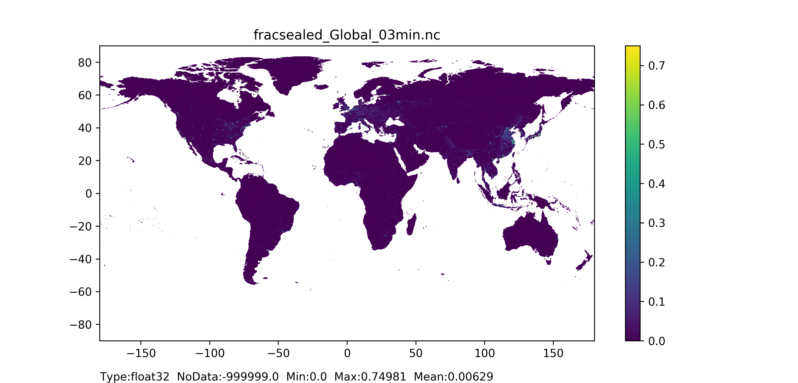

# Land use

The LISFLOOD hydrological model can distinguish the following land cover types: forest, inland water, sealed surface (impervious urban area), irrigated land, rice, and other land cover type. Interception, evapotranspiration, infiltration, and overland (or surface) flow respond differently to each surface type.  
    • Fraction of inland water map
Inland water map includes information on rivers, freshwater and saline lakes, ponds and other permanent water bodies over the continents. In the LISFLOOD model the inland water fraction map is used to identify the fraction of the pixel covered by open water bodies where the most prominent hydrological process is evaporation.
Considering that LISFLOOD does not distinguish oceans from inland water it is recommended to verify consistency between water fractions and computational area mask, especially in the coastal areas. Pixels included in the computational area mask cannot be fully covered with ocean. If this happens in coastal areas, then the fraction of inland water must be set to 1 and the lake mask (see Section XXXXX) should be changed accordingly.   
    • Fraction of sealed surface map
Here, the sealed surface map describes urban areas, characterizing the human impact on the environment. In the LISFLOOD model the sealed surface fraction map is used to identify impervious areas where there is no water infiltration into the soil, meaning water is accumulated in the surface depression, yet evaporates, but once depression is full - water is transported by a surface runoff.  
    • Fraction of forest map
Forest map describes land use composed of evergreen and deciduous needle leaf and broad leaf trees. In the LISFLOOD model the forest fraction is used to identify forested areas where main hydrological processes are canopy interception, evapotranspiration from canopies, canopies drainage and evapotranspiration. 
    • Fraction of irrigated crops map
Irrigated crops map includes all possible crops excluding rice (is modelled separately). In the LISFLOOD model the irrigated crops fraction map is used to identify part of the pixel which is used by agriculture - water is abstracted from ground water and surface water bodies to irrigate the fields; main hydrological process connected with the irrigated crops are canopy interception, evapotranspiration from canopies, canopies drainage and evapotranspiration.  
    • Fraction of other land cover type map
Other land cover type map includes agricultural areas, non-forested natural area, pervious surface of urban areas. In the LISFLOOD model the other land cover type fraction map is used in the following hydrological processes: canopy interception, evaporation from the canopies, canopy drainage, plant evapotranspiration, evaporation from the soil. The relative importance of these processes depends on the Leaf Area Index. 

## Fraction of inland water
### General map informatio and possible source data
| Map name | File name;type | Units; range | Description |
| :---| :--- | :--- | :--- |
|Fraction of inland water         | fracwater.nc;   Type: Float32          | Units: -;  Range: [0-1]         |Inland water fraction for each grid-cell; values range from 0 (grid-cell has no inland water) to 1 (grid-cell is fully covered with inland water) |

| Source data| Reference/preparation | Temporal coverage | Spatial information |
| :---| :--- | :--- | :--- |
|Copernicus Global Land Cover Layers: CGLS-LC100 collection 2   |https://developers.google.com/earth-engine/datasets/catalog/COPERNICUS_Landcover_100m_Proba-V-C3_Global#description       |2015        |Global, 100 m|

### Methodology

To create the fraction of inland water, the 'water-permanent-coverfraction' layer can be used. It gives the percentage values of permanent inland water covering each grid-cell, ranging from 0 - grid-cell has no inland water - to 100% - grid-cell is fully covered with inland water. Values are translated into fractions per grid-cell, and then high initial resolution reduced to the needed resolution, e.g. 1 arc min, with mean() reducer.
Note: Inland water fraction field should be checked for consistency with all other fractions.

### Results (example)

  
   

*Figure 9: Fraction of inland water map at 1 arc min horizontal resolution for European domain (left) and at 3 arc min horizontal resolution for Global domain (right).*

## Fraction of sealed surfaces
### General map informatio and possible source data
| Map name | File name;type | Units; range | Description |
| :---| :--- | :--- | :--- |
|Fraction of sealed surfaces        | fracsealed.nc;   Type: Float32          | Units: -;  Range: [0-1]         |Urban surface fraction for each grid-cell; values range from 0 (grid-cell has no urban surface) to 1 (grid-cell is fully covered with urban surface) |

| Source data| Reference/preparation | Temporal coverage | Spatial information |
| :---| :--- | :--- | :--- |
|Copernicus Global Land Cover Layers: CGLS-LC100 collection 2   |https://developers.google.com/earth-engine/datasets/catalog/COPERNICUS_Landcover_100m_Proba-V-C3_Global#description       |2015        |Global, 100 m|

### Methodology

To create the fraction of sealed surface map, the 'urban-coverfraction' layer can be used. It gives the percentage values of urban surface covering each grid-cell, ranging from 0 % - grid-cell has no urban surface to 100 % - grid-cell is fully covered with urban surface. Values are translated into fractions per grid-cell and multiplied by 0.75 to account for urban permeable part (it is assumed that in general all urban areas have part which allows water to infiltrate, e.g. trees along the road, bushes along the fence, grass or moss between concrete tiles or cobble stones, and on average it covers 25 % of the area at a kilometre scale), and then high native resolution is reduced to the needed resolution, e.g. 1 arc min, with mean() reducer. 
Note: Sealed surface fraction field should be checked for consistency with all other fractions.

### Results (example)

  
   

*Figure 10: Fraction of sealed surfaces map at 1 arc min horizontal resolution for European domain (left) and at 3 arc min horizontal resolution for Global domain (right).*

## Fraction of forest 
### General map informatio and possible source data
| Map name | File name;type | Units; range | Description |
| :---| :--- | :--- | :--- |
|Fraction of forest       | fracforest.nc;   Type: Float32          | Units: -;  Range: [0-1]         |Forest fraction for each grid-cell; values range from 0 (grid-cell has no forest) to 1 (grid-cell is fully covered with forest) |

| Source data| Reference/preparation | Temporal coverage | Spatial information |
| :---| :--- | :--- | :--- |
|Copernicus Global Land Cover Layers: CGLS-LC100 collection 2   |https://developers.google.com/earth-engine/datasets/catalog/COPERNICUS_Landcover_100m_Proba-V-C3_Global#description       |2015        |Global, 100 m|

### Methodology

To create the fraction of forest map, the 'tree-coverfraction' layer can be used. It gives the percentage values of forest covering each grid-cell, ranging from 0 % - grid-cell has no forest to 100 % - grid-cell is fully covered with forest. Values are translated into fractions per grid-cell, and then high native resolution is reduced to the needed resolution, e.g. 1 arc min, with mean() reducer. 
Note: Forest fraction field should be checked for consistency with all other fractions.

### Results (example)

  
   

*Figure 11: Fraction of forest map at 1 arc min horizontal resolution for European domain (left) and at 3 arc min horizontal resolution for Global domain (right).*

## Fraction of irrigated crops
### General map informatio and possible source data
| Map name | File name;type | Units; range | Description |
| :---| :--- | :--- | :--- |
|Fraction of irrigated crops      | fracirrigated.nc;   Type: Float32          | Units: -;  Range: [0-1]         |Irrigated crop (except rice) fraction for each grid-cell; values range from 0 (grid-cell has no irrigated crops) to 1 (grid-cell is fully covered with irrigated crops)|

| Source data| Reference/preparation | Temporal coverage | Spatial information |
| :---| :--- | :--- | :--- |
|Spatial Production Allocation Model (SPAM) - Global Spatially-Disaggregated Crop Production Statistics Data for 2010 (V 1.0)  |https://dataverse.harvard.edu/dataset.xhtml?persistentId=doi:10.7910/DVN/PRFF8V   |2018        |Global, 5 arcmin (approx 10 km)|
|CORINE Land Cover 2018 CLC2018   |https://land.copernicus.eu/pan-european/corine-land-cover      |2018        |European, 100 m|

### Methodology

To create the fraction of irrigated crops map, multiple data sources can be used, for example when more accurate information could be found regionally compared with a global dataset. We describe here the process when using two datasets. 
For a global coverage, the 'spam2010v1r0_global_physical-area_CROP_i' files from the SPAM dataset are used. They describe the area (in hectares) where each crop is grown (one file per crop), not considering how often its production is harvested, with 'i' denoting a portion of the crop is irrigated. The area of all irrigated crops globally (except rice – modelled separately) is summed and resulting values translated from hectares to fractions per grid-cell, and the native resolution is changed to the highest resolution of all datasets used, here CORINE dataset 100 m resolution. 
For a regional coverage (here Europe), the '212' - ‘Permanently irrigated land, excluding rice’ value from the CORINE dataset is used (discrete classification where each grid-cell is fully covered with a certain land cover), assigning grid-cells covered with irrigated crops fraction 1. 
Finally, the generated fields are merged, with priority given to the high quality dataset (here from CORINE) over its geographical domain (here over the European domain), and the merged field resolution is reduced to the needed resolution, e.g. 1 arc min, with mean() reducer. 
Note: Irrigated crops fraction field should be checked for consistency with all other fractions.

### Results (example)

  
   

*Figure 12: Fraction of irrigated crops map at 1 arc min horizontal resolution for European domain (left) and at 3 arc min horizontal resolution for Global domain (right).*

## Fraction of rice crops
### General map informatio and possible source data
| Map name | File name;type | Units; range | Description |
| :---| :--- | :--- | :--- |
|Fraction of rice      | fracrice.nc;   Type: Float32          | Units: -;  Range: [0-1]         |Irrigated rice fraction for each grid-cell; values range from 0 (grid-cell has no irrigated rice) to 1 (grid-cell is fully covered with irrigated rice)|

| Source data| Reference/preparation | Temporal coverage | Spatial information |
| :---| :--- | :--- | :--- |
|Spatial Production Allocation Model (SPAM) - Global Spatially-Disaggregated Crop Production Statistics Data for 2010 (V 1.0)  |https://dataverse.harvard.edu/dataset.xhtml?persistentId=doi:10.7910/DVN/PRFF8V   |2018        |Global, 5 arcmin (approx 10 km)|
|CORINE Land Cover 2018 CLC2018   |https://land.copernicus.eu/pan-european/corine-land-cover      |2018        |European, 100 m|

### Methodology

To create the fraction of irrigated rice map, multiple data sources can be used, for example when more accurate information could be found regionally compared with a global dataset. We describe here the process when using two datasets. 
For a global coverage, the 'spam2010v1r0_global_physical-area_rice_i' file from the SPAM dataset is used. It describes the area (in hectares) where crop is grown, not considering how often its production is harvested, with 'i' denoting a portion of the crop is irrigated. The area of irrigated rice values translated from hectares to fractions per grid-cell, and the native resolution is changed to the highest resolution of all datasets used, here CORINE dataset 100 m resolution. 
For a regional coverage (here Europe), the '213' - ‘Rice field’ value from the CORINE dataset is used (discrete classification where each grid-cell is fully covered with a certain land cover), assigning grid-cells covered with irrigated rice fraction 1. 
Finally, the generated fields are merged, with priority given to the high quality dataset (here from CORINE) over its geographical domain (here over the European domain), and the merged field resolution is reduced to the needed resolution, e.g. 1 arc min, with mean() reducer. 
Note: Irrigated rice fraction field should be checked for consistency with all other fractions. 

### Results (example)

  
   

*Figure 13: Fraction of rice crops map at 1 arc min horizontal resolution for European domain (left) and at 3 arc min horizontal resolution for Global domain (right).*

## Fraction of other land use type
### General map informatio and possible source data
| Map name | File name;type | Units; range | Description |
| :---| :--- | :--- | :--- |
|Fraction of other land use type     | fracother.nc;   Type: Float32          | Units: -;  Range: [0-1]         |Other (e.g. agricultural areas, non-forested natural areas, pervious surface of urban areas) land cover type (not mentioned above) fraction for each grid-cell; values range from 0 (grid-cell has no other land cover type) to 1 (grid-cell is fully covered with other land cover type); computed in a following way: fraction_other = 1 - (fraction_inlandWater + fraction_urban + fraction_forest + fraction_irrigatedCrop + fraction_irrigatedRice + fraction_oceanWater)|

| Source data| Reference/preparation | Temporal coverage | Spatial information |
| :---| :--- | :--- | :--- |
|Fraction of inland water|It can be prepared by implementing [this methology](../4_Static-Maps_land-use#fraction-of-inland-water)|NA|Glonbal|
|Fraction of sealed surfaces|It can be prepared by implementing [this methology](../4_Static-Maps_land-use#fraction-of-sealed-surfaces)|NA|Glonbal|
|Fraction of forest|It can be prepared by implementing [this methology](../4_Static-Maps_land-use#fraction-of-forest)|NA|Glonbal|
|Fraction of irrigated crops|It can be prepared by implementing [this methology](../4_Static-Maps_land-use#fraction-of-irrigated-crops)|NA|Glonbal|
|Fraction of rice|It can be prepared by implementing [this methology](../4_Static-Maps_land-use#fraction-of-rice-crops)|NA|Glonbal|

### Methodology

Here the other land cover type map is created based on all other fraction maps required by LISFLOOD model. It should be noted that: i) all fraction maps together (including fraction of other land cover type) should sum up to 1 in each grid-cell, and ii) consistency check for all fractions must be done because data come from different sources and it can happen that fractions summed can result to more than 1.  
The following procedures are recommended to check consistency between fraction maps. All fractions are summed up to compute the other land cover type fraction map. If the fraction sum is less than 1, then the other land cover type fraction is calculated as 1 minus all fraction sum, else other land cover type fraction is 0. For cases when the sum is greater than 1, a correction for forest, irrigated crops, rice, and sealed surface fractions is computed:  

$$
fractionCorrectionFactor= \frac{fractionAllSum-1}{fractionForest+fractionIrrigated+fractionRice+fractionSealed} 
$$

Finally, if data sources for forest, irrigated crops, rice, and sealed surfaces fractions have the same level of uncertainty, each of these fractions are corrected in the same way at the needed resolution (e.g. 1 and 3 arc min): 
$$
fractionCorrectedX=fractionX-fractionX cdot fractionCorrectionFactor
$$
where X is Forest, Irrigated, Rice, Sealed.

### Results (example)

  
   

*Figure 14: Fraction of other land use type map at 1 arc min horizontal resolution for European domain (left) and at 3 arc min horizontal resolution for Global domain (right).*
