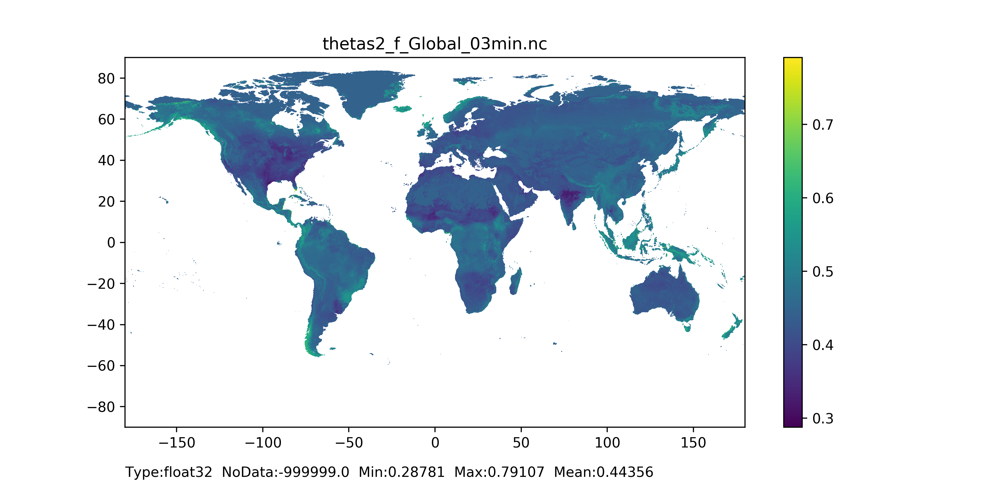
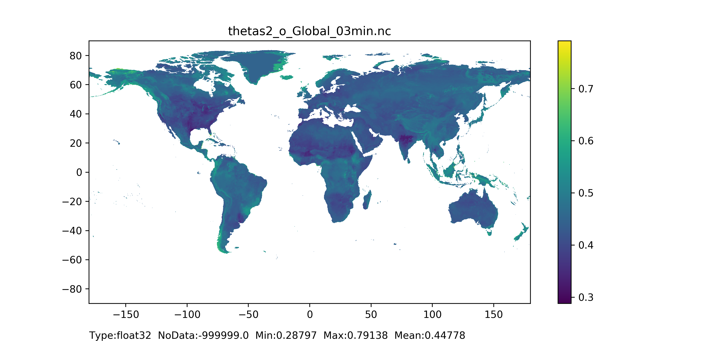
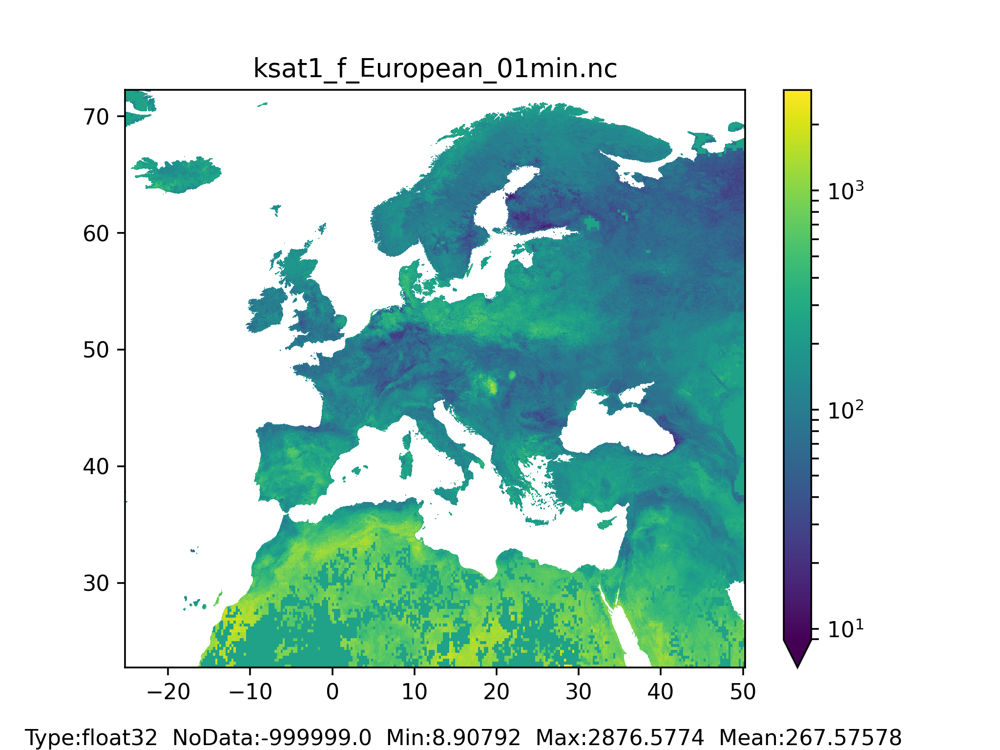
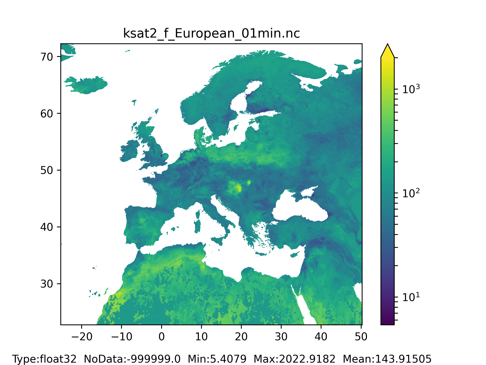

# Soil hydraulic properties

Soil hydraulic parameters are used to calculate water dynamics through a vertical soil profile.  
In the LISFLOOD model the relationship between soil moisture and suction pressure (water retention curve), and hydraulic conductivity and soil moisture is described by the Van Genuchten equation and requires the following parameters: saturated hydraulic conductivity, lambda, genu alpha, theta residual and theta saturated.  
+ Theta saturated (thetas) is the saturated water content soil hydraulic property representing the maximum water content in the soil. 
+ Theta residual (thetar) is the residual water content soil hydraulic property representing the minimum water content in the soil. 
+ Lambda is the Van Genuchten parameter λ (also referred as ‘n-1’ in literature) soil hydraulic property representing the pore size index of the soil.
+ Genu alpha (genua) is the Van Genuchten parameter α soil hydraulic property.  
+ K saturated (Ksat) is the saturated hydraulic conductivity soil hydraulic property describing the ease with which water moves through pore spaces of the soil. 

Moreover, LISFLOOD differentiates between the water dynamics of areas with topsoil covered by forest and topsoil covered by non-forest land types. Here, forest includes evergreen and deciduous needle leaf and broad leaf trees, and non-forest (also referred to as ’others‘) includes all the other land cover types apart from forest. According to [FAO_2008](http://www.fao.org/uploads/media/Harm-World-Soil-DBv7cv_1.pdf) topsoil represents the first 30 cm, in the LISFLOOD model the topsoil is represented by the first two soil layers of the model (surface and middle layers). As a result, two soil hydraulic parameters are assigned to each LISFLOOD soil depth layer (soil depth layers are explained [here](../4_Static-Maps_landuse-depending) that represent topsoil, one for forested and one for non-forested areas. The soil hydraulic parameters for the third soil layer (bottom layer) do not depend on the land cover type. 
Soil hydraulic parameters are often derived from pedotransfer functions (PTFs) which translate soil characteristics to soil hydraulic properties. It should be noted that the same set of PTFs should be used to compute all different soil hydraulic properties. This guide describes the implementation of the PTFs proposed by [Toth et al. (2015)](https://onlinelibrary.wiley.com/doi/full/10.1111/ejss.12192). Clearly, LISFLOOD users can decide to implement a different set of PTFs. 

## Soil hydraulic parameters for layers 1,2,3, for forested and non-forested areas maps

## General map information and possible source data

In the following table the soil hydraulic parameters required by the LISFLOOD model are presented.  

| Map name | File name;type | Units; range | Description |
| :---| :--- | :--- | :--- |
|Theta saturated |thetas**N_T**.nc;  Type: Float32  |Units: m3/m3;   Range: > 0.000 & < 1.000  |Saturated volumetric soil moisture content for forested/non-forested (others) areas  |
|Theta residual |thetar**N_T**.nc;  Type: Float32  |Units: m3/m3;   Range: > 0.000 & < 1.000  |Residual volumetric soil moisture content for forested/non-forested (others) areas  |
|lambda |lambda**N_T**.nc;  Type: Float32  |Units: - ;   Range: > 0.000 & ≤ 0.42  |Pore size index (λ) for forested/non-forested (others) areas  |
|Genu Alpha|genua**N_T**.nc;  Type: Float32  |Units: cm-1 ;   Range: > 0.000 & ≤ 0.055  |Van Genuchten parameter (α) for forested/non-forested (others) areas soil  |
|K saturated|ksat**N_T**.nc;  Type: Float32  |Units: mm/day ;   Range: > 0.000  |Saturated conductivity for forested/non-forested (others) areas  |

*where **N** is the number of soil depth layer (**N** = ’1’ for surface layer, **N** = ’2’ for middle layer, **N** = ’3’ for bottom layer), and **T** is the landcover type (**T** = ’f’ for forested areas, **T** = ’o’ for non-forested areas or others). For **N** = ’3’ landcover type is not differentiated (forested areas and others are combined).

The table below lists the data required for the implementation of the PTFs proposed by [Toth et al. (2015)](https://onlinelibrary.wiley.com/doi/full/10.1111/ejss.12192).

| Source data| Reference/preparation | Temporal coverage | Spatial information |
| :---| :--- | :--- | :--- |
| % of Clay (C)|[ISRIC](https://files.isric.org/soilgrids/latest/data/clay/), mean value |2020|Global, 250 m available depths (cm):  0-5, 5-15, 15-30, 30-60, 60-100, 100-200|
| % of Silt (S)|[ISRIC](https://files.isric.org/soilgrids/latest/data/silt/), - |2020|Global, 250 m available depths (cm):  0-5, 5-15, 15-30, 30-60, 60-100, 100-200|
| % organic carbon (OC)|[ISRIC](https://files.isric.org/soilgrids/latest/data/soc/), mean value|2020|Global, 250 m available depths (cm):  0-5, 5-15, 15-30, 30-60, 60-100, 100-200|
| Bulk Density (BD)|[ISRIC](https://files.isric.org/soilgrids/latest/data/bdod/), median value (Q0.5)|2020|Global, 250 m available depths (cm):  0-5, 5-15, 15-30, 30-60, 60-100, 100-200|
| Soil PH |[ISRIC](https://files.isric.org/soilgrids/latest/data/phh2o/), mean value|2020|Global, 250 m available depths (cm):  0-5, 5-15, 15-30, 30-60, 60-100, 100-200|
| Cation exchange capacity (CEC)|[ISRIC](https://files.isric.org/soilgrids/latest/data/cec/), mean value|2020|Global, 250 m available depths (cm):  0-5, 5-15, 15-30, 30-60, 60-100, 100-200|
| Soil depth map | It can be prepared by using the  methodology explained [here](../4_Static-Maps_land-use-depending)| NA | Global, 250 m |
| Fraction of forested  areas map | It can be prepared by using the  methodology explained [here](../4_Static-Maps_land-use)| NA| Global, 100 m |

## Methodology

The table below shows the PTFs developed in [Toth et al. (2015)](https://onlinelibrary.wiley.com/doi/full/10.1111/ejss.12192). The column on the right clarifies the conditions that must be considered when computing the soil hydraulic parameters, regardless of the selected PTF.  

| Parameter | Pedotransfer function* | Condition |
| :---| :--- | :--- | 
|Theta saturated |$Thetas = (0.83080 - 0.28217 \cdot D + 0.0002728 \cdot C + 0.000187 \cdot S)$ |$Thetas <1$ (hurdle) | 
|Theta residual |$Sand = 100 -S-C$   $Thetar=0.179$    if  Sand<2.0   $Thetar=0.041$    if Sand≥2.0 |Thetar < Thetas (hurdle) | 
|Lambda |$log10(λ) =$   $ 0.22236 - 0.30189 \cdot  BD - 0.05558 \cdot  T - 0.005306 \cdot  C - 0.003084 \cdot  S - 0.01072 \cdot  OC$  |lambda≤0.42 (recommended)| 
|Genu Alpha | $log10(Alpha) =$   $ -0.43348 - 0.41729 \cdot  D - 0.04762 \cdot  OC + 0.21810 \cdot  T - 0.01581 \cdot  C - 0.01207 \cdot  S$ |alpha≤0.055(recommended)| 
|K saturated** | $log10(KSat) =$   $ 0.40220 + 0.26122 \cdot  pH + 0.44565 \cdot  T - 0.02329 \cdot  C - 0.01265 \cdot  S - 0.01038 \cdot  CEC $| Ksat>0 (hurdle) | 

*where D is bulk density, C - % of clay, S - % of silt, OC - organic content, CEC - cation exchange capacity, pH - soil pH, and T is the topsoil and subsoil distinction. FAO_2008 (link) defines topsoil as 0-30 cm layer and subsoil as 30-100 cm layer. When soil depth is within the definition of topsoil then T = 1, otherwise T = 0. 
**K saturated results for Toth equation are in cm/day, the LISFLOOD model requires mm/day.

In this example of application, soil hydraulic parameters are firstly computed at the ISRIC soil proprieties resolution (~250 m) and resampled horizontally at a second stage.
Because in the current LISFLOOD model version, the soil depth layer 1 (surface) is fixed to the uniform value of 50 mm (see Section 6.2), the soil hydraulic parameters for this layer are calculated by applying the PTFs to the ISRIC soil characteristics of the 0-5 cm depth.  
For soil depth layers 2 (middle) and 3 (bottom) each soil hydraulic parameter is computed in 2 steps.   
In the first step the soil hydraulic parameters are computed for each ISRIC depth by applying the PTFs to each of the depths of the ISRIC soil characteristics (i.e. Clay, Silt, etc.) defined according to the ISRIC database (see Figure 30, Step 1).  
The second step consists in computing the value of the soil hydraulic parameter for the specific depth of the LISFLOOD soil depth layers 2 and 3. Unlike soil depth layer 1, the depths of soil layer 2 and soil layer 3 vary spatially (see Figure 26 to Figure 29). Each parameter is calculated as the weighted average of the parameters computed in step 1, for the soil depth corresponding to the grid-cell. Only the parameters that are within specific soil depth layer are used in the averaging operation (see Figure 30, step 2).
The following equation is used to compute the soil hydraulic parameter for the LISFLOOD model: 

$ \small parameter = \frac{ID2 \cdot parameter_{ID2} + ID3 \cdot parameter_{ID3} + ID4 \cdot parameter_{ID4}}{ID2+ID3+ID4} $

where ID1, ID2 and ID3 are the depths of the input ISRIC soil characteristics. Only the ISRIC depths included in the soil depth layer are used to compute the parameter. In the example, showed in Figure 30, the soil depth for layer 2 is equal to 450 mm, and the LISFLOOD soil hydraulic parameter is computed as:  

$ \small parameter = \frac{100 \cdot parameter_{ID2} + 150 \cdot parameter_{ID3} + 200 \cdot parameter_{ID4}}{100+150+200} $

where 100 is the thickness of ISRIC layer [5-15], 150 is the thickness of ISRIC layer [15-30], 200 is the result of the difference between 300 mm thickness of ISRIC layer (30-60) minus the 100 mm that are not in the soil depth grid-cell (ISRIC layer depths are expressed in cm, but for computations values are translated in mm). 
If cell's soil depth starts at a greater depth than 2000 mm, then each parameter is computed by using the input variables for depth layer (100-200). 

  

*Figure 30: Representation of ISRIC dataset depths (in squared brackets are the available depths), soil hydraulic parameters calculated for each ISRIC depth, LISFLOOD soil depth layer and the final soil hydraulic parameters for LISFLOOD model.*

The computed soil depth hydraulic property fields are resampled from native to required resolution. For layer 1 and 2 this can be done in a following way: the computed fields at native resolution are combined with forested and non-forested (others) area fields in % per grid-cell by taking the weighted average of the parameter according to the forest (or others) percentage per grid-cell. For layer 3 this can be done following soil depth layer 2 and 3 methodology. Below is an example for layer 2 or 3, by using percentages of forest/ others per grid-cell at 250 m resolution parameter values:

| Forest % | Others % | Parameter value|
| :---| :--- | :--- | 
| 5 | 95 | 0.6 |
| 20 | 80 | 0.6 |
| 50 | 50 | 0.3 |
| 90 | 10 | 0.1 |

Parameter value for forested area at 1 arcmin resolution:

$ \frac{90 \cdot 0.1 + 50 \cdot 0.3 + 20 \cdot 0.6 + 5 \cdot 0.6}{90+50+20+5} = 0.3 $

Parameter value for non-forested area at 1 arcmin resolution:

$ \frac{10 \cdot 0.1 + 50 \cdot 0.3 + 80 \cdot 0.6 + 95 \cdot 0.6}{10+50+80+95} = 0.5 $

### Results (examples)

  
   

*Figure 31: Theta saturated layer 1 (surface layer) for forested areas map at 1 arc min horizontal resolution for European domain (left) and at 3 arc min horizontal resolution for Global domain (right).*

  
   

*Figure 32: Theta saturated layer 1 (surface layer) for non-forested areas map at 1 arc min horizontal resolution for European domain (left) and at 3 arc min horizontal resolution for Global domain (right).*

  
   

*Figure 33: Theta saturated layer 2 (middle layer) for forested areas map at 1 arc min horizontal resolution for European domain (left) and at 3 arc min horizontal resolution for Global domain (right).*

  
   

*Figure 34: Theta saturated layer 2 (middle layer) for non-forested areas map at 1 arc min horizontal resolution for European domain (left) and at 3 arc min horizontal resolution for Global domain (right).*

  
   

*Figure 35: Theta saturated layer 3 (bottom layer) for forested and non-forested areas together map at 1 arc min horizontal resolution for European domain (left) and at 3 arc min horizontal resolution for Global domain (right).*

  
   

*Figure 36: K saturated layer 1 (surface layer) for forested areas map at 1 arc min horizontal resolution for European domain (left) and at 3 arc min horizontal resolution for Global domain (right).*

  
   

 
*Figure 37: K saturated layer 1 (surface layer) for non-forested areas map at 1 arc min horizontal resolution for European domain (left) and at 3 arc min horizontal resolution for Global domain (right).*
 
 
 

  
   

*Figure 38: K saturated layer 2 (surface layer) for forested areas map at 1 arc min horizontal resolution for European domain (left) and at 3 arc min horizontal resolution for Global domain (right).*

  
   

*Figure 39: K saturated layer 2 (surface layer) for non-forested areas map at 1 arc min horizontal resolution for European domain (left) and at 3 arc min horizontal resolution for Global domain (right).*

  
   

*Figure 40: K saturated layer 3 (bottom layer) for forested and non-forested areas together map at 1 arc min horizontal resolution for European domain (left) and at 3 arc min horizontal resolution for Global domain (right).*
