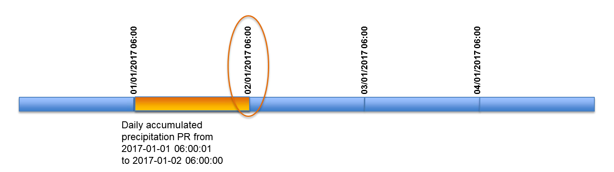
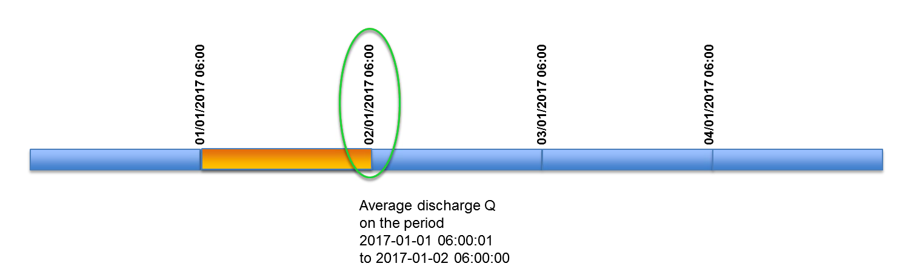
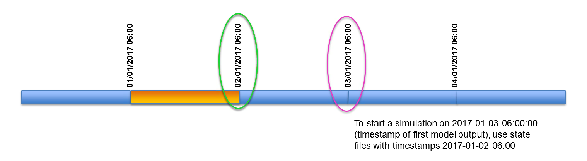

# Time management (start, end, re-start simulations)

## Time convention within LISFLOOD model

LISFLOOD follows an **"end of timestep" naming convention** for timestamps on both input (forcings) and output data.

Accordingly,  if timestamp "02/01/2017 06:00" is used for naming a time step of daily accumulated rainfall data, that time step will contain rainfall accumulation between  "01/01/2017 06:00" and "02/01/2017 06:00" (see  following figure).



Outputs  of LISFLOOD model will use the same naming convention. If timestamp  "02/01/2017 06:00" is used for naming a time step of daily discharge (output), that time step will contain average discharge over the period  between  "01/01/2017 06:00" and "02/01/2017 06:00" (see following  figure).



## Setting up time variables

In the `lfuser` element of the *Settings.xml* file, there are three different keys used to specify the start, end and initial state dates for a LISFLOOD simulation:

- **`StepStart`** specifies the starting date of the simulation. The starting date is also the date of the first LISFLOOD output. For example, we set `StepStart` to "02/01/2017 06:00":
    ```xml
    <textvar name="StepStart" value="02/01/2017 06:00"/>
    ```
    This means that  LISFLOOD will automatically use forcing meteorological data with timestamp "02/01/2017  06:00" (i.e. accumulated rainfall over the period between "01/01/2017  06:00" and "02/01/2017 06:00") and it will produce outputs with the  same timestamp (i.e. average discharge over the period between  "01/01/2017 06:00" and "02/01/2017 06:00").
    
- **`StepEnd`** specifies the end date of the simulation. The end date is also the date of the last LISFLOOD output. For instance, we set 'StepEnd' to "05/01/2017 06:00":
    ```xml
    <textvar name="StepEnd" value="05/01/2017 06:00"/>
    ```
    This means that the last output from LISFLOOD will have timestamp "05/01/2017 06:00" and it will represent, for instance, the average discharge over the previous 24 h.
- **`timestepInit`** specifies the timestamp that must be used to retrieve information from existing state files (i.e. from a previous simulation) to define the initial conditions of the current run. For  example, for a simulation that starts the "03/01/2017 06:00" we want to use hydrological state information from the last time step; we will set `timestepInit` to "02/01/2017 06:00".
    ```xml
    <textvar name="timestepInit" value="02/01/2017 06:00"/>
    ```
    Outputs from a previous run with timestamp "02/01/2017 06:00" will be used to initialize this run.



As il will be explained later, these three keys can be defined both as timestamps (dates) or timesteps (integer numbers). Apart from these three keys, there are another keys that concern the temporal settings. The two most relevant are:
* `CalendarDayStart`, which defines the originin of time whe writing/reading files, mus always be a date.
* `ReportSteps`, which defines the timesteps for which to produce output maps, must always be defined with timestemps (integers).
You can find a more exhaustive explanation on how to set time variables in the settings file in section [Step 2: Preparing the settings file](../3_step3_preparing-setting-file).

> <span style="color:red"> **Note**. Both timestamps and time steps ALWAYS refer to the END of the TIME INTERVAL!</span>

### Definig time variables using timestamps

Timestamps (dates) can be used to define `StepStart`, `StepEnd` and `timestepInit`. The string defining the date does not need to include the time (*hour:minute*); in that case, LISFLOOD implies midnight (00:00). When providing dates, `CalendarDayStart` takes usually a value equal to `StepStart` and is used by LISFLOOD to internally convert timestamps into timesteps. As mentioned earlier, `ReportSteps` must be provided as timesteps, which refer to the date of `CalendarDayStart`. In the following snippet of the settings file you can see an example on how to set the time variables with timestamps:

```xml
<lfuser>
    
    [...]

    <textvar name="CalendarDayStart" value="01/01/2015 06:00"/>
    <textvar name="StepStart" value="03/01/2015 06:00"/>                            
    <textvar name="StepEnd" value="05/01/2015 06:00"/>
    <textvar name="ReportSteps" value="1..5"/>
    
    [...]
    
</lfuser>
```

### Definig time variables using timesteps

In this option all variables but `CalendarDayStart` must be defined with timesteps (integers). `CalendarDayStart` is a date to which the timesteps refer to.

```xml
<lfuser>
    
    [...]

    <textvar name="CalendarDayStart" value="01/01/2015 06:00"/>
    <textvar name="StepStart" value="3"/>                            
    <textvar name="StepEnd" value="5"/>
    <textvar name="ReportSteps" value="1..5"/>
    
    [...]
    
</lfuser>
```

[:top:](#top)