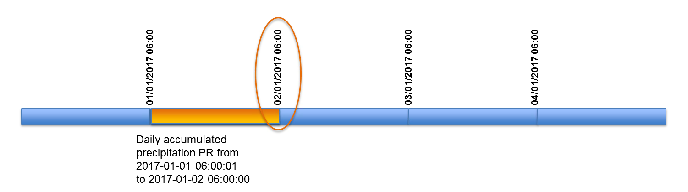
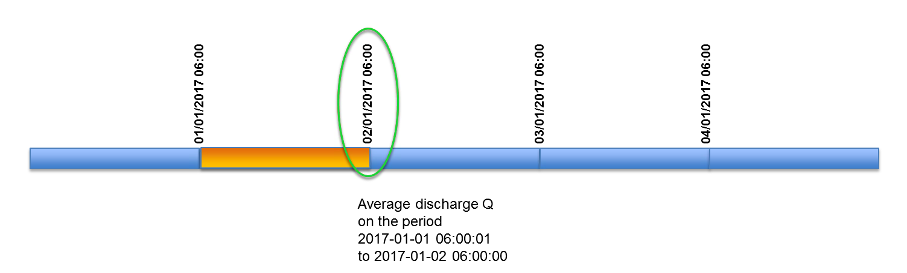
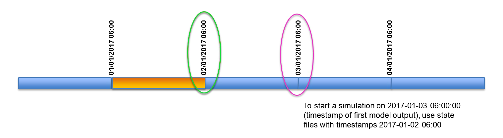

# Essential concepts

This page presents:
- an overview of the required files and folders
- an overview of the OS LISFLOOD Settings.xml file (the main and essential argument of OS LISFLOOD command line)
- the time convention within lisflood, understanding of the latter is **essential for a correct model set-up**.

## What is needed to run a OS LISFLOOD model?

In order the run a simulation you will need:

  -   Meteo input maps 
  -   Static input maps 
  -   Tables, only in case specific features such as reservoirs and lakes are included in the modeling excercis
  -   An empty output directory where all model data can be written 
  -   OS LISFLOOD settings file in .xml format

The section [Input files](../3_step4_preparing-input-files) provides a detailed description of input maps and tables.

The settings file (settings.xml) allows the selection of input maps, modelling options, and output variables and storage folder. The settings .xml is the essential argument of OS LISFLOOD command line. The section below presents its main components, an in depth descrition is provided in the section [Step 2: Preparing the Settings file](..//3_step3_preparing-setting-file/).


## OS LISFLOOD settings file (settings.xml)


All input files, output files, and parameter specifications are defined in a settings file. This file links variables and parameters in the model to in- and output files (maps, time series, tables) and numerical values. Moreover, the settings file can be used to specify the various model *options*. The settings file has a special (XML) structure. This page explains the general layout of the settings file; the section [Step 2: Preparing the Settings file](..//3_step3_preparing-setting-file/) provides an in-depth description of all the components of the file. 

A LISFLOOD settings file is made up of 3 elements, each of which has a specific function. 

For a LISFLOOD settings file, the basic structure looks like this:
<br>
**\<lfsettings\>**&nbsp;&nbsp;&nbsp;&nbsp;Start of settings elements<br>
&nbsp;&nbsp;<span style="color:blue"> **\<lfoptions\>**</span>&nbsp;&nbsp;&nbsp;&nbsp;Start of element with options<br>
&nbsp;&nbsp;&nbsp;&nbsp;&nbsp;&nbsp;&nbsp;&nbsp;&nbsp;&nbsp;&nbsp;&nbsp;&nbsp;&nbsp;&nbsp;&nbsp;&nbsp;&nbsp;&nbsp;&nbsp;&nbsp;&nbsp;&nbsp;&nbsp;<span style="color:blue"> LISFLOOD options (switches)</span><br>
&nbsp;&nbsp;<span style="color:blue"> **\</lfoptions\>**</span>&nbsp;&nbsp;&nbsp;&nbsp;End of element with options<br>
&nbsp;&nbsp;<span style="color:green"> **\<lfuser>**</span>&nbsp;&nbsp;&nbsp;&nbsp;Start of element with user-defined variables<br>
&nbsp;&nbsp;&nbsp;&nbsp;&nbsp;&nbsp;&nbsp;&nbsp;&nbsp;&nbsp;&nbsp;&nbsp;&nbsp;&nbsp;&nbsp;&nbsp;&nbsp;&nbsp;&nbsp;&nbsp;&nbsp;&nbsp;&nbsp;&nbsp;<span style="color:green"> User's specific parameters and settings</span><br>
&nbsp;&nbsp;<span style="color:green"> **\</lfuser\>**</span>&nbsp;&nbsp;&nbsp;&nbsp;End of element with user-defined variables<br>
&nbsp;&nbsp;<span style="color:pink"> **\<lfbinding\>**</span>&nbsp;&nbsp;&nbsp;&nbsp;Start of element with 'binding' variables<br>
&nbsp;&nbsp;&nbsp;&nbsp;&nbsp;&nbsp;&nbsp;&nbsp;&nbsp;&nbsp;&nbsp;&nbsp;&nbsp;&nbsp;&nbsp;&nbsp;&nbsp;&nbsp;&nbsp;&nbsp;&nbsp;&nbsp;&nbsp;&nbsp;<span style="color:pink"> LISFLOOD model general settings</span><br>
&nbsp;&nbsp;<span style="color:pink"> **\</lfbinding\>**</span>&nbsp;&nbsp;&nbsp;&nbsp;End of element with 'binding' variables<br>
**\</lfsettings\>**&nbsp;&nbsp;&nbsp;&nbsp;End of settings element<br>


### Main elements of the settings file
The sections ‘lfuser’, ‘lfoptions’ and ‘lfbinding’' have different purposes, as described below.

+ <span style="color:blue"> **lfoptions**</span> contains **switches to turn on/off specific components of the model**. Within LISFLOOD, there are two categories of options:
    - Options that activate OS LISFLOOD optional modules, such as simulate reservoirs, lakes, etc.
    - Options to activate the reporting of additional output maps and time series (e.g. soil moisture maps)

    Options are set to active using "1" (viceversa, "0" means that the option is de-activated).
    
    Users are not obliged to include all available options in Settings.xml file: if one option is not specified in Settings.xml, the default option will be automatically used.
    If Users leave the ‘lfoptions’ element empty, LISFLOOD will simply run using default options (i.e. run model without optional modules; only report most basic output files). 
    However, the ‘lfoptions’ element itself (i.e. <lfoptions> </lfoptions>) has to be present, even if empty.

    A comprehensive list of available options and default values is contained in the [Annex: settings and options](https://ec-jrc.github.io/lisflood-code/4_annex_settings_and_options/).


+ <span style="color:green"> **lfuser**</span> contains user-defined definition of **paths** to all in- and output files, and main model parameters (calibration + time-related).

     The variables in the ‘lfuser’ elements are all text variables, and they are used simply to substitute repeatedly used expressions in the binding element. 
     OS LISFLOOD code makes use of the settings in the 'lfbinding' section (see below). 'lfbinding' section includes all the settings. 'lfuser' section includes the subset of settings that are often changed by users. If a setting in the 'lfbinding' section refers to the 'lfuser' section, OS LISFLOOD code will use the latter one. 
     For example:

```xml
     'lfuser' secttion: 
     <textvar name="IrrigationEfficiency" value="$(PathMaps)/irrigation_efficiency_baseline.nc"></textvar>
     'lfbinding' secttion: 
     <textvar name="IrrigationEfficiency" value="$(IrrigationEfficiency)"></textvar>
```

+ <span style="color:pink"> **lfbinding**</span> contains definition of **all parameter values** of LISFLOOD model as well as **all in- and output maps, time series and tables**.

    Since OS LISFLOOD code refers to the ‘lfbinding’ section, it is possible to define everything directly in the ‘lfbinding’ section without using any text variables in 'lfuser' section. In that case, the ‘lfuser’ element can remain empty, even though it has to be present (i.e. <lfuser> </lfuser>).

    In general, it is a good idea to use user-defined variables for everything that needs to be changed on a regular basis (paths to input maps, tables, meteorological data, and parameter values). According to this approachm users will only need to verify and edit the variables in the ‘lfuser’ element, and changes to ‘lfbinding’ are not required.


## Time convention within OS LISFLOOD model

**LISFLOOD model follows an "end of timestep" naming convention** for timestamps of both input (forcings) and output data.

Accordingly,  if timestamp "02/01/2017 06:00" is used for naming a time step of daily  accumulated rainfall data, that time step will contain rainfall  accumulation between  "01/01/2017 06:00" and "02/01/2017 06:00" (see  following figure)



Outputs  of LISFLOOD model will use the same naming convention. If timestamp  "02/01/2017 06:00" is used for naming a time step of daily discharge (output), that time step will contain average discharge over the period  between  "01/01/2017 06:00" and "02/01/2017 06:00" (see following  figure)



In Settings file, three different keys are used to specify start date, end date and state file date for LISFLOOD simulation:

- **StepStart:** this key specifies the starting date of the simulation. The starting date is also the date of the first LISFLOOD output.
  >In Settings.xml: textvar name="StepStart" value="02/01/2017 06:00"

  >For  example, if we set StepStart to "02/01/2017 06:00", this means that  LISFLOOD will automatically use forcing data with timestamp "02/01/2017  06:00" (i.e. accumulated rainfall over the period between "01/01/2017  06:00" and "02/01/2017 06:00") and it will also store outputs with the  same timestamp (i.e. average discharge over the period between  "01/01/2017 06:00" and "02/01/2017 06:00").

- **StepEnd:** this key specifies the end date of the simulation. The end date is also the date of the last LISFLOOD output.
  >In Settings.xml:  textvar name="StepEnd value="05/01/2017 06:00"

  > For  example, if we set StepEnd to "05/01/2017 06:00", this means that last  output from LISFLOOD run will have timestamp "05/01/2017 06:00"

- **timestepInit:**  this key is used to specify which timestamp must be used to retrieve  information from existing state files (i.e. from a previous simulation)
  >For  example, if we want to start a new simulation at "03/01/2017 06:00" and  we want to use hydrological state information from the last time step,  we will set timestepInit to "02/01/2017 06:00". Outputs with timestamp  "02/01/2017 06:00" will be used to initialize the model, while the first  output of the simulation will be be store with timestamp "03/01/2017  06:00"



> <span style="color:red"> **Both timestamps and time steps ALWAYS refer to the END of the TIME INTERVAL!**</span>


### Using timestamps

Timestamps  (dates) can be used to set start date and end date of LISFLOOD  simulation. Dates can be used for keys: StepStart, StepEnd and  timestepInit in Settings.xml file. ReportSteps can only be provided as time steps numbers and are referred to CalendarDayStart ([Step 2: Preparing the Settings file](..//3_step3_preparing-setting-file/) provides an in-depth description of the Settings.xml file). 

If hours:minutes are not specified, LISFLOOD will automatically set them to 00:00

When using timestamps, CalendarDayStart key in Settings.xml is only used  internally to transform timestamps to model's time steps.

StepStart, StepEnd and timestepInit are used to access NetCDF files containing forcings and state variables, and to create output NetCDF files.


```xml
	<comment>                                                           	
	**************************************************************               
	TIME-RELATED CONSTANTS                                                
	**************************************************************               
	</comment>                                                          
	<textvar name="CalendarDayStart" value="02/01/2015 06:00">            
	<comment>                                                           
	Calendar day of 1st day in model run                                  
	Day of the year of first map (e.g. xx0.001) even if the model start   
	from map e.g. 500                                                     
	e.g. 1st of January: 1; 1st of June 151 (or 152 in leap year)         
	Needed to read out LAI tables correctly                               
	</comment>                                                          
	</textvar>                                                          
	<textvar name="DtSec" value="86400">                            
	<comment>                                                           
	timestep [seconds]                                                  
	</comment>                                                          
	</textvar>                                                          
	<textvar name="DtSecChannel" value="3600">                     
	<comment>                                                           
	Sub time step used for kinematic wave channel routing [seconds]     
	</comment>                                                          
	</textvar>                                                          
	<textvar name="StepStart" value="04/01/2015 06:00">                            
	<comment>                                                           
	Number of first time step in simulation                               
	</comment>                                                          
	</textvar>                                                          
	<textvar name="StepEnd" value="10/01/2015 06:00">                             
	<comment>                                                           
	Number of last time step in simulation                                
	</comment>                                                          
	</textvar>                                                          
	<textvar name="ReportSteps" value="3..6">                    
	<comment>                                                           
	Time steps at which to write model state maps                                              
	</comment>                                                          
	</textvar>                                                          
```


### Using time steps

Time  steps can still be used to set start step and end step of LISFLOOD  simulation. ReportSteps can only be provided as time steps numbers.

All steps numbers are referred to CalendarDayStart

When  using time steps, dates (including hours and minutes) to retrieve data for forcings and state variables are automatically determined by LISFLOOD.
