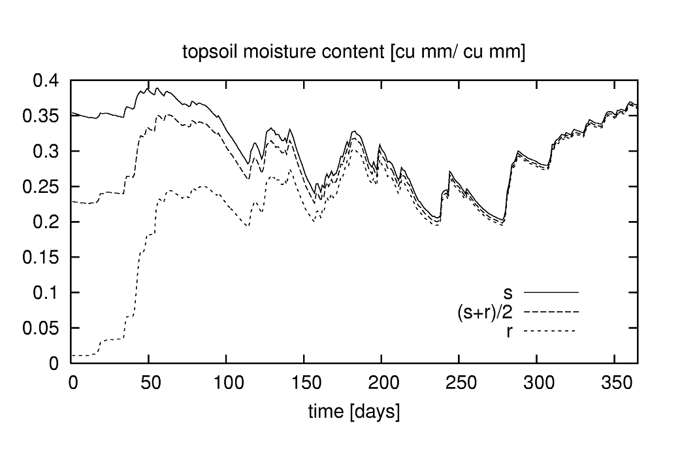
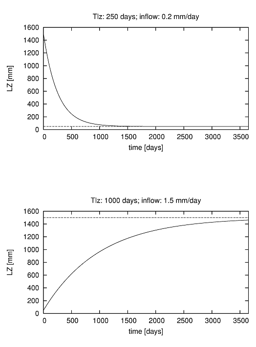

# Step 4: LISFLOOD initialization or prerun

Just as any other hydrological model, LISFLOOD needs to know the initial state (i.e. amount of water stored in the groundwater zone, soil, channels) of its internal state variables in order to start a simulation. However, in practice we hardly ever know the initial state of all state variables at a given time. Hence, the state of the initial storages must be estimated: this phase is the initialisation of a hydrological model.

A OS LISFLOOD simulation requires at least a prerun and a cold start. In some cases, performing warm start simulations might be convenient. The types of OS LISFLOOD runs are explained below. This page focuses on the OS LISFLOOD prerun, the next page is dedicated to the cold start and the warm start.

>**OS LISFLOOD prerun** simulation has the purpose to adequately initialize the state of the slow storages, namely groundwater zone and soil. OS LISFLOOD prerun constitutes the **initialization run**. OS LISFLOOD prerun output is used as input to the OS LISFLOOD cold start run.

>OS LISFLOOD cold start run and warm start run deliver the actual model outputs to be used for analysis/forecasts.

>**OS LISFLOOD cold start** run takes as input the OS LISFLOOD prerun output to initialize the slow storages (soil and groundwater). Initial values of fast(er) responding storages (e.g. channel volume) are set to bogus values. It is always recommended to discard the initial (3) years of the OS LISFLOOD cold start to allow adequate initialization of fast(er) responding storages.

>**OS LISFLOOD warm start** resumes the computations from the end states of a preceding simulation. 


In this page we will:

  1. [demonstrate the effect of the model's initial states on simulation results](../3_step4_model-initialisation/index.md#the-impact-of-the-model-initial-state-on-simulation-results)
  2. [explain the theory of initialisation and the steady-state storage concept](../3_step4_model-initialisation/index.md#the-theory-of-initialisation-and-the-steady-state-storage-concept)
  3. [explain how to run the pre-run (initialization) for kinematic (kinematic and diffusive) and split routing (split routing and diffusive) routing configurations](../3_step4_model-initialisation/index.md#setting-up-of-a-lisflood-prerun)
  4. [describe how to complete the initialisation in temporal chunks when needed](../3_step4_model-initialisation/index.md#setting-up-of-a-lisflood-prerun-in-temporal-chunks)
 
 

## The impact of the model initial state on simulation results 

When setting up a simulation, most of the internal state variables can be simply set to 0 at the start of the run. For example, this applies to the initial snow cover (*SnowCoverInitValue*), frost index (*FrostIndexInitValue*), interception storage (*CumIntInitValue*). 

However, this simple approach does not hold for all the state variables.

To better understand the impact of the initial model state on the results of a simulation, let's start with a simple example. The Figure below shows 3 LISFLOOD simulations of soil moisture for the upper soil layer. In the first simulation, it was assumed that the soil is initially completely saturated. In the second one, the soil was assumed to be completely dry (i.e. at residual moisture content). Finally, a third simulation was done where the initial soil moisture content was assumed to be in between these two extremes.

  

  **Figure:** *Simulation of soil moisture in upper soil layer for a soil that is initially at saturation (s), at residual moisture content (r) and in between (\[s+r\]/2)*

The initial amount of moisture in the upper soil layer only has a marked effect on the start of each simulation; after a few months the three curves converge. In other words, the "memory" of the upper soil layer only goes back a few months (or, more precisely, for time lags of more than about 8 months the autocorrelation in time is negligible).

This behaviour provides a convenient and simple way to initialise the soil moisture state of the upper soil layer. Suppose we want to do a simulation of the year 1995. We obviously don't know the state of the soil at the beginning of that year. However, we can get around this by starting the simulation a bit earlier than 1995, say one year. In that case we use the year 1994 as a *spin-up* period, assuming that by the start of 1995 the influence of the initial conditions (i.e. 1-1-1994) is negligible. 

Even though the use of a sufficiently long spin-up period usually results in a correct initialisation of many state variables, the time needed to initialise any storage component of the model is dependent on its specific average residence time of the water. As briefly shown above, the moisture content of the upper soil layer tends to respond relatively quickly to meteorological forcing variables (precipitation, evapo(transpi)ration). As a result, relatively short spin-up periods are sufficient to initialise this storage component. At the other extreme, the response of the (thick) lower soil layers and of the lower groundwater zone is generally very slow. 

To explain the challenge of the adequate initialization of the lower groundwater zone, we resume here the content presented in [this chapter](https://ec-jrc.github.io/lisflood-model/2_13_stdLISFLOOD_groundwater/) of OS LISFLOOD Model Documentation. 

The Figure below shows the results of two numerical experiments. In the upper Figure, we start with a very high initial storage of the groundwater lower zone (1500 mm). The inflow rate is fairly small (0.2 mm/day), and the outflow rate is relatively large. What is interesting here is that, over time, the storage evolves asymptotically towards a constant state. In the lower Figure, we start with a much smaller initial storage (50 mm), but the inflow rate is much higher (1.5 mm/day) and the outflow rate is much smaller. Here we see an upward trend, again towards a constant value. However, in this case the constant ‘end’ value is not reached within the simulation period. 



**Figure:** Two 10-year simulations of lower zone storage with constant inflow. Upper Figure: high initial storage, storage approaches steady-state storage
(dashed) after about 1500 days. Lower Figure: low initial storage, storage doesn’t reach steady-state within 10 years.

At this point it should be clear that being able to know the ‘end’ storages in the Figure above in advance would be very helpful, because it would eliminate any trend in the water content of the lower groundwater zone. 

A similar reasoning applies to the soil water content of the third soil layer.

Spurious trends in the soil layers and in the lower groundwater zone will obviously lead to spurious trends in the baseflow simulations. Consequently, to avoid unrealistic trends in the simulations, very long spin-up periods may be needed, thus requiring a large amount of computational and time resources.

To by-pass the need for excessively long spin-up periods, LISFLOOD is capable of calculating a *steady-state* storage amount for the third soil layer and for the lower groundwater zone. 


## The theory of initialisation and the steady-state storage concept

The following paragraphs explain how the analytical solutions can be used to leverage on the **outputs of a OS LISFLOOD prerun** to adequately initialize volumetric soil moisture content and lower groundwater zone water content of a **OS LISFLOOD cold start**.

The complete list of initial state values for a **OS LISFLOOD prerun** is presented [here](../3_step2_preparing-setting-file/index.md#initial-conditions-os-lisflood-prerun-cold-start-warm-start). The only relevant outputs of the OS LISFLOOD prerun are:
- end states of volumetric soil content and upper groundwater zone water content;
- average fluxes values (from upper to lower soil layer, net inflow to the lower groundwater zone);
- average discharge (when using SplitRouting).


### Initialization of volumetric soil moisture content 

> An improved initialization scheme has been implemented in OS-LISFLOOD v5, allowing to remove non-realistic trends in the third soil layer volumetric soil moisture content and consequent fictitious discharge values in the channels. These were previously observed, for example, in arid climates. Albeit the former initialization strategy with bogus values is still feasible, the use of the methodology explained here is highly recommended, for all modelling exercises.

OS LISFLOOD prerun provides in output end states and average fluxes. The end states are the volumetric soil moisture content for the three soil layers and the three land covers (9 maps). The average fluxes represent the average infiltration (over the simulation period) from the soil layer 2 to soil layer 3, for the three land cover fractions (3 maps indicated as *SeepTopToSubBAverageOther/Forest/Irrigated*). In the cold run, the end states are used to initialise the volumetric soil moisture content of soil layers 1 and 2. The initialisation of the volumetric soil moisture content of soil layer 3 makes use of the relevant end state and of the fluxes.
Specifically, according to the steady-state approach, the model tries to enable long term equilibrium conditions between average inflow and outflow fluxes in the third soil layer. 
*SeepTopToSubBAverageOther/Forest/Irrigated* is the average inflow to the third soil layer. As explained above, this quantity is computed during the prerun.

$$ 
q_{soil2to3,fraction} = SeepTopToSubBAverageFraction
$$

The prerun must include a sufficiently long simulation period (a few decades) to allow the computation of representative values of  *SeepTopToSubBAverageOther/Forest/Irrigated*. Furthermore, accounting for an adequate spin-up period of the prerun is recommended to compute realistic average fluxes values. This latter outcome can be achieved by adequately setting the value of *NumDaysSpinUp* (recommended value: 1095 days, i.e. 3 years). 

Within OS LISFLOOD, the outflow from the third soil layer to the upper groundwater zone is defined by the equations explained in the chapter [Soil moisture redistribution](https://ec-jrc.github.io/lisflood-model/2_12_stdLISFLOOD_soilmoisture-redistribution/) of the [Model Documentation](https://ec-jrc.github.io/lisflood-model/).

$$ 
q_{soil3toUZ,fraction} = K_s \cdot \sqrt{( \frac{w - w_r}{w_s - w_r})} \cdot \{ 1 - [ 1 - ( \frac{w -w_r}{w_s - w_r})^\frac{1}{m}]^m\}^2
$$

where $K_s$ is the saturated conductivity of the soil $[\frac{mm}{day}]$; and $w, w_r$ and $w_s$ are the actual, residual and maximum amounts of moisture in the soil respectively (all in $[mm]$); $m$ is a parameter related to the pore-size index.

The long term equilibrium conditions between average inflow and outflow fluxes requires, for each fraction, within each pixel:

$$ 
SeepTopToSubBAverageFraction = K_s \cdot \sqrt{( \frac{w - w_r}{w_s - w_r})} \cdot \{ 1 - [ 1 - ( \frac{w -w_r}{w_s - w_r})^\frac{1}{m}]^m\}^2
$$

The third layer volumetric soil moisture content *steady state storage* value is computed by solving the second-order, non-linear equation above, where $w$ is the only unknown.  
Prerun end states of volumetric soil moisture of layer 3 are used as initial guess for the numerical solution of the equation above.


### Initialization of the upper groundwater zone water content
To initialize the upper groundwater zone water content it is recommended to use the end state generated by the prerun. <br>


### Initialisation of the lower groundwater zone water content

According to the steady-state approach, the condition in which *the lower groundwater zone storage is constant over time means that the in- and outflow terms balance each other out*. OS LISFLOOD approach for the computation of inflow, outflow, and storage variation is explained in the chapter [Groundwater](https://ec-jrc.github.io/lisflood-model/2_13_stdLISFLOOD_groundwater/) of the [Model Documentation](https://ec-jrc.github.io/lisflood-model/).

The prerun computes the average net inflow $LZavin$ over the simulation period. For this purpose, the prerun must include a sufficiently long simulation period (a few decades) to achieve representative $LZavin$ values.

Within OS LISFLOOD, groundwater outflow is computed as:

$$
Q_{lz}=\frac{1}{T_{lz}} \cdot LZ
$$

$T_{lz}$ is a parameter provided as input to the model or defined by calibration.

The steady state storage $LZ_{ss}$ is then computed internally by the code:

$$
\frac{1}{T_{lz}} \cdot LZ =  LZ_{avin}
$$

$$
LZ_{ss} = T_{lz} \cdot LZ_{avin}
$$


 The set-up of the prerun run is explained below; the protocol differs slightly depending on the settings of the split routing option.

**Table:** LISFLOOD special initialisation methods activated by setting the value of each respective variable to a 'bogus' value of -9999

| **Variable**          | **Description**       | **Initialisation method**     |
|-------------------------------|-------------------------------|-------------------------------|
| ThetaInit1Value  <br> ThetaForestInit1Value  <br> ThetaIrrigationInit1Value    | initial volumetric soil moisture content<br> superficial soil layer (V/V)| set to soil moisture content <br> at field capacity, recommended only in LISFLOOD **prerun**|
| ThetaInit2Value  <br> ThetaForestInit2Value  <br> ThetaIrrigationInit2Value     | initial volumetric soil moisture content <br> upper soil layer (V/V) | set to soil moisture content <br> at field capacity, recommended only in LISFLOOD **prerun** |
| ThetaInit3Value  <br> ThetaForestInit3Value  <br> ThetaIrrigationInit3Value     | initial volumetric soil moisture content <br> lower soil layer (V/V) | set to soil moisture content <br> at field capacity, recommended only in LISFLOOD **prerun** |
| LZInitValue       | initial water in lower <br>  groundwater zone ($mm$)    | set to steady-state storage, only used in LISFLOOD **coldstart** |
| TotalCrossSectionArea <br> InitValue | initial cross-sectional area ($m^2$) <br> of water in channels              | set to half of bankfull depth, used in LISFLOOD **prerun and coldstart**      |
| PrevDischarge <br>PrevDischargeAvg        | Initial discharge ($m^3/s$)     | set to half of bankfull depth, used in LISFLOOD **prerun and coldstart**       |


*Note that the "-9999" 'bogus' value can *only* be used with the variables in the Table above; the use of the 'bogus' value for all the other variables will produce nonsense results!<br>*


## Setting-up of a LISFLOOD prerun

### Option 1: If using Kinematic routing only (no split routing):

1) Set initial state of all state variables to either 0, 1 or -9999 (i.e. cold start with bogus values or internally initialised values) in Settings.XML file

2) Activate the “InitLisfloodwithoutsplit” and the "InitLisflood" options in <lfoptions> section of Settings.XML file using:
```xml
       <setoption choice="1" name="InitLisflood"/>
       <setoption choice="1" name="InitLisfloodwithoutsplit"/>
       <setoption choice="0" name="ColdStart/>

       **************************************************************
       TIME-RELATED CONSTANTS
       **************************************************************      
       <textvar name="NumDaysSpinUp" value="1095">
       <comment>
       Number of days to be discarded when computing the average fluxes in the initialization (prerun) simulation.
       The use of NumDaysSpinUp avoids spurious large fluxes values driven by bogus initial conditions.
       Recommended value when performing the initialization (prerun) in one chunk or the cold start of the initialization (prerun) >= 1095 (3 years)  
       Value for lisflood cold run, warm start prerun/run: 0
       </comment>
       </textvar> 

```
  
3) Activate reporting maps (in NetCDF format) in <lfoptions> section of Settings.XML file using:
```xml
    <setoption choice="1" name="repEndMaps"/>
    <setoption choice="1" name="writeNetcdf"/>
```

4) Set split routing option to not active in <lfoptions> section of Settings.XML file using:
```xml
       <setoption choice="0" name="SplitRouting"/>
```

5) Set the name of the reporting map for average percolation rate from second to third soil layer, and from upper to lower groundwater zone in <lfuser> section of Settings.XML file using:
```xml
    <textvar name="LZAvInflowMap" value="$(PathOut)/lzavin">
    <textvar name="SeepTopToSubBAverageOtherMap" value= "$(PathOut)/SeepTopToSubBAverageOtherMap">
    <textvar name="SeepTopToSubBAverageForestMap" value= "$(PathOut)/SeepTopToSubBAverageForestMap">
    <textvar name="SeepTopToSubBAverageIrrigationMap" value= "$(PathOut)/SeepTopToSubBAverageIrrigationMap">
```
Similarly, set the name of the reporting map for the end states in <lfuser> section of Settings.XML. Some examples are provided below:
```xml
    <textvar name="Theta1End" value="$(PathOut)/th1.end">
    <textvar name="Theta2End" value="$(PathOut)/th2.end">
    <textvar name="Theta3End" value="$(PathOut)/th3.end">
    <textvar name="Theta1ForestEnd" value="$(PathOut)/thf1.end">
    <textvar name="Theta2ForestEnd" value="$(PathOut)/thf2.end">
    <textvar name="Theta3ForestEnd" value="$(PathOut)/thf3.end">
    <textvar name="Theta1IrrigationEnd" value="$(PathOut)/thi1.end">
    <textvar name="Theta2IrrigationEnd" value="$(PathOut)/thi2.end">
    <textvar name="Theta3IrrigationEnd" value="$(PathOut)/thi3.end">
    <textvar name="UZEnd" value="$(PathOut)/uz.end">
    <textvar name="UZForestEnd" value="$(PathOut)/uzf.end">
    <textvar name="UZIrrigationEnd" value="$(PathOut)/uzi.end">
```
6) Run the model for a long period (best for the whole modelling period)


### Option 2: If using Split routing:

1) Set initial state of all state variables to either 0,1 or -9999 (i.e. cold start with default values or internally initialised values) in Settings.XML file

2) Activate the “InitLisflood” option in <lfoptions> section of Settings.XML file using:
```xml
    <setoption choice="0" name="InitLisfloodwithoutsplit"/>
    <setoption choice="1" name="InitLisflood"/>
    <setoption choice="0" name="ColdStart"/>
```

3) Activate reporting maps (in NetCDF format) in <lfoptions> section of Settings.XML file using:
```xml
    <setoption choice="1" name="repEndMaps"/>
    <setoption choice="1" name="writeNetcdf"/>
```

4) Set split routing option to active in <lfoptions> section of Settings.XML file using:
```xml
    <setoption choice="1" name="SplitRouting"/>
```

5) Set the name of the reporting map for average percolation rate from second to third soil layer, and from upper to lower groundwater zone in <lfuser> section of Settings.XML file using:
```xml
    <textvar name="LZAvInflowMap" value="$(PathOut)/lzavin">
    <textvar name="SeepTopToSubBAverageOtherMap" value= "$(PathOut)/SeepTopToSubBAverageOtherMap">
    <textvar name="SeepTopToSubBAverageForestMap" value= "$(PathOut)/SeepTopToSubBAverageForestMap">
    <textvar name="SeepTopToSubBAverageIrrigationMap" value= "$(PathOut)/SeepTopToSubBAverageIrrigationMap">
```
Similarly, set the name of the reporting map for the end states in <lfuser> section of Settings.XML. Some examples are provided below:
```xml
    <textvar name="Theta1End" value="$(PathOut)/th1.end">
    <textvar name="Theta2End" value="$(PathOut)/th2.end">
    <textvar name="Theta3End" value="$(PathOut)/th3.end">
    <textvar name="Theta1ForestEnd" value="$(PathOut)/thf1.end">
    <textvar name="Theta2ForestEnd" value="$(PathOut)/thf2.end">
    <textvar name="Theta3ForestEnd" value="$(PathOut)/thf3.end">
    <textvar name="Theta1IrrigationEnd" value="$(PathOut)/thi1.end">
    <textvar name="Theta2IrrigationEnd" value="$(PathOut)/thi2.end">
    <textvar name="Theta3IrrigationEnd" value="$(PathOut)/thi3.end">
    <textvar name="UZEnd" value="$(PathOut)/uz.end">
    <textvar name="UZForestEnd" value="$(PathOut)/uzf.end">
    <textvar name="UZIrrigationEnd" value="$(PathOut)/uzi.end">
```

6) Set the name of the reporting map for average discharge map in <lfuser> section of Settings.XML file using:
```xml
    <textvar name="AvgDis" value="$(PathOut)/avgdis">
```

7) Run the model for a long period (best for the whole modelling period)


> - Using option SplitRouting=1 but InitLisfloodwithoutsplit=1  will result in an AvgDis file with zero values everywhere.
> - In case of doubts, check content of AvgDis file: if it's all zero, then split routing must be off. Note that an AvgDis file containing all zero values will automatically set LISFLOOD cold start to no split routing, even if SplitRouting=1.


## Setting-up of a LISFLOOD prerun in temporal chunks

Due to specific settings of the computational infrastructure (e.g. timewall that limits the maximum duration of a job), it might be necessary to complete the LISFLOOD initialization in chunks.

As an example, the full initialization period 02/01/1980-01/01/2025 must be computed in three temporal chunks:
* (a) 02/01/1980 00:00 - 01/01/1995 00:00, 
* (b) 02/01/1995 00:00 - 01/01/2010 00:00, 
* (c) 02/01/2010 00:00 - 01/01/2025 00:00 

Starting with LISFLOOD v5, the computation of the initialization run in temporal chunk can be performed by following the instructions below (the same instructions apply with SplitRouting on or off)

**Prerun (a): cold start**

```xml
    <setoption choice="1" name="InitLisflood"/>
    <setoption choice="0" name="InitLisfloodwithoutsplit"/>   OR  <setoption choice="1" name="InitLisfloodwithoutsplit"/>
    <setoption choice="0" name="ColdStart/>

    **************************************************************
    TIME-RELATED CONSTANTS
    **************************************************************      
    <textvar name="NumDaysSpinUp" value="1095">
                <comment>
                    Number of days to be discarded when computing the average fluxes in the initialization (prerun) simulation.
                    The use of NumDaysSpinUp avoids spurious large fluxes values driven by bogus initial conditions.
                    Recommended value when performing the initializtion (prerun) in one chunk or the cold start of the initialization (prerun) >= 1095 (3 years)  
                    Value for lisflood cold run, warm start prerun/run: 0
                </comment>
    </textvar> 


    <comment>
    **************************************************************
    CUMULATIVE FLUXES REQUIRED WHEN COMPUTING THE PRE-RUN IN CHUNKS
    **************************************************************
    </comment>

    <textvar name="LZInflowCUMInit" value="0">
                <comment>
                    Cumulative inflow to the lower groundwater zone
                    0: this is appropriate for the cold start of the pre-run, the cold start of the run, the warm start of the run
                    LZInflowCumEnd: required for the warm start of the pre-run
                </comment>
     </textvar>   
       
     <textvar name="cumSeepTopToSubBOtherInit" value="0">
                <comment>
                    Cumulative flux from second to third soil layer, other land cover fraction
                    0: this is appropriate for the cold start of the pre-run, the cold start of the run, the warm start of the run
                    cumSeepTopToSubBOtherEnd: required for the warm start of the pre-run
                </comment>       
     </textvar>
       
     <textvar name="cumSeepTopToSubBForestInit" value="0">
                <comment>
                    Cumulative flux from second to third soil layer, forest land cover fraction
                    0: this is appropriate for the cold start of the pre-run, the cold start of the run, the warm start of the run
                    cumSeepTopToSubBForestEnd: required for the warm start of the pre-run
                </comment>       
     </textvar>
       
     <textvar name="cumSeepTopToSubBIrrigationInit" value="0">
                <comment>
                    Cumulative flux from second to third soil layer, irrigation land cover fraction
                    0: this is appropriate for the cold start of the pre-run, the cold start of the run, the warm start of the run
                    cumSeepTopToSubBIrrigationEnd: required for the warm start of the pre-run
                </comment>       
     </textvar>
       
     <textvar name="CumQInit" value="0">
                <comment>
                    Cumulative discharge
                    0: this is appropriate for the cold start of the pre-run, the cold start of the run, the warm start of the run
                    CumQEnd: required for the warm start of the pre-run
                </comment>       
     </textvar>           
                            
     <textvar name="TimeSinceStartPrerunChunkInit" value="0">
                <comment>
                    Cumulative number of days from the start of the prerun
                    0: this is appropriate for the cold start of the pre-run, the cold start of the run, the warm start of the run
                    TimeSinceStartPrerunChunkEnd: required for the warm start of the pre-run
                </comment>       
     </textvar>
         

```

Prerun (a) generates the following intermediate outputs:

-End files of state variables  
-LZInflowCUMEnd,  
-CumQEnd,  
-cumSeepTopToSubBForestEnd,  
-cumSeepTopToSubBOtherEnd,  
-cumSeepTopToSubBIrrigationEnd,  
-TimeSinceStartPrerunChunkEnd.  

**Prerun (b): warm start**

```xml
       <setoption choice="1" name="InitLisflood"/>
       <setoption choice="0" name="InitLisfloodwithoutsplit"/>   OR  <setoption choice="1" name="InitLisfloodwithoutsplit"/>
       <setoption choice="0" name="ColdStart/>

    **************************************************************
    TIME-RELATED CONSTANTS
    **************************************************************      
    <textvar name="NumDaysSpinUp" value="0">
                <comment>
                    Number of days to be discarded when computing the average fluxes in the initialization (prerun) simulation.
                    The use of NumDaysSpinUp avoids spurious large fluxes values driven by bogus initial conditions.
                    Recommended value when performing the initialization (prerun) in one chunk or the cold start of the initialization (prerun) >= 1095 (3 years)  
                    Value for lisflood cold run, warm start prerun/run: 0
                </comment>
    </textvar> 


    <comment>
    **************************************************************
    CUMULATIVE FLUXES REQUIRED WHEN COMPUTING THE PRE-RUN IN CHUNKS
    **************************************************************
    </comment>

    <textvar name="LZInflowCUMInit" value="$(PathInit)/LZInflowCumEnd">
                <comment>
                    Cumulative inflow to the lower groundwater zone
                    0: this is appropriate for the cold start of the pre-run, the cold start of the run, the warm start of the run
                    LZInflowCumEnd: required for the warm start of the pre-run
                </comment>
     </textvar>   
       
     <textvar name="cumSeepTopToSubBOtherInit" value="$(PathInit)/cumSeepTopToSubBOtherEnd">
                <comment>
                    Cumulative flux from second to third soil layer, other land cover fraction
                    0: this is appropriate for the cold start of the pre-run, the cold start of the run, the warm start of the run
                    cumSeepTopToSubBOtherEnd: required for the warm start of the pre-run
                </comment>       
     </textvar>
       
     <textvar name="cumSeepTopToSubBForestInit" value="$(PathInit)/cumSeepTopToSubBForestEnd">
                <comment>
                    Cumulative flux from second to third soil layer, forest land cover fraction
                    0: this is appropriate for the cold start of the pre-run, the cold start of the run, the warm start of the run
                    cumSeepTopToSubBForestEnd: required for the warm start of the pre-run
                </comment>       
     </textvar>
       
     <textvar name="cumSeepTopToSubBIrrigationInit" value="$(PathInit)/cumSeepTopToSubBIrrigationEnd">
                <comment>
                    Cumulative flux from second to third soil layer, irrigation land cover fraction
                    0: this is appropriate for the cold start of the pre-run, the cold start of the run, the warm start of the run
                    cumSeepTopToSubBIrrigationEnd: required for the warm start of the pre-run
                </comment>       
     </textvar>
       
     <textvar name="CumQInit" value="$(PathInit)/CumQEnd">
                <comment>
                    Cumulative discharge
                    0: this is appropriate for the cold start of the pre-run, the cold start of the run, the warm start of the run
                    CumQEnd: required for the warm start of the pre-run
                </comment>       
     </textvar>           
                            
     <textvar name="TimeSinceStartPrerunChunkInit" value="$(PathInit)/TimeSinceStartPrerunChunkEnd">
                <comment>
                    Cumulative number of days from the start of the prerun
                    0: this is appropriate for the cold start of the pre-run, the cold start of the run, the warm start of the run
                    TimeSinceStartPrerunChunkEnd: required for the warm start of the pre-run
                </comment>       
     </textvar>
          

```
Prerun (b) uses the intermediate outputs of prerun(a) and generates an update of the same end variables for the intermediate chunk (b):

-End files of state variables
-LZInflowCUMEnd,
-CumQEnd,
-cumSeepTopToSubBForestEnd,
-cumSeepTopToSubBOtherEnd,
-cumSeepTopToSubBIrrigationEnd,
-TimeSinceStartPrerunChunkEnd.


**Prerun (c): warm start**

```xml
       <setoption choice="1" name="InitLisflood"/>
       <setoption choice="0" name="InitLisfloodwithoutsplit"/>   OR  <setoption choice="1" name="InitLisfloodwithoutsplit"/>
       <setoption choice="0" name="ColdStart/>

       **************************************************************
       TIME-RELATED CONSTANTS
       **************************************************************      
       <textvar name="NumDaysSpinUp" value="0">
       <comment>
       Number of days to be discarded when computing the average fluxes in the initialization (prerun) simulation.
       The use of NumDaysSpinUp avoids spurious large fluxes values driven by bogus initial conditions.
       Recommended value when performing the initialization (prerun) in one chunk or the cold start of the initialization (prerun) >= 1095 (3 years)  
       Value for lisflood cold run, warm start prerun/run: 0
       </comment>
       </textvar> 

```

Prerun(c) uses the intermediate outputs of prerun(b) and returns the outputs for the full initialization period (in the example above, prerun(c) reports the results for 02/01/1980 00:00 - 01/01/2025 00:00). 
Therefore, Prerun(c) generates all the files to be used for the LISFLOOD Cold Start.
These outputs are:

    | Output file | Description |
|-------------|-------------|
| lzavin.nc | Average percolation rate from upper to lower groundwater zone |
| SeepTopToSubBAverageOtherMap.nc | Average flux from layer 2 to layer 3 — other fraction |
| SeepTopToSubBAverageForestMap.nc | Average flux from layer 2 to layer 3 — forest fraction |
| SeepTopToSubBAverageIrrigationMap.nc | Average flux from layer 2 to layer 3 — irrigation fraction |
| avgdis.nc | Average discharge (only with SplitRouting) |
| th1.end.nc | End state soil moisture — other — layer 1 |
| th2.end.nc | End state soil moisture — other — layer 2 |
| th3.end.nc | End state soil moisture — other — layer 3 |
| thf1.end.nc | End state soil moisture — forest — layer 1 |
| thf2.end.nc | End state soil moisture — forest — layer 2 |
| thf3.end.nc | End state soil moisture — forest — layer 3 |
| thi1.end.nc | End state soil moisture — irrigation — layer 1 |
| thi2.end.nc | End state soil moisture — irrigation — layer 2 |
| thi3.end.nc | End state soil moisture — irrigation — layer 3 |
| uz.end.nc | End state upper groundwater zone — other |
| uzf.end.nc | End state upper groundwater zone — forest |
| uzi.end.nc | End state upper groundwater zone — irrigation |
