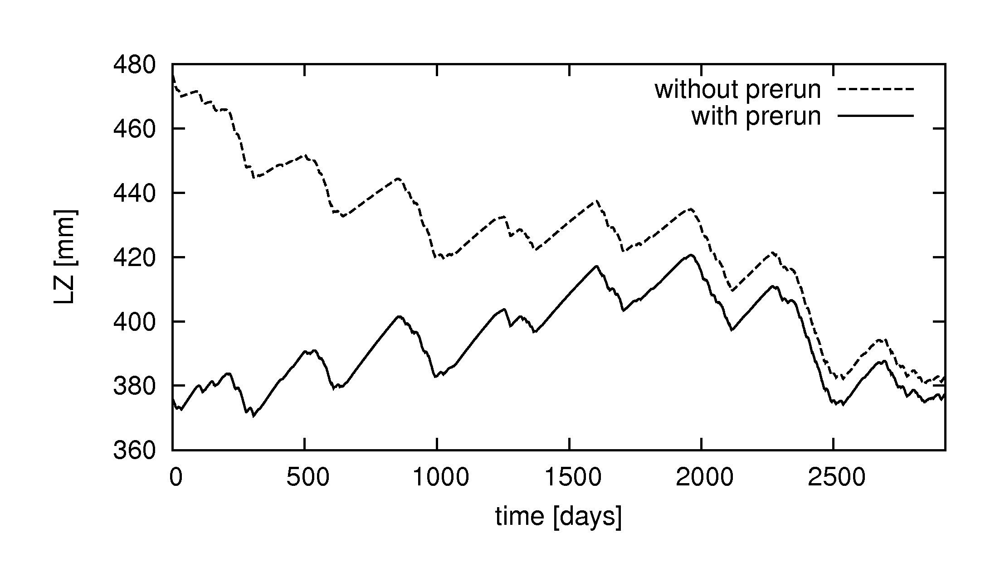

# Step 5: Running LISFLOOD: cold start and warm start

> **!Reminder!** Types of OS LISFLOOD model runs and their purpose:

>**OS LISFLOOD prerun** simulation has the purpose to adequately initialize the state of the slow storages, namely groundwater zone and soil. OS LISFLOOD prerun constitutes the **initialization run**. OS LISFLOOD prerun output is used as input to the OS LISFLOOD cold start run.

>OS LISFLOOD cold start run and warm start run deliver the actual model outputs to be used for analysis/forecasts.

>**OS LISFLOOD cold start** run takes as input the OS LISFLOOD prerun output to initialize the slow storages (soil and groundwater). Initial values of fast(er) responding storages (e.g. channel volume) are set to bogus values. It is always recommended to discard the initial (3) years of the OS LISFLOOD cold start to allow adequate initialization of fast(er) responding storages.

>**OS LISFLOOD warm start** resumes the computations from the end states of a preceding simulation. 

## Setting-up a OS LISFLOOD cold start simulation

Running a OS LISFLOOD cold start simulation requires the following settings:

```xml
    <setoption choice="0" name="InitLisfloodwithoutsplit"/>
    <setoption choice="0" name="InitLisflood"/>
    <setoption choice="1" name="ColdStart"/>
```
> Note that the option <setoption choice="1" name="ColdStart/> was introduced with LISFLOOD v5.

OS LISFLOOD cold start requires the output of the OS LISFLOOD prerun.
The prerun generates a number (from 1 to 17, depending on the .xml settings) of maps in NetCDF format. 

The following list enumerates the files required for the correct execution of the LISFLOOD Cold Start:

| File name | Description | Requirement |
|-----------|-------------|-------------|
| lzavin.nc | Average inflow to lower groundwater zone | Strictly required |
| avgdis.nc | Average channel discharge | Strictly required (only with SplitRouting) |
| uz.end.nc | Upper groundwater zone water content — other fraction | Strongly recommended |
| uzf.end.nc | Upper groundwater zone water content — forest fraction | Strongly recommended |
| uzi.end.nc | Upper groundwater zone water content — irrigation fraction | Strongly recommended |
| th1.end.nc | Soil moisture — other fraction — layer 1 (superficial) | Strongly recommended |
| th2.end.nc | Soil moisture — other fraction — layer 2 (upper) | Strongly recommended |
| th3.end.nc | Soil moisture — other fraction — layer 3 (lower) | Strongly recommended |
| thf1.end.nc | Soil moisture — forest fraction — layer 1 (superficial) | Strongly recommended |
| thf2.end.nc | Soil moisture — forest fraction — layer 2 (upper) | Strongly recommended |
| thf3.end.nc | Soil moisture — forest fraction — layer 3 (lower) | Strongly recommended |
| thi1.end.nc | Soil moisture — irrigation fraction — layer 1 (superficial) | Strongly recommended |
| thi2.end.nc | Soil moisture — irrigation fraction — layer 2 (upper) | Strongly recommended |
| thi3.end.nc | Soil moisture — irrigation fraction — layer 3 (lower) | Strongly recommended |
| SeepTopToSubBAverageOtherMap.nc | Average flux from layer 2 to layer 3 — other fraction | Strongly recommended |
| SeepTopToSubBAverageForestMap.nc | Average flux from layer 2 to layer 3 — forest fraction | Strongly recommended |
| SeepTopToSubBAverageIrrigationMap.nc | Average flux from layer 2 to layer 3 — irrigation fraction | Strongly recommended |


Copy those maps (found in folder "out", see the setting $(PathOut) of the prerun settings .xml) into the folder "init" ($(PathInit) of the cold start settings .xml)


```xml
**************************************************************
INITIAL CONDITIONS FOR THE WATER BALANCE MODEL
(can be either maps or single values)
**************************************************************
</comment>

<textvar name="LZAvInflowMap" value="$(PathInit)/lzavin">
<comment>
$(PathInit)/lzavin.map
Reported map of average percolation rate from upper to
lower groundwater zone (reported for end of simulation)
</comment>
</textvar>

<textvar name="AvgDis" value="$(PathInit)/avgdis">
<comment>
$(PathInit)/avgdis.map
CHANNEL split routing in two lines
Average discharge map [m3/s]
</comment>
</textvar>

<textvar name="SeepTopToSubBAverageOtherMap" value= "$(PathInit)/SeepTopToSubBAverageOtherMap">
<textvar name="SeepTopToSubBAverageForestMap" value= "$(PathInit)/SeepTopToSubBAverageForestMap">
<textvar name="SeepTopToSubBAverageIrrigationMap" value= "$(PathInit)/SeepTopToSubBAverageIrrigationMap">

**************************************************************
INITIAL CONDITIONS OTHER/FOREST/IRRIGATION
(maps or single values)
**************************************************************

<textvar name="ThetaInit1Value" value="$(PathInit)/th1.end">
<textvar name="ThetaInit2Value" value="$(PathInit)/th2.end">
<textvar name="ThetaInit3Value" value="$(PathInit)/th3.end">

<textvar name="ThetaForestInit1Value" value="$(PathInit)/thf1.end">
<textvar name="ThetaForestInit2Value" value="$(PathInit)/thf2.end">
<textvar name="ThetaForestInit3Value" value="$(PathInit)/thf3.end">

<textvar name="ThetaIrrigationInit1Value" value="$(PathInit)/thi1.end">
<textvar name="ThetaIrrigationInit2Value" value="$(PathInit)/thi2.end">
<textvar name="ThetaIrrigationInit3Value" value="$(PathInit)/thi3.end">

<textvar name="UZInitValue" value="$(PathInit)/uz.end">
<textvar name="UZForestInitValue" value="$(PathInit)/uzf.end">
<textvar name="UZIrrigationInitValue" value="$(PathInit)/uzi.end">
```

>Users must be aware that values of internal state variables of the model** (especially lower zone storage) strongly dependent on the parameterisation used. Hence, suppose we have 'end maps' and 'average flux maps' that were created using parameter set *A*, then these maps should **not** be used as initial conditions for a model run with a different parameter set *B*. Mixing parameter sets will likely lead to serious initialisation problems (but these may not be immediately visible in the output!).


### Verify the correct execution of model initialization

Before proceeding to analyse the fluxes and states of interest (e.g. discharge, soil moisture, reservoir storage), it is strongly recommended to carefully verify the successful execution of model states initialization. A non correct initialization is likely to result in spurious trends in soil moisture, groundwater, and river flow variables.

The presence of any initialisation problems of the lower groundwater zone and of the volumetric soil moisture content can be checked by adding the following line to the ‘lfoptions’ element of the settings file:

```xml
<setoption name="repStateUpsGauges" choice="1"></setoption>
```

This tells the model to write the values of all state variables (averages, upstream of contributing area to each gauge) to time series files. 
The default name of the time series of lower groundwater zone water content is ‘lzUps.tss’.
The default name of the time series of volumetric soil moisture content for layers 1, 2, 3 are 'th1AvUps.tss', 'th2AvUps.tss', 'th3AvUps.tss'.
Users are encouraged to plot the time series and verify the absence of temporal trends.



***Figure:*** *Initialisation of lower groundwater zone with and without using a pre-run. Note the strong decreasing trend in the simulation without pre-run.*

### Cold start spin-up period, simulation length

OS LISFLOOD prerun is devoted to the initialization of the slow storages (volumetric soil moisture content, groudwater water content). 

Within the cold start simulation, an adequate spin-up period allows the adequate initialization of fast(er) storages such as channels water volume. The length of the spin-up period can be identified empirically by the user as it depends on catchments morphological and climatological features. Experiments based on the global and european model set-ups suggest a spin-up period of 3 years. For example, the OS LISFLOOD cold start of a study aiming to analyse hydrological states and fluxes conditions from 02/01/2000 00:00 should have simulation start date 02/01/1997 00:00 (OS LISFLOOD output results from 02/01/1997 00:00 to 02/01/2000 00:00 will be discarded). As a reminder, the duration of the prerun should cover at least a few decades to enable the computation of reliable average values. 

Depending on the available computational resources and on the purpose of the modelling exercise, the cold start simulation can cover the entire period of interest (i.e. the end step of the cold start can be the last time step for which OS LISFLOOD output results are needed).

Conversely, where the required duration of the simulation exceeded the available computational resources (e.g. timewall of computational facilities), or in case of specific applications such as forecast generation, data assimilation studies, or in-depth analysis of specific flood events (within a long term simulation), the sequence cold start and warm start is required.


## Setting-up a OS LISFLOOD warm start simulation

OS LISFLOOD "warm start" simulation resumes the computations from the end point of a cold start simulation (or of a warm start simulation focusing on a preceding period). The warm start uses all internal state variables ('end maps') generated by the preceding run as initial conditions. 

>Reminder: prerun, cold start, and warm start simulations must always share the same set of parameters.

At the end of each model run, LISFLOOD writes maps of all internal state variables: the complete list of state variables is provided in [this Annex](../5_annex_state-variables/index.md). Two different sets of maps can be stored (simultaneously, in the output folder):

- End maps: NetCDF single maps containing internal state variables values for the last simulation timestep (*StepEnd*)
- State maps: NetCDF stack maps containing internal state variables values for the *ReportSteps* period

You can use either state maps or end maps as the initial conditions for a succeeding simulation. 

- **Saving end maps**
    To save end maps to be used for later model runs, activate the "repEndMaps" option in <lfoptions> section of Settings.XML:
    ```xml
    <setoption choice="1" name="repEndMaps"/>
    ```

- **Saving state maps**
    To save state maps to be used for later model runs, activate the "repStateMaps" option in <lfoptions> section of Settings.XML:
    ```xml
    <setoption choice="1" name="repStateMaps"/>
    ```
  

**Using state/end maps**

LISFLOOD warm start is managed by two keys in Settings XML file:

- "StepStart" which is the first output step/date from LISFLOOD model (forecast);
- "timestepInit" which is the step/date to use as the initial state (one model step before "StepStart").

Two different settings are used to **warm start LISFLOOD** if using dates in Settings XML file; or if using steps numbers in Settings XML file:

**Option 1 - Using timestamps (dates) with State files:**

CalendarDayStart = any timestamp before or equal to first output timestamp (date) (forecast); it is usually the same as StepStart  (i.e. 2015-01-10 12:00)

StepStart= timestamp of first output (forecast) (i.e. 2015-01-10 12:00)

timestepInit= timestamp of the step just before first model output (forecast) (i.e. 2015-01-10 06:00)

If "CalendarDayStart" is set to 2015-01-10 12:00 and "StepStart" is set to 2015-01-10 12:00, the first output of the model will be marked 2015-01-10 12:00 and all netCDF state files will be stored using CalendarDayStart as time_unit with "time" array starting with [0].

To warm start LISFLOOD for a 6-hourly simulation with first output on  2015-01-10 12:00, state variables values for 2015-01-10 06:00 must be used to initialize the model, so  "timestepInit" must be set to 2015-01-10 06:00.

**Option 2 - Using timesteps (step numbers) with State files:**

CalendarDayStart = timestamp of first model output (forecast)

StepStart=1

timestepInit=0

Step numbers in LISFLOOD are always referred to "CalendarDayStart". If "CalendarDayStart" is 2015-01-10 12:00 and "StepStart" is 1, this means that the first output of the model will be at 2015-01-10 12:00 and all netCDF state files will be now stored using "hours since 2015-01-10 12:00" as time_unit and "time" array starting with [0]. The first step in NetCDF state files stored by this run, will be the same as CalendarDayStart, 2015-01-10 12:00.

To warm start LISFLOOD for a 6-hourly simulation with first output on  2015-01-10 12:00 (step #1), state variables values for 2015-01-10 06:00 must be used to initialize the model, so "timestepInit" must be set to 0.

> NOTE: If State files are used to initialize LISFLOOD model run, LISFLOOD will automatically use timestamps in NetCDF files to get data for "timestepInit". If End files are used, LISFLOOD will automatically assign data from NetCDF to "timestepInit".
