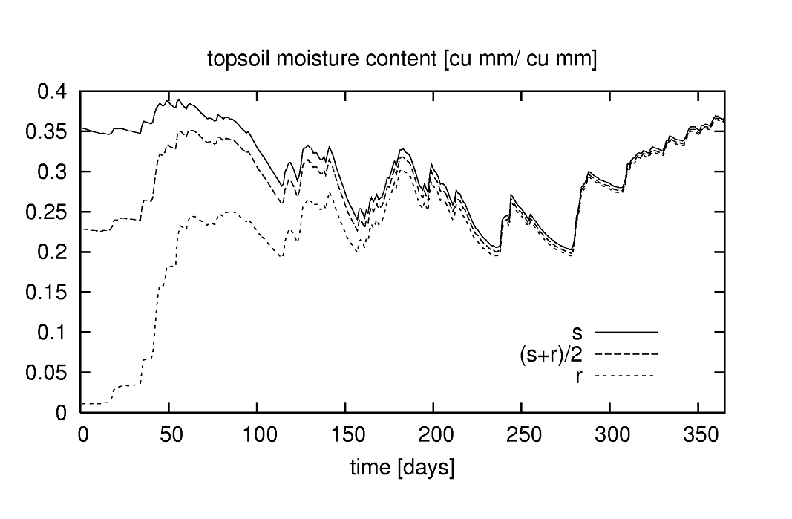
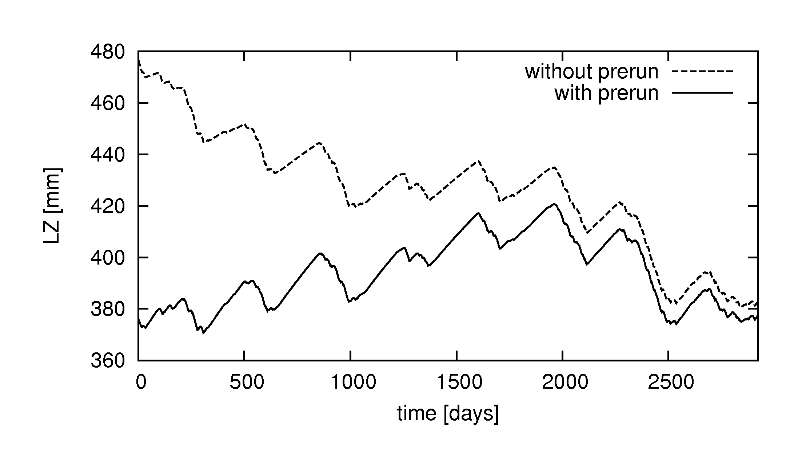

# Step 4: Initialisation & cold start of LISFLOOD

Just as any other hydrological model, LISFLOOD needs to know the initial state (i.e. amount of water stored) of its internal state variables in order to be able to produce reasonable discharge simulations. However, in practice we hardly ever know the initial state of all state variables at a given time. Hence, we have to estimate the state of the initial storages in a reasonable way, which is also called the initialisation of a hydrological model.

In this subsection we will first demonstrate the effect of the model's initial state on the results of a simulation, explain the steady-state storage in practice and then explain you in detail how to initialize LISFLOOD.


## The impact of the model's initial state on simulation results 

To better understand the impact of the initial model state on the results of a simulation, let's start with a simple example. The Figure below shows 3 LISFLOOD simulations of soil moisture for the upper soil layer. In the first simulation, it was assumed that the soil is initially completely saturated. In the second one, the soil was assumed to be completely dry (i.e. at residual moisture content). Finally, a third simulation was done where the initial soil moisture content was assumed to be in between these two extremes.

  

  **Figure:** *Simulation of soil moisture in upper soil layer for a soil that is initially at saturation (s), at residual moisture content (r) and in between (\[s+r\]/2)*

What is clear from the Figure is that the initial amount of moisture in the soil only has a marked effect on the start of each simulation; after a few months the three curves converge. In other words, the  "memory" of the upper soil layer only goes back a few months (or, more precisely, for time lags of more than about 8 months the autocorrelation in time is negligible).

In theory, this behaviour provides a convenient and simple way to initialise a model such as LISFLOOD. Suppose we want to do a simulation of the year 1995. We obviously don't know the state of the soil at the beginning of that year. However, we can get around this by starting the simulation a bit earlier than 1995, say one year. In that case we use the year 1994 as a *warm-up* period, assuming that by the start of 1995 the influence of the initial conditions (i.e. 1-1-1994) is negligible. The very same technique can be applied to initialise LISFLOOD's other state variables, such as the amounts of water in the lower soil layer, the upper groundwater zone, the lower groundwater zone, and in the channel.

## The theory of initialisation

When setting up a **model cold run**, most of the internal state variables can be simply set to 0 at the start of the run. For example, this applies to the initial snow cover (*SnowCoverInitValue*), frost index (*FrostIndexInitValue*), interception storage (*CumIntInitValue*). The initial value of the 'days since last rainfall event' (*DSLRInitValue*) is typically set to 1.

For soil and groundwater state variables, initialisation is somewhat less straightforward. The amount of water that can be stored in the three soil layers (*ThetaInit1aValue*,*ThetaInit1bValue*, *ThetaInit2Value*) is limited by the soil's porosity. The lower groundwater zone poses special problems because of its overall slow response (discussed in a separate section below). Because of this, LISFLOOD provides the possibility to initialise these variables internally. The following Table summarises these special initialisation methods:

**Table:** *LISFLOOD special initialisation methods*$^1$ 

| **Variable**          | **Description**       | **Initialisation method**     |
|-------------------------------|-------------------------------|-------------------------------|
| ThetaInit1Value / <br> ThetaForestInit2Value    | initial soil moisture content<br> upper soil layer (V/V)| set to soil moisture content <br> at field capacity |
| ThetaInit2Value / <br> ThetaForestInit2Value    | initial soil moisture content <br> lower soil layer (V/V) | set to soil moisture content <br> at field capacity |
| LZInitValue / <br> LZForestInitValue       | initial water in lower <br>  groundwater zone (mm)    | set to steady-state storage |
| TotalCrossSectionArea <br> InitValue | initial cross-sectional area <br> of water in channels              | set to half of bankfull depth      |
| PrevDischarge         | Initial discharge     | set to half of bankfull depth       |

$^1$ These special initialisation methods are activated by setting the value of each respective variable to a 'bogus' value of "-9999"*     

Note that the "-9999" 'bogus' value can *only* be used with the variables in the Table above; the use of the 'bogus' value for all the other variables will produce nonsense results! For this reason, the initialisation of the lower groundwater zone is necessary.<br>

*WARNING!* In some areas, the use of initial soil water content equal to field capacity leads to nonrealistic trends in soil moisture content and to fictitious discharge values in the channels. <br>
The issue above can occur, for instance, in catchments with arid climate and very thick (~10^2) soil layers or in catchments in very cold area where frost conditions are frequent.

To avoid nonrealistic results in such specific contexts, it is recommended to use the end states and the fluxes computed by the prerun to initialize soil moisture valus for the three soil layers, and upper groundwater zone storages. <br>

This optional, extensive initialization has been implemented in OS-LISFLOOD v4.X.X.

Initialization of the soil moisture content: the prerun provides in output end states and average fluxes. The end states are the volumetric soil moisture content for the three soil layers and the three land covers (9 maps). The average fluxes represent the averaege (over the simulation period) infiltration from the soil layer 2 to soil layer 3, for the three land cover fractions (3 maps). In the cold run, the end states  are used to initialize the volumetric soil moisture content of soil layers 1 and 2. The initilization of the volumetric soil moisture content of soil layer 3 makes use of the relevant end state and of the fluxes: following the same reasoning implemented for the lower groundwater zone (see below), the model tries to enable long term equilibrium conditions between average inflow and outflow fluxes in the third soil layer.

Initialization of the upper groundwater zone water content: it is recommended to use the end state generated by the prerun. <br>

*Please note that the content of this paragraph does not apply to the runs with warm start!* <br>


**Initialisation of the lower groundwater zone**
Even though the use of a sufficiently long warm-up period usually results in a correct initialisation, a complicating factor is that the time needed to initialise any storage component of the model is dependent on the average residence time of the water in it. For example, the moisture content of the upper soil layer tends to respond almost instantly to LISFLOOD's meteorological forcing variables (precipitation, evapo(transpi)ration). As a result, relatively short warm-up periods are sufficient to initialise this storage component. At the other extreme, the response of the lower groundwater zone is generally very slow (especially for large values of $T_{lz}$). Consequently, to avoid unrealistic trends in the simulations, very long warm-up periods may be needed. The Figure below shows a typical example for an 8-year simulation, in which a decreasing trend in the lower groundwater zone is visible throughout the whole simulation period. Because the amount of water in the lower zone is directly proportional to the baseflow in the channel, this will obviously lead to an unrealistic long-term simulation of baseflow. Assuming the long-term climatic input is more or less constant, the baseflow (and thus the storage in the lower zone) should be free of any long-term trends (although some seasonal variation is normal). In order to avoid the need for excessive warm-up periods, LISFLOOD is capable of calculating a 'steady-state' storage amount for the lower groundwater zone. This *steady state* storage is very effective for reducing the lower zone's warm-up time. The concept of *steady state* is explained in the [LISFLOOD model description](https://ec-jrc.github.io/lisflood-model/2_13_stdLISFLOOD_groundwater/), here we will show how it can be used to speed up the initialisation of a LISFLOOD run.


**Steady-state storage in practice**
An actual LISFLOOD simulation differs from the theoretical *steady state* in 2 ways. First, in any real simulation the inflow into the lower zone is not constant, but varies in time. This is not really a problem, since $LZ_{ss}$ can be computed from the *average* recharge. However, this is something we do not know until the end of the simulation! Also, the inflow into the lower zone is controlled by the availability of water in the upper zone, which, in turn, depends on the supply of water from the soil. Hence, it is influenced by any calibration parameters that control behaviour of soil- and subsoil (e.g. $T_{uz}$, $GW_{perc}$, $b$, and so on). This means that -when calibrating the model- the average recharge will be different for every parameter set. Note, however, that it will *always* be smaller than the value of $GW_{perc}$, which is used as an upper limit in the model. 
As an alternative to using the internal initialization (and hence the bogus values), LZavin and AvgDis (LZInitValue and PrevDischarge) can be computed using an initialization run (or pre-run). The pre-run procedure must include a sufficiently long warm-up period to allow the computation of reliable values of  LZavin and AvgDis. The set-up of the initialization run is explained below: the protocol differs slightly depending on the settings of the option split routing.


## What you need to do:  

### Option 1: If using Kinematic routing only (no split routing):

1) Set  initial state of all state variables to either 0,1 or -9999 (i.e. cold start with default values or internally initialized values) in Settings.XML file

2) Activate the “InitLisfloodwithoutsplit” and the "InitLisflood" options in <lfoptions> section of Settings.XML file using:
```xml
       <setoption choice="1" name="InitLisflood"/>
       <setoption choice="1" name="InitLisfloodwithoutsplit"/>
       <setoption choice="0" name="WarmStart/>
```
  
3) Activate reporting maps (in NetCDF format) in <lfoptions> section of Settings.XML file using:
```xml
    <setoption choice="1" name="repEndMaps"/>
    <setoption choice="1"  name="writeNetcdf"/>
```

4) Set split routing option to not active in <lfoptions> section of Settings.XML file using:
```xml
       <setoption choice="0" name="SplitRouting"/>
```

5) Set the name of the reporting map for average percolation rate from second to third soil layer, and from upper to lower groundwater zone in <lfuser> section of Settings.XML file using:
```xml
    <textvar name="LZAvInflowMap" value="$(PathOut)/lzavin">
    <textvar name="SeepTopToSubBAverageOtherMap" value= "$(PathOut)/SeepTopToSubBAverageOtherMap">
    <textvar name="SeepTopToSubBAverageForestMap" value= "$(PathOut)/SeepTopToSubBAverageForestMap">
    <textvar name="SeepTopToSubBAverageIrrigationMap" value= "$(PathOut)/SeepTopToSubBAverageIrrigationMap">
```
Similarly, set the name of the reporting map for the end states in <lfuser> section of Settings.XML. Some examples are provided below:
```xml
    <textvar name="Theta1End" value="$(PathOut)/th1.end">
    <textvar name="Theta2End" value="$(PathOut)/th2.end">
    <textvar name="Theta3End" value="$(PathOut)/th3.end">
    <textvar name="Theta1ForestEnd" value="$(PathOut)/thf1.end">
    <textvar name="Theta2ForestEnd" value="$(PathOut)/thf2.end">
    <textvar name="Theta3ForestEnd" value="$(PathOut)/thf3.end">
    <textvar name="Theta1IrrigationEnd" value="$(PathOut)/thi1.end">
    <textvar name="Theta2IrrigationEnd" value="$(PathOut)/thi2.end">
    <textvar name="Theta3IrrigationEnd" value="$(PathOut)/thi3.end">
    <textvar name="UZEnd" value="$(PathOut)/uz.end">
    <textvar name="UZForestEnd" value="$(PathOut)/uzf.end">
    <textvar name="UZIrrigationEnd" value="$(PathOut)/uzi.end">
```
6) Run the model for a long period (best for the whole modelling period)

7) Go back to the LISFLOOD settings file, and set the InitLisfloodwithoutsplit to inactive, leaving all other switches as before:

```xml
    <setoption choice="0" name="InitLisfloodwithoutsplit"/>
    <setoption choice="0" name="InitLisflood"/>
    <setoption choice="0" name="WarmStart/>
```

### If using Split routing:

1) Set  initial state of all state variables to either 0,1 or -9999 (i.e. cold start with default values or internally initialized values) in Settings.XML file

2) Activate the “InitLisflood” option in <lfoptions> section of Settings.XML file using:
```xml
    <setoption choice="0" name="InitLisfloodwithoutsplit"/>
    <setoption choice="1" name="InitLisflood"/>
    <setoption choice="0" name="WarmStart/>
```

3) Activate reporting maps (in NetCDF format) in <lfoptions> section of Settings.XML file using:
```xml
    <setoption choice="1" name="repEndMaps"/>
    <setoption choice="1"  name="writeNetcdf"/>
```

4) Set split routing option to active in <lfoptions> section of Settings.XML file using:
```xml
    <setoption choice="1" name="SplitRouting"/>
```

5) Set the name of the reporting map for average percolation rate from second to third soil layer, and from upper to lower groundwater zone in <lfuser> section of Settings.XML file using:
```xml
    <textvar name="LZAvInflowMap" value="$(PathOut)/lzavin">
    <textvar name="SeepTopToSubBAverageOtherMap" value= "$(PathOut)/SeepTopToSubBAverageOtherMap">
    <textvar name="SeepTopToSubBAverageForestMap" value= "$(PathOut)/SeepTopToSubBAverageForestMap">
    <textvar name="SeepTopToSubBAverageIrrigationMap" value= "$(PathOut)/SeepTopToSubBAverageIrrigationMap">
```
Similarly, set the name of the reporting map for the end states in <lfuser> section of Settings.XML. Some examples are provided below:
```xml
    <textvar name="Theta1End" value="$(PathOut)/th1.end">
    <textvar name="Theta2End" value="$(PathOut)/th2.end">
    <textvar name="Theta3End" value="$(PathOut)/th3.end">
    <textvar name="Theta1ForestEnd" value="$(PathOut)/thf1.end">
    <textvar name="Theta2ForestEnd" value="$(PathOut)/thf2.end">
    <textvar name="Theta3ForestEnd" value="$(PathOut)/thf3.end">
    <textvar name="Theta1IrrigationEnd" value="$(PathOut)/thi1.end">
    <textvar name="Theta2IrrigationEnd" value="$(PathOut)/thi2.end">
    <textvar name="Theta3IrrigationEnd" value="$(PathOut)/thi3.end">
    <textvar name="UZEnd" value="$(PathOut)/uz.end">
    <textvar name="UZForestEnd" value="$(PathOut)/uzf.end">
    <textvar name="UZIrrigationEnd" value="$(PathOut)/uzi.end">
```

6) Set the name of the reporting map for average discharge map in <lfuser> section of Settings.XML file using:
```xml
    <textvar name="AvgDis" value="$(PathOut)/avgdis">
```

7) Run the model for a longer period (if possible more than 3 years, best for the whole modelling period)

8) Go back to the LISFLOOD settings file, and set the InitLisflood inactive, leaving all other switches as before:

```xml
    <setoption choice="0" name="InitLisfloodwithoutsplit"/>
    <setoption choice="0" name="InitLisflood"/>
    <setoption choice="0" name="WarmStart/>
```

### What to do after the initialization run - Proceed with a LISFLOOD run


i) Checking the lower zone initialisation

The presence of any initialisation problems of the lower zone can be checked by adding the following line to the ‘lfoptions’ element of the settings file:

```xml
<setoption name=" repStateUpsGauges" choice="1"></setoption>
```

This tells the model to write the values of all state variables (averages, upstream of contributing area to each gauge) to time series files. The default name of the lower zone time series is ‘lzUps.tss’.




***Figure:*** *Initialisation of lower groundwater zone with and without using a pre-run. Note the strong decreasing trend in the simulation without pre-run.*


ii) The prerun will then created a number (from 1 to 17, depending on the .xml settings) of maps NetCDF format. Copy those maps (found in folder "out", see the setting $(PathOut) above) into the folder "init" ($(PathInit))

Exmaples:
    lzavin.nc
    avgdis.nc
    uzi.end.nc
    thia.end.nc
    SeepTopToSubBAverageOtherMap.nc
    
Please note that avgdis.nc is not required to run the Lisflood model without split routing.


```xml
**************************************************************
INITIAL CONDITIONS FOR THE WATER BALANCE MODEL
(can be either maps or single values)
**************************************************************
</comment>

<textvar name="LZAvInflowMap" value="$(PathInit)/lzavin">
<comment>
$(PathInit)/lzavin.map
Reported map of average percolation rate from upper to
lower groundwater zone (reported for end of simulation)
</comment>
</textvar>

<textvar name="AvgDis" value="$(PathInit)/avgdis">
<comment>
$(PathInit)/avgdis.map
CHANNEL split routing in two lines
Average discharge map [m3/s]
</comment>
</textvar>

<textvar name="SeepTopToSubBAverageOtherMap" value= "$(PathInit)/SeepTopToSubBAverageOtherMap">
<textvar name="SeepTopToSubBAverageForestMap" value= "$(PathInit)/SeepTopToSubBAverageForestMap">
<textvar name="SeepTopToSubBAverageIrrigationMap" value= "$(PathInit)/SeepTopToSubBAverageIrrigationMap">

**************************************************************
INITIAL CONDITIONS OTHER/FOREST/IRRIGATION
(maps or single values)
**************************************************************

<textvar name="ThetaInit1Value" value="$(PathInit)/th1.end">
<textvar name="ThetaInit2Value" value="$(PathInit)/th2.end">
<textvar name="ThetaInit3Value" value="$(PathInit)/th3.end">

<textvar name="ThetaForestInit1Value" value="$(PathInit)/thf1.end">
<textvar name="ThetaForestInit2Value" value="$(PathInit)/thf2.end">
<textvar name="ThetaForestInit3Value" value="$(PathInit)/thf3.end">

<textvar name="ThetaIrrigationInit1Value" value="$(PathInit)/thi1.end">
<textvar name="ThetaIrrigationInit2Value" value="$(PathInit)/thi2.end">
<textvar name="ThetaIrrigationInit3Value" value="$(PathInit)/thi3.end">

<textvar name="UZInitValue" value="$(PathInit)/uz.end">
<textvar name="UZForestInitValue" value="$(PathInit)/uzf.end">
<textvar name="UZIrrigationInitValue" value="$(PathInit)/uzi.end">
```

iii) launch LISFLOOD

To run the model, start up a command prompt (Windows) or a console window (Linux) and type 'lisflood' followed by the name of the settings file, e.g.:

```unix
lisflood settings.xml
```


> Important note:
> - Calibration parameters obtained with no split routing should never be used to run simulations with split routing and vice versa.
> - Using option InitLisfloodwithoutsplit=1 will result in an AvgDis file with zero values everywhere.
> - In case of doubts, check content of AvgDis file: if it's all zero, then split routing must be off. Note that an AvgDis file containing all zero values will automatically set LISFLOOD to no split routing, even if SplitRouting=1.

