# Channel geometry

In the LISFLOOD model flow through the channel is simulated using the kinematic wave equations. Channel maps describe the sub grid information of the channel geometry, i.e. the length, slope, width and depth of the main channel inside a grid-cell.   
+ The **channel mask** map is the Boolean field with '1' for all grid-cells with channels and NoData for all grid-cells with no channels.   
+ The **MCT channel mask** map is the Boolean field with '1' for all river grid-cells using MCT wave routing and '0' for other channel grid cells.   
+ The **channel side slope** map (referred as 's' in Figure 41) defines the slope of the channel banks.  
+ The **channel length** map is the length of the river in each grid-cell, and the value can exceed grid-size to account for meandering rivers.  
+ The **channel gradient** (or channel slope) map is the average gradient of the main river inside a cell.  
+ The **Manning's roughness coefficient** map can be derived by an empirical relationship of the DEM and the upstream area according to [Burek et al. (2014)](https://ec-jrc.github.io/lisflood/pdfs/Dataset_hydro.pdf). The kinematic wave approach uses the Manning’s formula, an empirical formula for open channel flow or free-surface flow driven by gravity. The Manning’s roughness coefficient is reciprocal proportional to the cross-sectional average velocity (in m/s). A lower Manning’s coefficient results in a faster responding time at the outlet.  
+ The **bottom width map** (referred as Wb in Figure 41) is the width of the bottom of the channel.  
+ The **floodplain map** (referred as Wfp in Figure 41) is used to calculate water levels in the LISFLOOD model.  
+ The **bankfull channel depth** map (referred as Dbf in Figure 41) is the difference between floodplain bottom level (referred as zfp in Figure 41) and the channel bottom level (referred as zbot in Figure 41.  
Channel characteristics, explained above, are shown in the Figure 41 below.   

  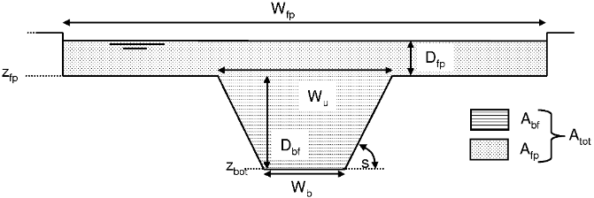
  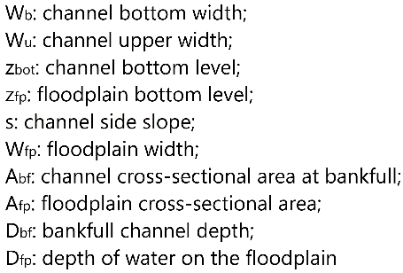 

*Figure41: Geometry of channel cross-section in kinematic wave routing (original figure from [Burek et al., 2013](https://publications.jrc.ec.europa.eu/repository/handle/JRC78917)).*

## General map information and possible source data

| Map name | File name;type | Units; range | Description |
| :---| :--- | :--- | :--- |
|Channel mask         | chan.nc;   Type: Boolean          | Units: -;  Range: NoData or 1         |Boolean map that identifies the channel grid-cells |
|MCT Channel mask         | chanmct.nc;   Type: Boolean          | Units: -;  Range: [0-1]         |Boolean map that identifies the channel grid-cells using the MCT diffusive river routing |
|Side slope        |chans.nc;   Type: Float32          | Units: m;  Range>0          |Channel side slope|
|Channel length         |chanlength.nc;   Type: Float32          | Units: m;  Range>0         |Channel length (value can exceed grid size, to account for meandering rivers)|
|Channel gradient         |changrad.nc;   Type: Float32           |Units: m/m;  Range: [0-1]          |Channel longitudinal gradient|
|Manning's roughness coefficient |chanman.nc;   Type: Float32           |Units: m1/3 s-1         |channels Manning's roughness coefficient |
|Bottom width         |chanbw.nc;   Type: Float32           |Units: m;  Range>0          |Channel bottom width|
|Floodplain         |chanflpn.nc;   Type: Float32           |Units: m;  Range>0          |Width of the area where the surplus of water is distributed when the water level in the channel exceeds the bankfull channel depth
|Bankfull channel depth         |chanbnkf.nc;   Type: Float32           |Units: m;  Range>0          |Bankfull channel depth

| Source data| Reference/preparation | Temporal coverage | Spatial information |
| :---| :--- | :--- | :--- |
|Channel width        |[CaMa-Flood](https://global-hydrodynamics.github.io/CaMa-Flood/)          |2018         |Global, 1' and 3'|
|River lenght        | [CaMa-Flood](https://global-hydrodynamics.github.io/CaMa-Flood/)         |2018          |Global, 1' and 3'|
|MERIT DEM: Multi-Error-Removed Improved-Terrain DEM|[MERIT-DEM](https://global-hydrodynamics.github.io/MERIT_DEM/)        |2018          |Global, 3" (at about 90 m)|
|Mask map        |Can be prepared following [these instructions](../4_Static-Maps_general-maps#area-mask-and-land-use-mask-maps)|NA          |Global, 1' and 3'|
|Local drain direction (ldd)        |Can be prepared following [these instructions](../4_Static-Maps_topography#local-drain-direction-map)|NA          |Global, 1' and 3'|
|Upstream area map         |Can be prepared following [these instructions](../4_Static-Maps_topography#upstream-area)|NA          |Global, 1' and 3'|

## Methodology

### Channel mask (chan)
The channel mask map indicates with 1 the pixels (cells) that have channels. In the current OS LISFLOOD implementation, all pixels included in the mask map have value 1, meaning that all pixels are suitable to convey water and included in the routing computations. Water accumulates from smaller to larger streams according to the local drainage direction [ldd](/4_Static-Maps_topography/index.md) map.

### MCT Channel mask (chanmct)
The  MCT channel mask map is used to identify the cells using the Muskingum-Cunge-Todini diffusive wave routing (details on the routing methodology are available in the [OS LISFLOOD Model Documentation](https://ec-jrc.github.io/lisflood-model/)). The grid-cells that have a riverbed slope < *ChanGradMaxMCT* (default value 0.001) and a set number of upstream grid cells also meeting the same condition are assigned to the mask. All downstream channel pixels of any of the pixels using MCT wave routing are also added to the mask. The OS LISFLOOD utility [mctrivers](https://github.com/ec-jrc/lisflood-utilities#mctrivers) can be used to generate the MCT channel mask. 

### Side slope (chans)
The channel side slope map is calculated by dividing the horizontal distance (referred as 'dx' in Figure 42) by vertical distance (referred as 'dy' in Figure 42); here ‘1’ was assigned to all the grid cells, which correspond to a 45° angle of the side slope.

  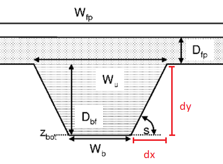

*Figure 42: Zoom of Figure 41 with highlighted components dx and dy (in red) used to calculate the channel side slope (original figure is from [Burek et al., 2013](https://publications.jrc.ec.europa.eu/repository/handle/JRC78917)).*

### Channel length (chanlenght)
The channel length map (in meters) can be created by using the 'rivlen' layers from the Catchment-based Macro-scale Floodplain Global River Hydrodynamics Model v4.0 maps ([CaMa-Flood](https://global-hydrodynamics.github.io/CaMa-Flood/); [Yamazaki et al, 2011](https://agupubs.onlinelibrary.wiley.com/doi/10.1029/2010WR009726)), multiplied by the LISFLOOD model mask.

### Channel gradient (changrad)
To compute the channel gradient map, the absolute difference (in meters) of the elevation between two grid-cells is first calculated by using i) the local drain direction (ldd) map to extract the connectivity between grid-cells, and ii) the channel length of the upstream grid-cell: 

$\small elevationDifference = elevationUpstreamCell-elevationDownstreamCell$

Then, the channel gradient is computed and assigned to the upstream grid-cell:

$changrad=\frac{elevationDifference}{chanlength}$

$changrad$ is set equal 0 where $ldd$ is 5.

### Manning's roughness coefficient (chanman)
The Manning's roughness coefficient for channels can be derived by an empirical relationship between the elevation (in $m$) of the grid-cell and its upstream area (in $km^2$) following [Burek et al. (2014)](https://ec-jrc.github.io/lisflood/pdfs/Dataset_hydro.pdf):

$chanman =$  
$0.025 + 0.015 \cdot \min(\frac{50}{upstreamArea} , 1) + 0.030 \cdot \min(\frac{elevation}{2000} , 1)$

### Bottom width (chanbw)
The channel bottom width map can be computed using empirical relationship that relate channel width of the grid-cell with its upstream area (in $km^2$); for example, following [Burek et al. (2014)](https://ec-jrc.github.io/lisflood/pdfs/Dataset_hydro.pdf): 

$chanbw_{step1} = 0.0032 \cdot upstreamArea$

It is here noted that the study mentioned above ([Burek et al. (2014)](https://ec-jrc.github.io/lisflood/pdfs/Dataset_hydro.pdf)), also suggests a second step. The LISFLOOD model first needs to be run for the entire simulation period length with the initial channel bottom width to get a long-term average discharge ($avgdis$) which is then used in the following *empirical* equation: 

$chanbw_{step2} = avgdis^{0.539}$
 
The latter empirical equation stems from a study on the European domain ([Burek et al. (2014)](https://ec-jrc.github.io/lisflood/pdfs/Dataset_hydro.pdf)).
It is not possible to identify an optimal solution for all the catchments, and all the applications. Users are advised to test the one or two-steps protocol for their specific scenario and identify the best solution according to their expert judgement.

It is here noted that chanbw used for the Copernicus Emergency Management Service European and Global Flood Awareness System ([CEMS EFAS](https://european-flood.emergency.copernicus.eu/react) and [CEMS GloFAS](https://global-flood.emergency.copernicus.eu/react)) operational set-ups were computed using a slightly different protocol: *width* values from the ([CaMa-Flood](https://global-hydrodynamics.github.io/CaMa-Flood/)) were used as primary source of data. Where the processing of such primary source of data led to negative values, *chanbw* was computed using step1 of the protocol explained in this page. 
More details on the workflow used to derive CEMS EFAS and GloFAS *chanbw* maps are provided in [Choulga et al., 2024](https://hess.copernicus.org/articles/28/2991/2024/).

### Floodplain width (Wfp)
The floodplain width (in $m$) can be computed using the following equation from [Burek et al. (2014)](https://ec-jrc.github.io/lisflood/pdfs/Dataset_hydro.pdf): 

$floodplainWidth = 3 \cdot chanbw$

### Bankfull channel depth (chanbnkf)
Channel bankfull depth can be computed in two steps. The first step uses the empirical relationship relating the channel bankfull depth of the grid-cell with its upstream area (in $km^2$) following [Burek et al. (2014)](https://ec-jrc.github.io/lisflood/pdfs/Dataset_hydro.pdf): 

$chanbnkf_{step1} = 0.27 \cdot upstreamArea^{0.33}$

The second (optional) step uses the Manning's equation following [Burek et al. (2014)](https://ec-jrc.github.io/lisflood/pdfs/Dataset_hydro.pdf). The LISFLOOD model first needs to be run for the entire simulation period length with the initial channel bottom width and bankfull depth parameters to get a long-term average discharge ($avgdis$) which is then used in the Manning's equation: 

$chanbnkf_{step2} =$ 
$1.004 \cdot chanman^{0.6} \cdot (2 \cdot avgdis)^{0.6} \cdot chanbw^{-0.6} \cdot changrad^{-0.3}$

It is not possible to identify an optimal solution for all the catchments, and all the applications. Users are advised to test the one or two-steps protocol for their specific scenario and identify the best solution according to their expert judgement.
For example, chanbnkf used for the Copernicus Emergency Management Service European and Global Flood Awareness System ([CEMS EFAS](https://european-flood.emergency.copernicus.eu/react) and [CEMS GloFAS](https://global-flood.emergency.copernicus.eu/react)) operational set-ups were computed based on the first step only.

## Results (examples)

  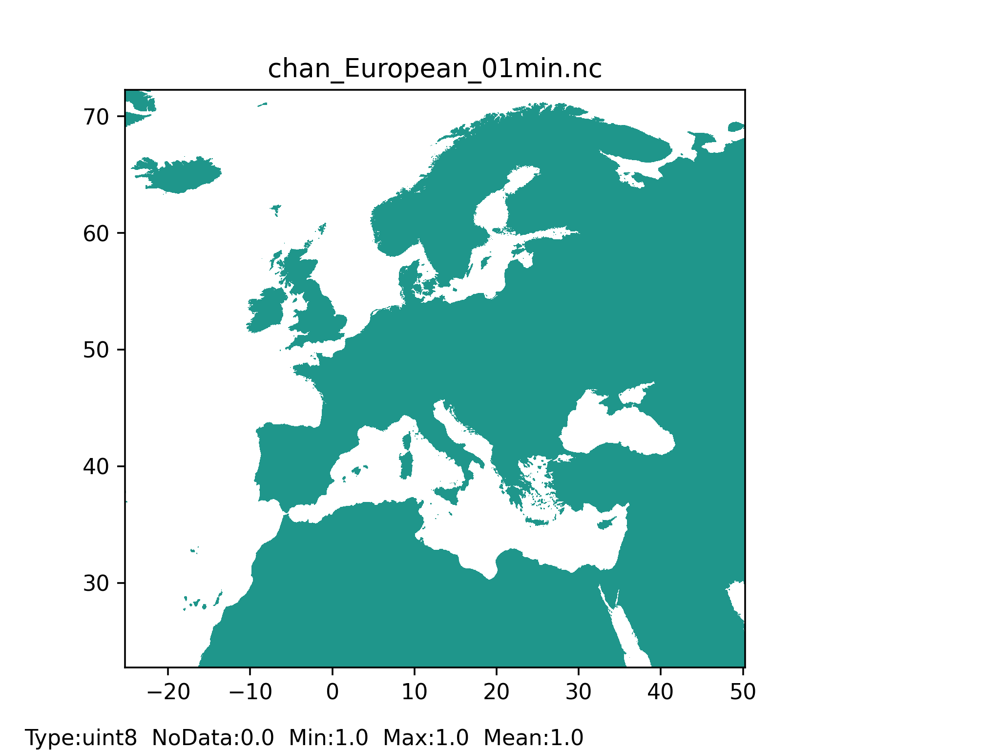
  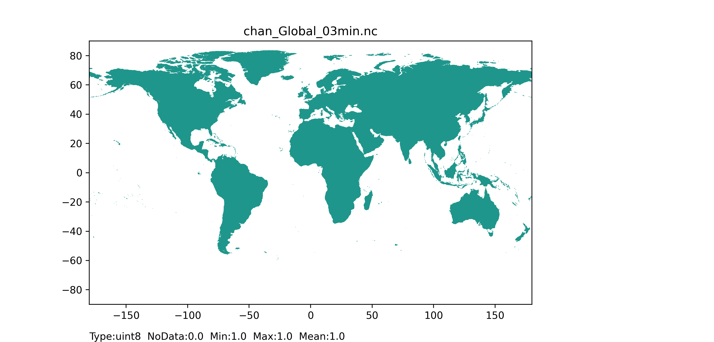 

*Figure 43: Channel mask map at 1 arc min horizontal resolution for European domain (left) and at 3 arc min horizontal resolution for Global domain (right) with coloured areas showing the channel pixels.*

  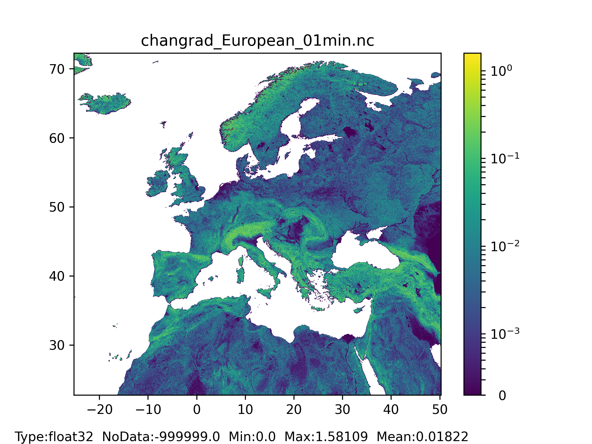
  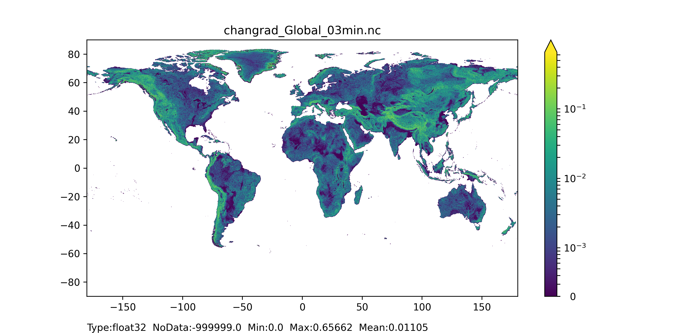 

*Figure 44: Channel gradient or slope map at 1 arc min horizontal resolution for European domain (left) and at 3 arc min horizontal resolution for Global domain (right).*

  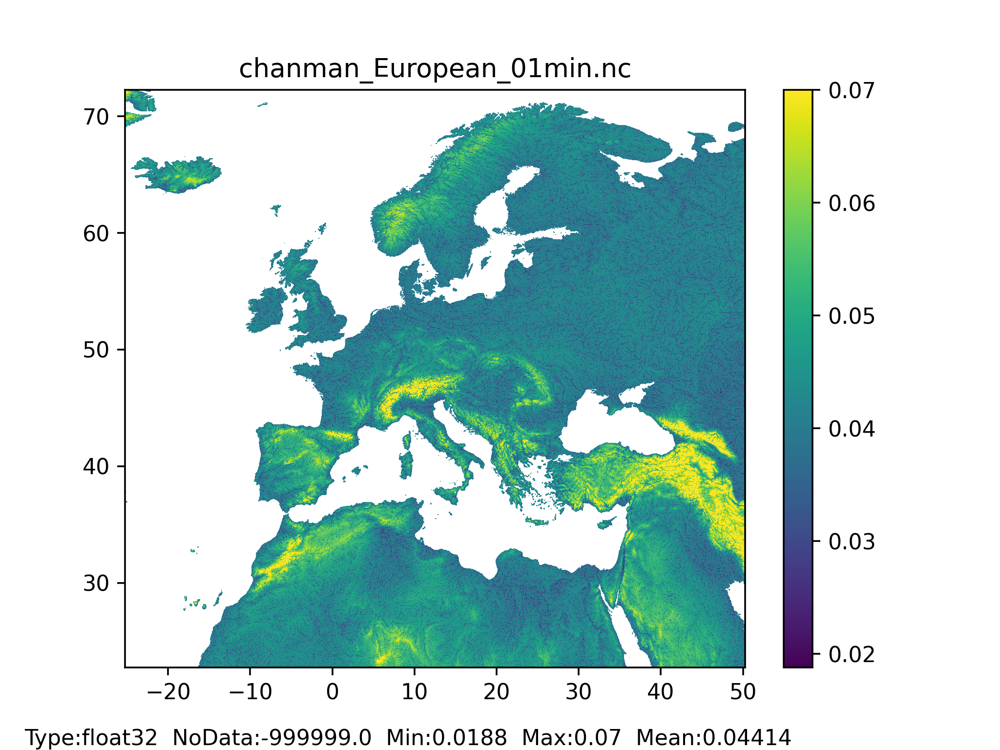
  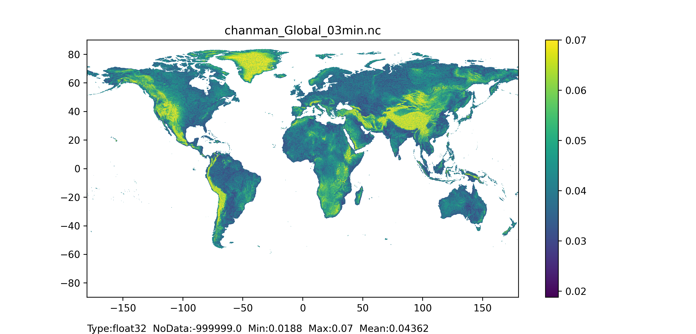 

*Figure 45: Manning’s roughness coefficient for channels map at 1 arc min horizontal resolution for European domain (left) and at 3 arc min horizontal resolution for Global domain (right).*

  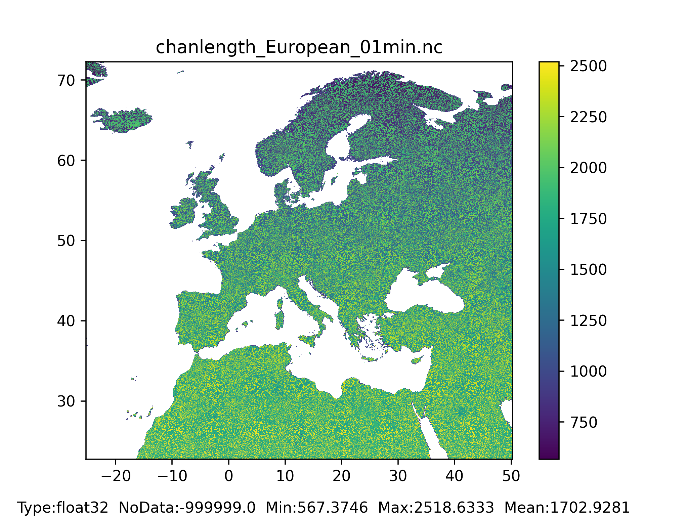
  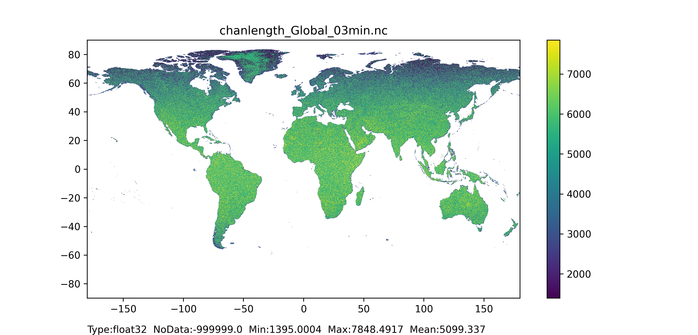 

*Figure 46: Channel length map at 1 arc min horizontal resolution for European domain (left) and at 3 arc min horizontal resolution for Global domain (right).*

  
   

*Figure 47: Channel bottom width map at 1 arc min horizontal resolution for European domain (left) and at 3 arc min horizontal resolution for Global domain (right).*

  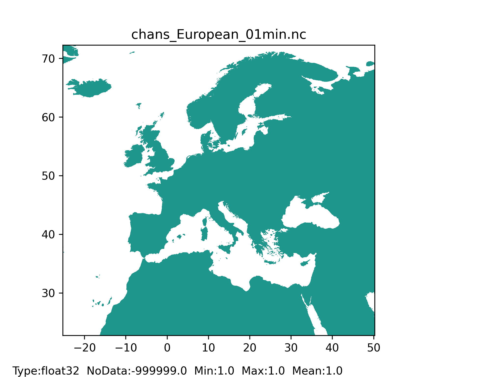
  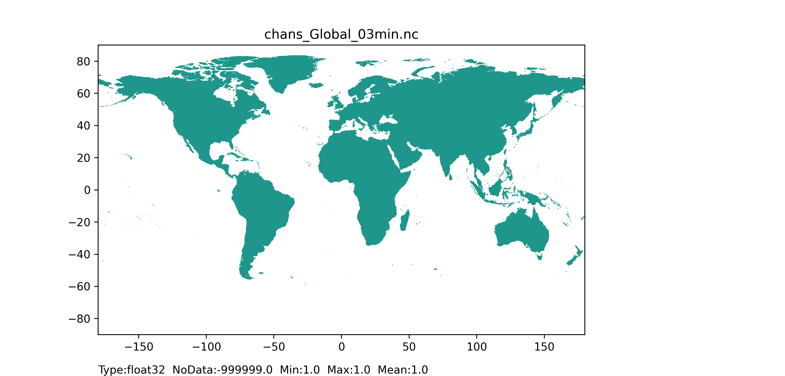 

 
*Figure 48: Channel side slope map at 1 arc min horizontal resolution for European domain (left) and at 3 arc min horizontal resolution for Global domain (right) with coloured areas showing channel side slope (equal to 1) pixel.*
 
 
 

  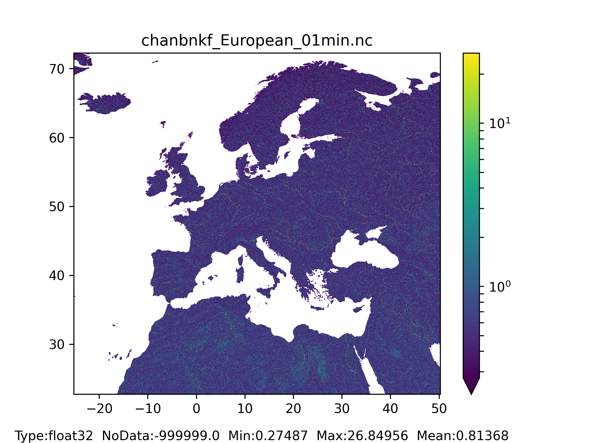
  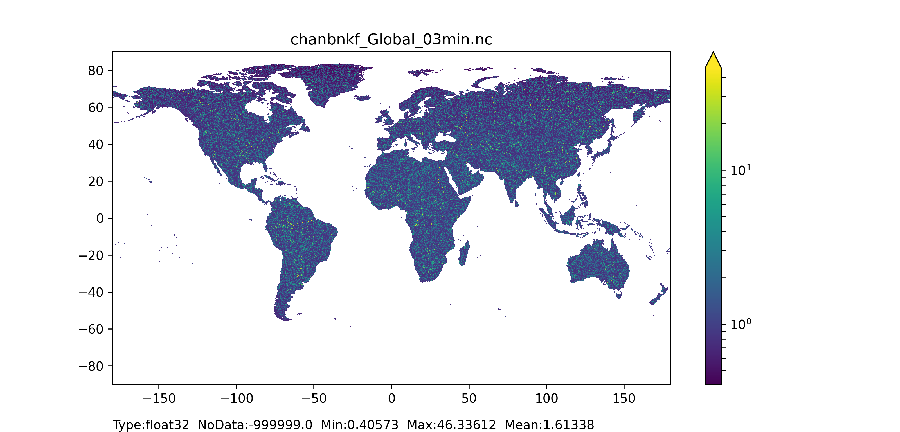 

*Figure 49: Bankfull channel depth map at 1 arc min horizontal resolution for European domain (left) and at 3 arc min horizontal resolution for Global domain (right).*

  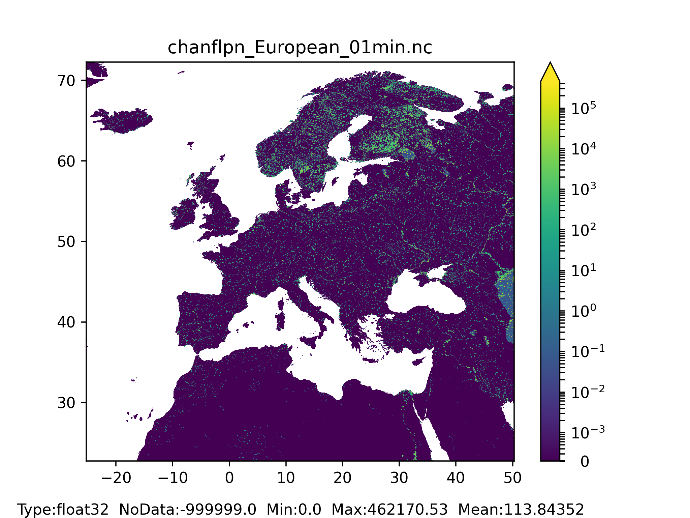
  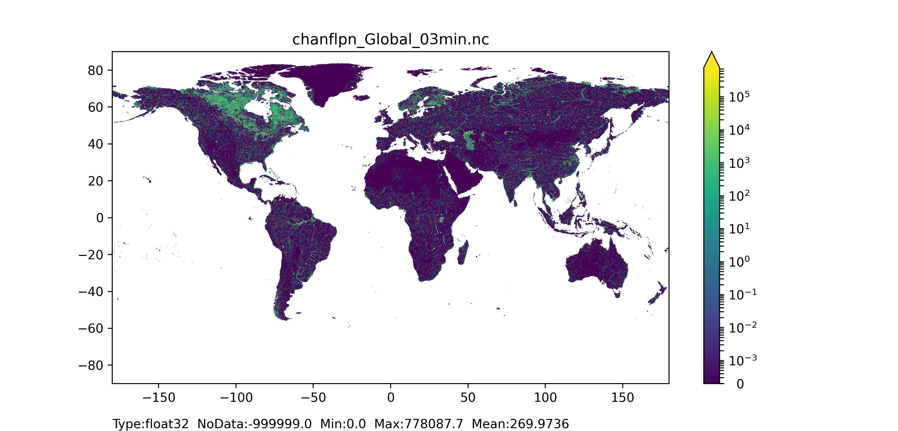 

*Figure 50: Channels floodplain width at 1 arc min horizontal resolution for European domain (left) and at 3 arc min horizontal resolution for Global domain (right).*
