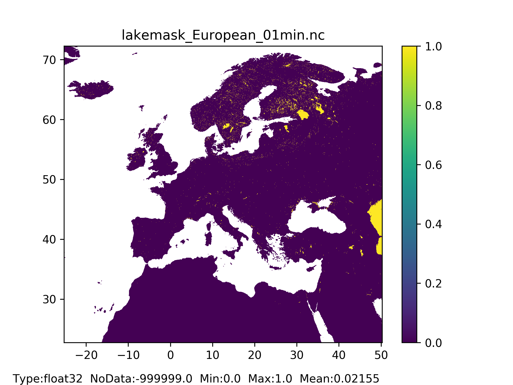
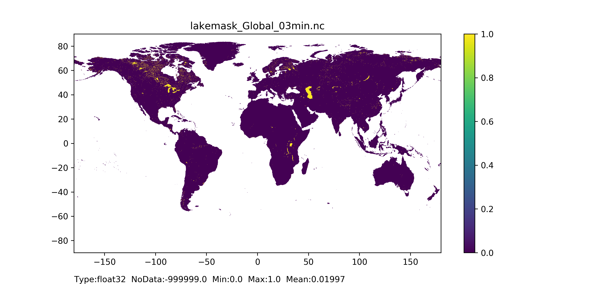

# Reservoirs and lakes 

Lakes and reservoirs can be defined as a significant volume of water, which occupies a depression of the land and has no direct connection with a sea. They can intensify winter snowstorms, increase precipitation or/and surface temperature, generate night convection and intensive thunderstorms. Lakes and reservoirs can influence the atmosphere regionally and globally. 

The modelling of lakes and reservoirs requires three maps and a set of txt files.

 
## Lake mask map

The lake mask map represents the area covered by lakes and reservoirs, it is used for computing evaporation from open water surfaces.

### General map information and possible source data

| Map name | File name;type | Units; range | Description |
| :---| :--- | :--- | :--- |
| Lake mask| lakemask.nc;  Type: Float32 |  Units: -;  Range: 0 or 1 | Map of the footprint of lakes|

| Source data| Reference/preparation | Temporal coverage | Spatial information |
| :---| :--- | :--- | :--- |
|Global Lakes and Wetlands Database (GLWD):  Large Lake Polygons (Level 1) |[GLWD leve1](https://www.worldwildlife.org/publications/global-lakes-and-wetlands-database-large-lake-polygons-level-1)|2004|Global, 1:1 to 1:3 million resolution|
|Global Lakes and Wetlands Database (GLWD):  Small Lake Polygons (Level 3) |[GLWD leve1](https://www.worldwildlife.org/publications/global-lakes-and-wetlands-database-large-lake-polygons-level-2)|2004|Global, 1:1 to 1:3 million resolution|
|Fraction of inland water| It can be prepared by using  the methodology explained [here](../4_Static-Maps_land-use#lend-use)|NA|Global|

### Methodology

Fraction of inland water map is adjusted to the LISFLOOD model – all grid-cells fully covered with ocean water that are considered during computations are filled with inland water.  
If a grid-cell has any fraction of inland water and is inside the GLWD Level 1 and GLWD level 2 lake shapefiles, it is marked as ‘1’ (fully covered), otherwise it is marked as ‘0’. 

### Results (examples)

  
   

*Figure 53: Lakemask map at 1 arc min horizontal resolution for European domain (left) and at 3 arc min horizontal resolution for Global domain (right) with coloured areas showing land pixel.*

## Reservoirs map and tables 

Reservoirs are identified using a unique integer number (ID).
The reservoirs map shows the outflow location of each reservoir: each outflow point has the ID of the relevant reservoir. Modelling of reservoirs within OS LISFLOOD then requires the following pieces of information: reservoir storage, minimum reservoir outflow, normal reservoir outflow, flood reservoir outflow (connected to 100 year return period discharge). The latter information is provuided to the code in .txt format (these txt files are traditionally called OS LISFLOOD tables).

### General map and tables information and possible source data

| Map/table name | File name; type | Units; range | Description |
| :---| :--- | :--- | :--- |
|Reservoirs|res.nc;  Type: Float32|Units: -;  Range: integer  ID number to identify each lake |Reservoir outflow location   (stores lake ID number in the metadata file)|
|Reservoir Total Storage| res_storage.txt;  2 columms: ID VALUE; 1 row for each reservoir|Units: m3|Reservoir capacity|
|Reservoir Flood outflow| res_flood_outflow.txt;  2 columms: ID VALUE; 1 row for each reservoir|Units: m3/s|Reservoir Flood outflow|
|Reseervoir normal outflow| res_normal_outflow.txt;  2 columms: ID VALUE; 1 row for each reservoir|Units: m3/s|Normal outflow|
|Reseervoir minimum outflow| res_min_outflow.txt;  2 columms: ID VALUE; 1 row for each reservoire|Units: m3/s|Minimum outlfow|

The well-known Global Reservoir and Dam Database[GDW](https://www.globaldamwatch.org/grand) now superseeded by the Global Dam Watch [GDW](https://www.globaldamwatch.org/database) is a relevant example of source of data for lakes map and tables.

### Methodology
As a first step, it is recommended to create a file including all reservoir information required by OS LISFLOOD and some relevant metadata that can help with model analysis and results description.
Essential information are:

1. reservoir unique identifier, selected by the user or taken from external datasets;
2. Geographic oordinates of the reservoir outlet;
3. Coordinates of the reservoir outlet mapped on OS LISFLOOD local drainage direction map  ([ldd](https://ec-jrc.github.io/lisflood-code/4_Static-Maps_topography/));
4. Reservoir storage capacity;
5. Reservoir normal outflow;
6. Reservoir minimum ouflow;
7. Reservoir flood outflow.

Optional metadata are:

7. Reservoir catchment area [e.g. km2]
8. Reservoir surface area [e.g. km2]
9. Reservoir name 
10. River, basin, country
11. Year of construction
12. Year of removal
13. Degree of regulation in years, DOR
14. Main purpose(s)
15. Source of information 4,5,6,7,8,9 (and others)

The following paragraphs provide guidelines for the generation of the reservoir map and tables.

Reservoir unique identifier (1) and coordinates of the outlet mapped on the OS LISFLOOD local drainage direction map  ([ldd](https://ec-jrc.github.io/lisflood-code/4_Static-Maps_topography/)) (3) are required to generate the reservoirs map. Geographic oordinates of the reservoirs outlet (2) and OS LISFLOOD local drainage direction map  ([ldd](https://ec-jrc.github.io/lisflood-code/4_Static-Maps_topography/)) are essential to generate (3), for this step, the comparison between reservoir catchment area (7) and OS LISFLOOD [upstream area map](https://ec-jrc.github.io/lisflood-code/4_Static-Maps_topography/) is strongly recommended.

Reservoir storage capcaity can be retrieved from local datasets or global datasets such as [GDW](https://www.globaldamwatch.org/grand).

Reservoir normal outflow, minimum outflow, flood outflow can also be derived from in situ observations, local datasets or global datasets. Where such information is not avaible, users can implement the following approximations: reservoir normal outflow can be approximated by river average discharge (from measurements or numerical simulations); reservoir minimum outflow can be approximated by environmental discharge (from regulations or numerical approximation); resrervoir flood outflow can be approaximated by 100-year return period of river discharge discharge.

The degree of regulation can be computes as the quotient between reservoir capacity (Units: MCM) and normal reservoir outflow (units: m3/s). It is recommented to model reservoirs with low degree of regulation (e.g. lower than 0.08) as lakes.

Reservoir maps and tables of the European 1arcmin domain and global 3arcmin domain are mainly based on information from [GDW](https://www.globaldamwatch.org/grand).
Reservoirs included in the European 1arcmin domain had a minimum volume of 10 hm3, a minimum upstream catchment area of 50 km2, degree of regulation larger or equal to 0.08.
Lakes included in the global 3arcmin domain had a minimum volume of 100 hm3, a minimum upstream catchment area of 250 km2, degree of regulation larger or equal to 0.08.
Reservoir normal, nminimum, flood outflow were computed using OS LISFLOOD CEMS EFAS and CEMS GloFAS discharge reanalysis (GloFASv4 reanalysis upstream of the reservoir for GloFASv5 tables; EFASv5 naturalized flow simulation for EFASv6 tables).

## Lakes map and tables 

Lakes are identified using a unique integer number (ID).
The lakes map shows the outflow location of each lake: each outflow point has the ID of the relevant lake. Modelling of lakes within OS LISFLOOD then requires the following pieces of information: lake surface area, average inflow to the lake, width of the lake outlet. The latter information is provuided to the code in .txt format (these txt files are traditionally called OS LISFLOOD tables).

### General map and tables information and possible source data

| Map/table name | File name; type | Units; range | Description |
| :---| :--- | :--- | :--- |
|Lakes|lakes.nc;  Type: Float32|Units: -;  Range: integer  ID number to identify each lake |Lake outflow location   (stores lake ID number in the metadata file)|
|lakea| lakea.txt;  2 columms: ID VALUE; 1 row for each lake|Units: m|Width of the outltet of the lake|
|lakerea| lakearea.txt;  2 columms: ID VALUE; 1 row for each lake|Units: m2|Lake surface area|
|lakeavginflow| lakeavginflow.txt;  2 columms: ID VALUE; 1 row for each lake|Units: m3/s|Average inflow to the lake|

[HydroLAKES](https://www.hydrosheds.org/products/hydrolakes) is a relevant example of source of data for lakes map and tables.

### Methodology

As a first step, it is recommended to create a file including all lakes information required by OS LISFLOOD and some relevant metadata that can help with model analysis and results description.
Essential information are:

1. Lake unique identifier, selected by the user or taken from external datasets;
2. Geographic oordinates of the lake outlet;
3. Coordinates of the lake outlet mapped on OS LISFLOOD local drainage direction map  ([ldd](https://ec-jrc.github.io/lisflood-code/4_Static-Maps_topography/));
4. Lake surface area;
5. Lake outlet width;
6. Average inflow to the lake.

Optional metadata are:

7. Lake catchment area [e.g. km2]
8. Lake volume [e.g. hm3]
9. Lake name 
10. River, basin, country
11. Lake identifier in other dataset
12. Source of information 4,5,6,7,8

The following paragraphs provide guidelines for the generation of the lake map and tables.

Lake unique identifier (1) and coordinates of the outlet mapped on the OS LISFLOOD local drainage direction map  ([ldd](https://ec-jrc.github.io/lisflood-code/4_Static-Maps_topography/)) (3) are required to generate the lake map. Geographic oordinates of the lake outlet (2) and OS LISFLOOD local drainage direction map  ([ldd](https://ec-jrc.github.io/lisflood-code/4_Static-Maps_topography/)) are essential to generate (3), for this step, the comparison between lake catchment area (7) and OS LISFLOOD [upstream area map](https://ec-jrc.github.io/lisflood-code/4_Static-Maps_topography/) is strongly recommended.

Lake surface area can be retrieved from local datasets or global datasets such as HydroLAKES](https://www.hydrosheds.org/products/hydrolakes), [GLWD](https://www.hydrosheds.org/products/glwd), [GRAND](https://www.globaldamwatch.org/grand).

Where lake outlet width cannot be retrieved from external datdaset, it can be measured with GIS tools.

Finally, lake average inflow can be retrieved from observed time series (where available) or numerical model results.

Lake maps and tables of the European 1arcmin domain and global 3arcmin domain are based on information from [HydroLAKES](https://www.hydrosheds.org/products/hydrolakes): waterbodies classified in HydroLakes as natural lake were considered for inclusion into the lakes dataset.
Lakes included in the European 1arcmin domain had a minimum volume of 10 hm3, a minimum lake surface area of 5 km2, a minimum upstream catchment area of 50 km2.
Lakes included in the global 3arcmin domain had a minimum volume of 100 hm3, a minimum lake surface area of 50 km2, a minimum upstream catchment area of 250 km2.
Lake outlet width was generally measured with GIS tools; lake average inflow was computed using OS LISFLOOD CEMS EFAS and CEMS GloFAS discharge reanalysis (GloFASv4 reanalysis for GloFASv5 tables; EFASv5 naturalized flow for EFASv6 tables).