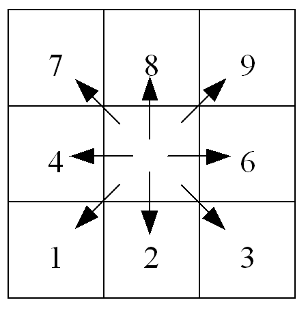

# LISFLOOD input files

All input that LISFLOOD requires are either in map or table format. Before showing a listing of all LISFLOOD input files, first some important remarks on the meteorological input data LISFLOOD requires.

## Treatment of meteorological input variables

The meteorological conditions provide the driving forces behind the water balance. LISFLOOD uses the following meteorological input variables:

| **Code**      | **Description**                                        | **Unit**               |
| --------- | -------------------------------------------------- | ------------------ |
| $P$       | Precipitation                                      | $[\frac{mm}{day}]$ |
| $ET0$     | Potential (reference) evapotranspiration rate      | $[\frac{mm}{day}]$ |
| $EW0$    | Potential evaporation rate from open water surface | $[\frac{mm}{day}]$ |
| $ES0$     | Potential evaporation rate from bare soil surface  | $[\frac{mm}{day}]$ |
| $T_{avg}$ | Average *daily* temperature                        | $^\circ C$         |

> **Note** that the model needs *daily* average temperature values, even if the model is run on a smaller time interval (e.g. hourly). This is because the routines for snowmelt and soil freezing are use empirical relations which are based on daily temperature data.. Just as an example, feeding hourly temperature data into the snowmelt routine can result in a gross overestimation of snowmelt. This is because even on a day on which the average temperature is below $T_m$  (no snowmelt), the instantaneous (or hourly) temperature may be higher for a part of the day, leading to unrealistically high simulated snowmelt rates.

Both precipitation and evaporation are internally converted from *intensities* $[\frac{mm}{day}]$ to *quantities per time step* $[mm]$ by multiplying them with the time step, $\Delta t$ (in $days$). 
For the sake of consistency, all in- and outgoing fluxes will also be described as *quantities per time step* $[mm]$ in the following, unless stated otherwise. 
$ET0$, $EW0$ and $ES0$ can be calculated using standard meteorological observations.

To this end a dedicated pre-processing application has been developed (LISVAP), which is documented in a separate [manual](https://ec-jrc.github.io/lisflood-lisvap/). 

## LISFLOOD input maps

***Table:*** *LISFLOOD input maps.*

| Map                                                       | Default name   | Units, range                                           | Description                                                  |
| --------------------------------------------------------- | ------------------- | ------------------------------------------------------ | ------------------------------------------------------------ |
| **GENERAL**                                               |                     |                                                        |                                                              |
| MaskMap                                                   | area.map            | Unit: -   Range: 0 or 1                             | Boolean map that defines model boundaries                    |
| **TOPOGRAPHY**                                            |                     |                                                        |                                                              |
| Ldd                                                       | ldd.map             | U.: flow directions   R.: 1 ≤ map ≤ 9               | local drain direction map (with value 1-9); this file contains flow directions from each cell to its steepest downslope neighbour. Ldd directions are coded according to the following diagram:      This resembles the numeric key pad of your PC's keyboard, except for the value 5, which defines a cell without local drain direction (pit). The pit cell at the end of the path is the outlet point of a catchment. |
| Grad                                                      | gradient.map        | U.: $\frac{m}{m}$    R.: map > 0                 | Slope gradient                                               |
| Elevation Stdev                                           | elvstd.map          | U.: $m$   R.: map ≥ 0                               | Standard deviation of elevation                              |
| **LAND USE -- fraction maps**                             |                     |                                                        |                                                              |
| Fraction of water                                         | fracwater.map       | U.: [-]   R.: 0 ≤ map ≤ 1                           | Fraction of inland water for each cell. Values range from 0 (no water at all) to 1 (pixel is 100% water) |
| Fraction of sealed surface                                | fracsealed.map      | U.: [-]   R.: 0 ≤ map ≤ 1                           | Fraction of impermeable surface for each cell. Values range from 0 (100% permeable surface -- no urban at all) to 1 (100% impermeable surface). |
| Fraction of forest                                        | fracforest.map      | U.:[-]   R.: 0 ≤ map ≤ 1                            | Forest fraction for each cell. Values range from 0 (no forest at all) to 1 (pixel is 100% forest) |
| Fraction of other land cover                              | fracother.map       | U.: [-]   R.: 0 ≤ map ≤ 1                           | Other (agricultural areas, non-forested natural area, pervious surface of urban areas) fraction for each cell. |
| **LAND COVER depending maps**                             |                     |                                                        |                                                              |
| Crop coef. for forest                                     | cropcoef_forest.map | U.: [-]   R.: 0.8≤ map ≤ 1.2                        | Crop coefficient for forest                                  |
| Crop coef. for other                                      | cropcoef_other.map  | U.: [-]   R.: 0.8≤ map ≤ 1.2                        | Crop coefficient for other                                   |
| Crop group number for forest                              | crgrnum_forest.map  | U.: [-]   R.: 1 ≤ map ≤ 5                           | Crop group number for forest                                 |
| Crop group number for forest                              | crgrnum_other.map   | U.: [-]   R.: 1 ≤ map ≤ 5                           | Crop group number for other                                  |
| Manning for forest                                        | mannings_forest.map | U.: $m^{-1/3} s$   R.: 0.2≤ map ≤ 0.4               | Manning's roughness for forest                               |
| Manning for other                                         | mannings_other.map  | U.: $m^{-1/3} s$    R.: 0.01≤ map ≤0.3              | Manning's roughness for other                                |
| Soil depth for forest for layer1a                          | soildep1a_forest.map | U.: $mm$   R.: map ≥ 50                             | Forest soil depth for soil layer 1a            |
| Soil depth for other for layer1a                           | soildep1a_other.map  | U.: $mm$   R.: map ≥ 50                             | Other soil depth for soil layer 1a           |
| Soil depth for forest for layer1b                         | soildep1b_forest.map | U.: $mm$   R.: map ≥ 50                             | Forest soil depth for soil layer 1b                           |
| Soil depth for other for layer1b                           | soildep1b_other.map  | U.: $mm$   R.: map ≥ 50                             | Other soil soil depth for soil layer 1b                       |
| Soil depth for forest for layer2                          | soildep2_forest.map | U.: $mm$   R.: map ≥ 50                             | Forest soil depth for soil layer 2                           |
| Soil depth for other for layer2                           | soildep2_other.map  | U.: $mm$   R.: map ≥ 50                             | Other soil soil depth for soil layer 2                       |
| **SOIL HYDRAULIC PROPERTIES (depending on soil texture)** |                     |                                                        |                                                              |
| ThetaSat1a for forest                                      | thetas1a_forest.map | U.: [V/V]   R.: 0 < map < 1                         | Saturated volumetric soil moisture content layer 1a           |
| ThetaSat1a for other                                       | thetas1a_other.map  | U.: [V/V]   R.: 0 < map < 1                         | Saturated volumetric soil moisture content layer 1a           |
| ThetaSat1b for forest                                      | thetas1b_forest.map | U.: [V/V]   R.: 0 < map < 1                         | Saturated volumetric soil moisture content layer 1b           |
| ThetaSat1b for other                                       | thetas1b_other.map  | U.: [V/V]   R.: 0 < map < 1                         | Saturated volumetric soil moisture content layer 1b           |
| ThetaSat2 for forest and other                            | thetas2.map         | U.: [V/V]   R.: 0 < map < 1                         | Saturated volumetric soil moisture content layer 2            |
| ThetaRes1a for forest                                      | thetar1a_forest.map  | U.: [V/V]   R.: 0 < map < 1                         | Residual volumetric soil moisture content layer 1a           |
| ThetaRes1a for other                                       | thetar1a_other.map   | U.: [V/V]   R.: 0 < map < 1                         | Residual volumetric soil moisture content layer 1a           |
| ThetaRes1b for forest                                      | thetar1b_forest.map  | U.: [V/V]   R.: 0 < map < 1                         | Residual volumetric soil moisture content layer 1b           |
| ThetaRes1b for other                                       | thetar1b_other.map   | U.: [V/V]   R.: 0 < map < 1                         | Residual volumetric soil moisture content layer 1b           |
| ThetaRes2 for forest and other                            | thetar2.map         | U.: [V/V]   R.: 0 < map < 1                         | Residual volumetric soil moisture content layer 2            |
| Lambda1a for forest                                        | lambda1a_forest.map  | U.: [-]   R.:  map>0                          | Pore size index (λ) layer 1a                                 |
| Lambda1a for other                                         | lambda1a_other.map   | U.: [-]   R.:  map>0                           | Pore size index (λ) layer 1a                               |
| Lambda1b for forest                                        | lambda1b_forest.map  | U.: [-]   R.:  map>0                          | Pore size index (λ) layer 1b                                 |
| Lambda1b for other                                         | lambda1b_other.map   | U.: [-]   R.:  map>0                          | Pore size index (λ) layer 1b                                
| Lambda2 for forest and other                              | lambda2.map         | U.: [-]   R.: map>0                          | Pore size index (λ) layer 2                                  |
| GenuAlpha1a for forest                                     | alpha1a_forest.map   | U.: $\frac{1} {cm}$   R.: 0 < map < 1               | Van Genuchten parameter α layer 1a                            |
| GenuAlpha1a for other                                      | alpha1a_other.map    | U.: $\frac{1} {cm}$   R.: 0 < map < 1               | Van Genuchten parameter α layer 1a                            |
| GenuAlpha1b for forest                                     | alpha1b_forest.map   | U.: $\frac{1} {cm}$   R.: 0 < map < 1               | Van Genuchten parameter α layer 1b                           |
| GenuAlpha1b for other                                      | alpha1b_other.map    | U.: $\frac{1} {cm}$   R.: 0 < map < 1               | Van Genuchten parameter α layer 1b                            |
| GenuAlpha2 for forest and other                           | alpha2.map          | U.: $\frac{1} {cm}$   R.: 0 < map < 1               | Van Genuchten parameter α layer 2                            |
| Sat1a for forest                                           | ksat1a_forest.map    | U.: $\frac{mm} {day}$   R.:  map>0           | Saturated conductivity layer 1a                               |
| Sat1a for other                                            | ksat1a_other.map     | U.: $\frac{mm} {day}$   R.:  map>0           | Saturated conductivity layer 1a                               |
| Sat1b for forest                                           | ksat1b_forest.map    | U.: $\frac{mm} {day}$   R.:  map>0           | Saturated conductivity layer 1b                               |
| Sat1b for other                                            | ksat1b_other.map     | U.: $\frac{mm} {day}$   R.:  map>0           | Saturated conductivity layer 1b                               |
| Sat2 for forest and other                                 | ksat2.map           | U.: $\frac{mm} {day}$   R.:  map>0           | Saturated conductivity layer 2                               |
| **CHANNEL GEOMETRY**                                      |                     |                                                        |                                                              |
| Channels                                                  | chan.map            | U.: [-]   R.: 0 or 1                                | Map with Boolean 1 for all channel pixels, and Boolean 0 for all other pixels on MaskMap |
| ChanGrad                                                  | changrad.map        | U.: $\frac{m} {m}$   R.: map > 0    !!!          | Channel gradient                                             |
| ChanMan                                                   | chanman.map         | U.: $m^{-1/3} s$   R.: map > 0                      | Manning's roughness coefficient for channels                 |
| ChanLength                                                | chanleng.map        | U.: $m$   R.: map > 0                               | Channel length (can exceed grid size, to account for meandering rivers) |
| ChanBottomWidth                                           | chanbw.map          | U.: $m$   R.: map > 0                               | Channel bottom width                                         |
| ChanSdXdY                                                 | chans.map           | U.: $\frac{m} {m}$   R.: map ≥ 0                    | Channel side slope Important: defined as horizontal divided by vertical distance (dx/dy); this may be confusing because slope is usually defined the other way round (i.e. dy/dx)! |
| ChanDepthThreshold                                        | chanbnkf.map        | U.: $m$   R.: map > 0                               | Bankfull channel depth                                       |
| **METEOROLOGICAL VARIABLES**                              |                     |                                                        |                                                              |
| PrecipitationMaps                                         | pr                  | U.: $\frac{mm} {day}$   R.: map ≥ 0                 | Precipitation rate                                           |
| TavgMaps                                                  | ta                  | U.: $°C$   R.:-50 ≤map ≤ +50                        | Average daily temperature                                    |
| E0Maps                                                    | e                   | U.: $\frac{mm} {day}$   R.: map ≥ 0                 | Daily potential evaporation rate, free water surface         |
| ES0Maps                                                   | es                  | U.: $\frac{mm} {day}$   R.: map ≥ 0                 | Daily potential evaporation rate, bare soil                  |
| ET0Maps                                                   | et                  | U.: $\frac{mm} {day}$   R.: map ≥ 0                 | Daily potential evapotranspiration rate, reference crop      |
| **DEVELOPMENT OF VEGETATION OVER TIME**                   |                     |                                                        |                                                              |
| LAIMaps for forest                                        | lai_forest          | U.: $\frac{m^2} {m^2}$   R.: map ≥ 0                | Pixel-average Leaf Area Index for forest                     |
| LAIMaps for other                                         | lai_other           | U.: $\frac{m^2} {m^2}$   R.: map ≥ 0                | Pixel-average Leaf Area Index for other                      |
| **DEFINITION OF INPUT/OUTPUT TIMESERIES**                 |                     |                                                        |                                                              |
| Gauges                                                    | outlets.map         | U.: [-]   R.: For each station an individual number | Nominal map with locations at which discharge timeseries are reported (usually correspond to gauging stations) |
| Sites                                                     | sites.map           | U.: [-]   R.: For each station an individual number | Nominal map with locations (individual pixels or areas) at which timeseries of intermediate state and rate variables are reported (soil moisture, infiltration, snow, etcetera) |

***Table:*** *Optional maps that define grid size.* 

| Map             | Default name | Units, range             | Description           |
| --------------- | ------------ | ------------------------ | --------------------- |
| PixelLengthUser | pixleng.map  | U.: $m$   R.: map > 0 | Map with pixel length |
| PixelAreaUser   | pixarea.map  | U.: $m$   R.: map > 0 | Map with pixel area   |

## Tables

In the previous version of LISFLOOD a number of model parameters are read through tables that are linked to the classes on the land use and soil (texture) maps. 
Those tables are replaced by maps (e.g. soil hydraulic property maps) in order to include the sub-grid variability of each parameter. 

Therefore only one default table is used in the standard LISFLOOD setting. The following table gives an overview:

***Table:*** *LISFLOOD input tables.*                      

| Table                  | Default name | Description                              |
| ---------------------- | ------------ | ---------------------------------------- |
| **LAND USE**           |              |                                          |
| Day of the year -> LAI | LaiOfDay.txt | Lookup table: Day of the year -> LAI map |

[🔝](#top)

