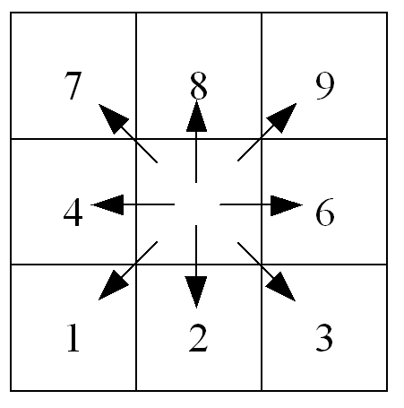

# LISFLOOD input maps for standard modules

LISFLOOD requires input files in map or text format (the latter are called *tables*). The detailed description is provided in [this chapter](../4_Static-Maps-introduction) of LISFLOOD User Guide.

This Annex reiterates the guidelines for the prearation of meteorological varaibles and provides the list of LISFLOOD input maps required when only the standard modules are used.
The description of the optional modules in the [OS LISFLOOD Model Documentation](https://ec-jrc.github.io/lisflood-model/) includes also the list of additional maps and tables.

## Units of meteorological input variables

The meteorological conditions provide the driving forces behind the water balance. LISFLOOD uses the following meteorological input variables:

| **Code**      | **Description**                                        | **Unit**               |
| --------- | -------------------------------------------------- | ------------------ |
| $P$       | Precipitation                                      | $[\frac{mm}{day}]$ |
| $ET0$     | Potential (reference) evapotranspiration rate      | $[\frac{mm}{day}]$ |
| $EW0$     | Potential evaporation rate from open water surface | $[\frac{mm}{day}]$ |
| $ES0$     | Potential evaporation rate from bare soil surface  | $[\frac{mm}{day}]$ |
| $T_{avg}$ | Average temperature                                | $^\circ C$ or $K $ |

Both precipitation and evaporation are internally converted from *intensities* $[\frac{mm}{day}]$ to *quantities per time step* $[mm]$ by multiplying them with the time step, $\Delta t$ (in $days$). 
For the sake of consistency, all in- and outgoing fluxes will also be described as *quantities per time step* $[mm]$ in the following, unless stated otherwise. 

$ET0$, $EW0$ and $ES0$ can be calculated using standard meteorological observations. [LISVAP](https://ec-jrc.github.io/lisflood-lisvap/) could be used for this purpose. 

## LISFLOOD input maps for standard modules

***Table:*** *LISFLOOD input maps.*

| Map                                                       | Default name   | Units, range (indicative)                                         | Description                                                  |
| --------------------------------------------------------- | ------------------- | ------------------------------------------------------ | ------------------------------------------------------------ |
| **GENERAL**                                               |                     |                                                        |                                                              |
| MaskMap                                                   | area.nc            | Unit: -   Range: 0 or 1                             | Boolean map that defines model boundaries                    |
| **TOPOGRAPHY**                                            |                     |                                                        |                                                              |
| Ldd                                                       | ldd.nc             | U.: flow directions   R.: 1 ≤ map ≤ 9               | local drain direction map (with value 1-9); this file contains flow directions from each cell to its steepest downslope neighbour. Ldd directions are coded according to the following diagram:      This resembles the numeric key pad of your PC's keyboard, except for the value 5, which defines a cell without local drain direction (pit). The pit cell at the end of the path is the outlet point of a catchment. |
| Grad                                                      | gradient.nc        | U.: $\frac{m}{m}$    R.: map > 0                 | Slope gradient                                               |
| Elevation Stdev                                           | elvstd.nc          | U.: $m$   R.: map ≥ 0                               | Standard deviation of elevation                              |
| **LAND USE -- fraction maps**                             |                     |                                                        |                                                              |
| Fraction of water                                         | fracwater.nc       | U.: [-]   R.: 0 ≤ map ≤ 1                           | Fraction of inland water for each cell. Values range from 0 (no water at all) to 1 (pixel is 100% water) |
| Fraction of sealed surface                                | fracsealed.nc      | U.: [-]   R.: 0 ≤ map ≤ 1                           | Fraction of impermeable surface for each cell. Values range from 0 (100% permeable surface -- no urban at all) to 1 (100% impermeable surface). |
| Fraction of forest                                        | fracforest.nc      | U.:[-]   R.: 0 ≤ map ≤ 1                            | Forest fraction for each cell. Values range from 0 (no forest at all) to 1 (pixel is 100% forest) |
| Fraction of irrigated areas                               | fracirrigation.nc      | U.:[-]   R.: 0 ≤ map ≤ 1                            | Irrigated fraction for each cell. Values range from 0 to 1  |
| Fraction of rice fields                                   | fracrice.nc      | U.:[-]   R.: 0 ≤ map ≤ 1                            | Fraction for each cell dedicated to paddy rice crops. Values range from 0 to 1 |
| Fraction of other land cover                              | fracother.nc       | U.: [-]   R.: 0 ≤ map ≤ 1                           | Other (non-forested natural area, pervious surface of urban areas, shrubs abd bushes, ...) fraction for each cell. |
| **LAND COVER depending maps**                             |                     |                                                        |                                                              |
| Crop coeff. for forest                                     | cropcoef_forest.nc | U.: [-]   R.: 0.2≤ map ≤ 1.2                        | Crop coefficient for forest                                  |
| Crop coeff. for other                                      | cropcoef_other.nc  | U.: [-]   R.: 0.2≤ map ≤ 1.2                        | Crop coefficient for other                                   |
| Crop coeff. for irrigated areas                                     | cropcoef_irr.nc  | U.: [-]   R.: 0.2≤ map ≤ 1.2                        | Crop coefficient for irrigated areas                                   |
| Crop group number for forest                              | crgrnum_forest.nc  | U.: [-]   R.: 1 ≤ map ≤ 5                           | Crop group number for forest                                 |
| Crop group number for forest                              | crgrnum_other.nc   | U.: [-]   R.: 1 ≤ map ≤ 5                           | Crop group number for other                                  |
| Crop group number for irrigated areas                              | crgrnum_irr.nc   | U.: [-]   R.: 1 ≤ map ≤ 5                           | Crop group number for irrigation                                  |
| Manning for forest                                        | mannings_forest.nc | U.: $m^{1/3} s^{-1}$   R.: 0.015≤ map ≤ 0.4               | Manning's roughness for forest                               |
| Manning for other                                         | mannings_other.nc  | U.: $m^{1/3} s^{-1}$    R.: 0.015≤ map ≤0.4              | Manning's roughness for other                                |
| Manning for irrigation                                         | mannings_irr.nc  | U.: $m^{1/3} s^{-1}$    R.: 0.015≤ map ≤0.4              | Manning's roughness for irrigation                                |
| Soil depth for forest for layer1                          | soildepth1_forest.nc | U.: $mm$   R.: map ≥ 50                             | Forest soil depth for soil layer 1            |
| Soil depth for other for layer1                           | soildepth1_other.nc  | U.: $mm$   R.: map ≥ 50                             | Other soil depth for soil layer 1           |
| Soil depth for forest for layer2                          | soildepth2_forest.nc | U.: $mm$   R.: map ≥ 50                             | Forest soil depth for soil layer 2                           |
| Soil depth for other for layer2                           | soildepth2_other.nc  | U.: $mm$   R.: map ≥ 50                             | Other soil soil depth for soil layer 2                       |
| Soil depth for forest for layer3                          | soildepth3_forest.nc | U.: $mm$   R.: map ≥ 50                             | Forest soil depth for soil layer 3                           |
| Soil depth for other for layer3                           | soildepth3_other.nc  | U.: $mm$   R.: map ≥ 50                             | Other soil soil depth for soil layer 3                       |
| **SOIL HYDRAULIC PROPERTIES (depending on soil texture)** |                     |                                                        |                                                              |
| ThetaSat1 for forest                                      | thetas1_forest.nc | U.: [V/V]   R.: 0 < map < 1                         | Saturated volumetric soil moisture content layer 1           |
| ThetaSat1 for other                                       | thetas1_other.nc  | U.: [V/V]   R.: 0 < map < 1                         | Saturated volumetric soil moisture content layer 1           |
| ThetaSat2 for forest                                      | thetas2_forest.nc | U.: [V/V]   R.: 0 < map < 1                         | Saturated volumetric soil moisture content layer 2           |
| ThetaSat2 for other                                       | thetas2_other.nc  | U.: [V/V]   R.: 0 < map < 1                         | Saturated volumetric soil moisture content layer 2           |
| ThetaSat3 for forest and other                            | thetas2.nc         | U.: [V/V]   R.: 0 < map < 1                         | Saturated volumetric soil moisture content layer 3            |
| ThetaRes1 for forest                                      | thetar1_forest.nc  | U.: [V/V]   R.: 0 < map < 1                         | Residual volumetric soil moisture content layer 1           |
| ThetaRes1 for other                                       | thetar1_other.nc   | U.: [V/V]   R.: 0 < map < 1                         | Residual volumetric soil moisture content layer 1           |
| ThetaRes2 for forest                                      | thetar2_forest.nc  | U.: [V/V]   R.: 0 < map < 1                         | Residual volumetric soil moisture content layer 2           |
| ThetaRes2 for other                                       | thetar2_other.nc   | U.: [V/V]   R.: 0 < map < 1                         | Residual volumetric soil moisture content layer 2           |
| ThetaRes3 for forest and other                            | thetar2.nc         | U.: [V/V]   R.: 0 < map < 1                         | Residual volumetric soil moisture content layer 3            |
| Lambda1 for forest                                        | lambda1_forest.nc  | U.: [-]   R.:  map>0                          | Pore size index (λ) layer 1                                 |
| Lambda1 for other                                         | lambda1_other.nc   | U.: [-]   R.:  map>0                           | Pore size index (λ) layer 1                               |
| Lambda2 for forest                                        | lambda2_forest.nc  | U.: [-]   R.:  map>0                          | Pore size index (λ) layer 2                                 |
| Lambda2 for other                                         | lambda2_other.nc   | U.: [-]   R.:  map>0                          | Pore size index (λ) layer 2                                
| Lambda3 for forest and other                              | lambda2.nc         | U.: [-]   R.: map>0                          | Pore size index (λ) layer 3                                  |
| GenuAlpha1 for forest                                     | alpha1_forest.nc   | U.: $\frac{1} {cm}$   R.: 0 < map < 1               | Van Genuchten parameter α layer 1                            |
| GenuAlpha1 for other                                      | alpha1_other.nc    | U.: $\frac{1} {cm}$   R.: 0 < map < 1               | Van Genuchten parameter α layer 1                            |
| GenuAlpha2 for forest                                     | alpha2_forest.nc   | U.: $\frac{1} {cm}$   R.: 0 < map < 1               | Van Genuchten parameter α layer 2                           |
| GenuAlpha2 for other                                      | alpha2_other.nc    | U.: $\frac{1} {cm}$   R.: 0 < map < 1               | Van Genuchten parameter α layer 2                            |
| GenuAlpha3 for forest and other                           | alpha2.nc          | U.: $\frac{1} {cm}$   R.: 0 < map < 1               | Van Genuchten parameter α layer 3                            |
| KSat1 for forest                                           | ksat1_forest.nc    | U.: $\frac{mm} {day}$   R.:  map>0           | Saturated conductivity layer 1                               |
| KSat1 for other                                            | ksat1_other.nc     | U.: $\frac{mm} {day}$   R.:  map>0           | Saturated conductivity layer 1                               |
| KSat2 for forest                                           | ksat2_forest.nc    | U.: $\frac{mm} {day}$   R.:  map>0           | Saturated conductivity layer 2                               |
| KSat2 for other                                            | ksat2_other.nc     | U.: $\frac{mm} {day}$   R.:  map>0           | Saturated conductivity layer 2                               |
| KSat3 for forest and other                                 | ksat3.nc           | U.: $\frac{mm} {day}$   R.:  map>0           | Saturated conductivity layer 3                               |
| **CHANNEL GEOMETRY**                                      |                     |                                                        |                                                              |
| Channels                                                  | chan.nc            | U.: [-]   R.: 0 or 1                                | Map with Boolean 1 for all channel pixels, and Boolean 0 for all other pixels on MaskMap |
| ChanGrad                                                  | changrad.nc        | U.: $\frac{m} {m}$   R.: map > 0    !!!          | Channel gradient                                             |
| ChanMan                                                   | chanman.nc         | U.: $m^{-1/3} s$   R.: map > 0                      | Manning's roughness coefficient for channels                 |
| ChanLength                                                | chanleng.nc        | U.: $m$   R.: map > 0                               | Channel length (can exceed grid size, to account for meandering rivers) |
| ChanBottomWidth                                           | chanbw.nc          | U.: $m$   R.: map > 0                               | Channel bottom width                                         |
| ChanSdXdY                                                 | chans.nc           | U.: $\frac{m} {m}$   R.: map ≥ 0                    | Channel side slope Important: defined as horizontal divided by vertical distance (dx/dy); this may be confusing because slope is usually defined the other way round (i.e. dy/dx)! |
| ChanDepthThreshold                                        | chanbnkf.nc        | U.: $m$   R.: map > 0                               | Bankfull channel depth                                       |
| **METEOROLOGICAL VARIABLES**                              |                     |                                                        |                                                              |
| PrecipitationMaps                                         | pr                  | U.: $\frac{mm} {day}$   R.: map ≥ 0                 | Precipitation rate                                           |
| TavgMaps                                                  | ta                  | U.: $°C$   R.:-50 ≤map ≤ +50  or U.: $K$                   | Average temperature                                    |
| E0Maps                                                    | e                   | U.: $\frac{mm} {day}$   R.: map ≥ 0                 | Daily potential evaporation rate, free water surface         |
| ES0Maps                                                   | es                  | U.: $\frac{mm} {day}$   R.: map ≥ 0                 | Daily potential evaporation rate, bare soil                  |
| ET0Maps                                                   | et                  | U.: $\frac{mm} {day}$   R.: map ≥ 0                 | Daily potential evapotranspiration rate, reference crop      |
| **DEVELOPMENT OF VEGETATION OVER TIME**                   |                     |                                                        |                                                              |
| LAIMaps for forest                                        | lai_forest          | U.: $\frac{m^2} {m^2}$   R.: map ≥ 0                | Pixel-average Leaf Area Index for forest                     |
| LAIMaps for other                                         | lai_other           | U.: $\frac{m^2} {m^2}$   R.: map ≥ 0                | Pixel-average Leaf Area Index for other                      |
| LAIMaps for irrigation                                        | lai_irrigation           | U.: $\frac{m^2} {m^2}$   R.: map ≥ 0                | Pixel-average Leaf Area Index for irrigated areas                    |
| **DEFINITION OF INPUT/OUTPUT TIMESERIES**                 |                     |                                                        |                                                              |
| Gauges                                                    | outlets.nc         | U.: [-]   R.: For each station an individual number | Nominal map with locations at which discharge timeseries are reported (usually correspond to gauging stations) |

***Table:*** Maps that define grid size, always required when uisng geographic (lat/lon) coordinate system.* 

| Map             | Default name | Units, range             | Description           |
| --------------- | ------------ | ------------------------ | --------------------- |
| PixelLengthUser | pixleng.nc  | U.: $m$   R.: map > 0 | Map with pixel length |
| PixelAreaUser   | pixarea.nc  | U.: $m$   R.: map > 0 | Map with pixel area   |

[🔝](#top)

